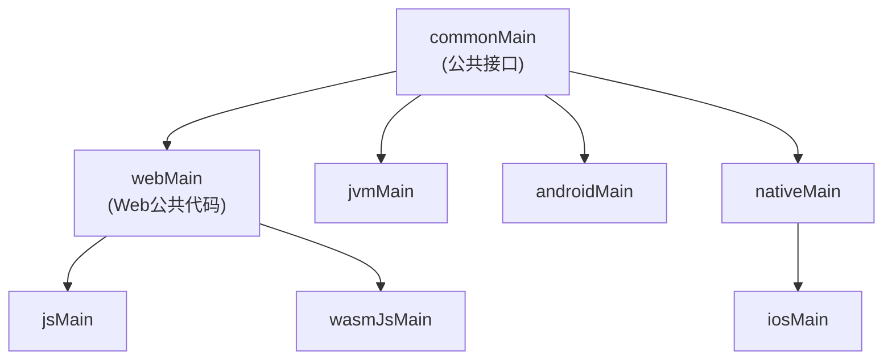

# MyHub Compose UI 平台抽象模块方案设计

**方案名称**：Platform Compose Infra v1  
**文档版本**：v1.0  
**文档类型**：技术方案设计文档  
**创建日期**：2026-01-13  
**锁定日期**：2026-01-13  
**最后更新**：2026-01-13  
**作者**：MyHub Development Team  
**评审状态**：🟢 通过  
**方案状态**：🔒 已锁定

---

## 📋 文档目录

1. [修改历史](#修改历史)
2. [方案状态摘要](#-方案状态摘要)
3. [问题背景](#1-问题背景)
4. [设计目标](#2-设计目标)
5. [技术调研](#3-技术调研)
6. [架构设计](#4-架构设计)
7. [实现细节](#5-实现细节)
8. [实施计划](#6-实施计划)
9. [风险评估](#7-风险评估)
10. [附录](#8-附录)

---

## 📊 方案状态摘要

**当前状态**：

- **评审状态**：🟢 通过（文档已通过评审，可以进入实施阶段）
- **方案状态**：🔒 已锁定 - 此版本已冻结，作为 Platform Compose Infra v1 的基线设计
- **锁定日期**：2026-01-13
- **当前进度**：所有阶段已完成，方案设计已确定并锁定

**状态说明**：

- **评审状态**：用于标识文档的评审进度
  - 🟢 通过：文档已通过评审，可以进入实施阶段
  - 🟡 待评审：文档正在等待评审或评审进行中
  - 🔴 需修改：文档评审后需要修改
- **方案状态**：用于标识方案的实施进度
  - 🔒 已锁定：方案设计已确定，不允许随意修改
  - 📝 进行中：方案设计正在进行中，可以修改
  - ⏸️ 暂停：方案设计暂时停止，保留当前状态
- 详细状态定义请参考 [MyHub 架构设计文档规范](../../../docs/myhub-infra-rules.md)

---

## 修改历史

| 版本 | 日期       | 修改内容                           | 修改原因           |
| ---- | ---------- | ---------------------------------- | ------------------ |
| v1.0 | 2026-01-13 | 初始方案设计                       | 新建               |
| v1.0 | 2026-01-13 | 完成架构设计文档                   | 完善文档           |
| v1.0 | 2026-01-13 | 更新状态：评审通过、方案已锁定     | 状态更新：评审通过 |

---

## 1. 问题背景

### 1.1 用户场景

在 MyHub 应用的 Compose UI 开发和运行过程中，需要处理多个平台（Android、iOS、JVM、Web）的 UI 差异。典型的场景包括：

1. **主题管理**：应用需要支持深色/浅色主题切换，不同平台获取系统主题的方式不同
2. **语言环境**：应用需要支持多语言（英语、简体中文、繁体中文、日语），不同平台获取语言环境的方式不同
3. **响应式布局**：应用需要根据窗口大小自动调整布局（手机、平板、桌面），不同平台获取窗口尺寸的方式不同
4. **手势交互**：应用需要统一的交互方式（如滑动返回），不同平台的手势实现方式不同
5. **跨平台抽象**：在 KMP Compose 项目中，需要为不同平台提供统一的 Compose UI 抽象，隐藏平台实现细节

### 1.2 问题根因

在引入统一的 Compose UI 平台抽象模块之前，MyHub 应用面临以下问题：

1. **主题管理分散**：各模块可能使用不同的方式获取和设置主题，导致主题不一致
2. **语言环境访问不一致**：不同平台获取语言环境的方式不同（Android 使用 `Configuration.locale`，iOS 使用 `NSLocale`，Web 使用 `navigator.language`），缺乏统一抽象
3. **窗口尺寸检测分散**：各模块可能使用不同的方式检测窗口尺寸，导致响应式布局不一致
4. **平台特定代码耦合**：业务代码直接使用平台特定的 Compose API（如 Android 的 `LocalConfiguration`，iOS 的 `LocalWindowInfo`），导致跨平台代码难以维护
5. **手势实现重复**：滑动返回等手势交互在各处重复实现，缺乏统一抽象
6. **扩展性差**：添加新的平台支持或新的 UI 功能需要修改多处代码，扩展性差

### 1.3 影响范围

- **开发效率**：缺乏统一的 Compose UI 平台抽象导致开发人员需要了解多个平台的 Compose API，降低开发效率
- **代码维护**：平台特定代码分散，增加维护成本和出错风险
- **跨平台兼容性**：直接使用平台特定 Compose API 导致代码难以在不同平台间复用
- **用户体验**：主题、语言、响应式布局等不一致导致用户体验差
- **测试困难**：平台特定 Compose 代码难以测试，特别是单元测试

---

## 2. 设计目标

### 2.1 功能目标

- ✅ **统一的主题管理接口**：提供统一的 `LocalAppTheme` CompositionLocal，隐藏平台实现细节
- ✅ **统一的语言环境接口**：提供统一的 `LocalAppLocale` CompositionLocal，支持多语言切换
- ✅ **统一的窗口尺寸检测**：提供统一的 `getWindowSize()` 函数和 `WindowSizeClass`，支持响应式布局
- ✅ **统一的手势交互**：提供统一的 `swipeBackGesture()` Modifier，支持滑动返回等交互
- ✅ **语言枚举和转换**：提供 `Language` 枚举和转换函数，方便语言代码和枚举之间的转换
- ✅ **主题配置**：提供 `AppTheme` Composable，统一应用主题配置
- ✅ **多平台支持**：支持 Android、iOS、JVM、JS、WASM 等多个平台
- ✅ **类型安全**：使用 Kotlin 的类型系统，提供类型安全的 API

### 2.2 非功能目标

- ✅ **性能优化**：主题和语言环境访问应该是轻量级的，不影响 UI 性能
- ✅ **易用性**：提供简洁、易用的 Compose API，降低学习成本
- ✅ **可扩展性**：易于添加新的平台支持或新的 UI 功能
- ✅ **可测试性**：提供可测试的接口，支持单元测试和 Compose UI 测试
- ✅ **代码复用**：最大化代码复用，减少重复代码

### 2.3 模块特性说明

**重要说明**：`core/platform-compose` 模块是一个**混合（Mixed）模块**，与其他单一功能的 core 模块（如 `core/logger`、`core/app-build-config`）不同，它包含多个 Compose UI 平台相关的功能：

1. **主题管理功能**：提供跨平台的深色/浅色主题支持
2. **语言环境功能**：提供跨平台的多语言支持
3. **窗口尺寸检测功能**：提供跨平台的窗口大小检测和响应式布局支持
4. **手势交互功能**：提供统一的滑动返回等手势交互
5. **语言枚举和转换功能**：提供语言代码和枚举之间的转换
6. **主题配置功能**：提供统一的 Material3 主题配置
7. **未来可能扩展的功能**：如平台特定的动画、导航过渡效果等

这种混合设计是合理的，因为：

- 这些功能都与 Compose UI 平台相关，属于同一领域
- 将它们放在同一个模块中可以减少模块数量，简化依赖关系
- 它们共享相同的平台抽象机制（expect/actual）和 Compose 特性
- 便于统一管理和维护 Compose UI 平台相关的代码

---

## 3. 技术调研

### 3.1 技术选型

#### 3.1.1 Compose Multiplatform

**选择理由**：

- ✅ **跨平台 UI**：Compose Multiplatform 是 JetBrains 提供的跨平台 UI 框架，支持 Android、iOS、JVM、Web
- ✅ **声明式 UI**：使用声明式的方式构建 UI，代码简洁易维护
- ✅ **状态管理**：Compose 的状态管理机制天然支持响应式 UI
- ✅ **Material3 支持**：Compose Multiplatform 支持 Material3，提供现代化的 UI 组件
- ✅ **资源管理**：Compose Resources 提供跨平台的资源管理能力

#### 3.1.2 CompositionLocal

**选择理由**：

- ✅ **隐式传递**：CompositionLocal 提供隐式传递上下文的能力，适合主题、语言等全局配置
- ✅ **类型安全**：使用类型安全的 API，避免字符串键的错误
- ✅ **性能优化**：CompositionLocal 在编译时优化，运行时性能好
- ✅ **Compose 原生支持**：Compose 原生支持 CompositionLocal，无需额外依赖

#### 3.1.3 expect/actual 机制

**选择理由**：

- ✅ **KMP 原生支持**：Kotlin Multiplatform 提供的 expect/actual 机制是跨平台抽象的标准方式
- ✅ **编译时检查**：expect/actual 机制在编译时检查，确保所有平台都提供了实现
- ✅ **类型安全**：使用 Kotlin 的类型系统，提供类型安全的 API
- ✅ **零运行时开销**：expect/actual 在编译时解析，运行时无额外开销

### 3.2 平台支持策略

#### 3.2.1 支持的平台

| 平台    | 支持状态    | 说明                     |
| ------- | ----------- | ------------------------ |
| Android | ✅ 完全支持 | 使用 Android Compose API |
| iOS     | ✅ 完全支持 | 使用 iOS Compose API     |
| JVM     | ✅ 完全支持 | 使用 JVM Compose API     |
| JS      | ✅ 完全支持 | Kotlin/JS Compose 平台   |
| WASM    | ✅ 完全支持 | Kotlin/WASM Compose 平台 |

#### 3.2.2 平台特定实现策略

- **Android**：使用 `LocalConfiguration` 获取窗口尺寸，使用系统 API 获取主题和语言环境
- **iOS**：使用 `LocalWindowInfo` 获取窗口尺寸，使用 iOS API 获取主题和语言环境
- **JVM**：使用参数传入窗口尺寸，使用系统 API 获取主题和语言环境
- **JS/WASM**：使用浏览器 API 获取窗口尺寸和语言环境，使用 CSS 媒体查询获取主题

### 3.3 代码复用策略

#### 3.3.1 Web 平台代码复用

- **webMain Source Set**：JS 和 WASM 的公共代码提取到 `webMain` Source Set
- **符合 KMP 结构**：`webMain` 是 `jsMain` 和 `wasmJsMain` 的父级源集，符合 KMP 默认结构
- **减少重复代码**：`LocalAppLocale` 和 `LocalAppTheme` 的 Web 实现放在 `webMain`，避免重复

---

## 4. 架构设计

### 4.1 整体架构

```text
┌─────────────────────────────────────────────────────────────┐
│                     应用层（Application）                      │
│  ┌──────────────┐  ┌──────────────┐  ┌──────────────┐      │
│  │  Feature A   │  │  Feature B   │  │  Feature C   │      │
│  └──────┬───────┘  └──────┬───────┘  └──────┬───────┘      │
└─────────┼──────────────────┼──────────────────┼──────────────┘
          │                  │                  │
          └──────────────────┼──────────────────┘
                             │
          ┌──────────────────▼──────────────────┐
          │   core:platform-compose 模块         │
          │  (混合模块 - Compose UI平台功能集合)   │
          │                                     │
          │  ┌──────────────────────────────┐   │
          │  │    Compose UI API            │   │
          │  │  (统一接口)                   │   │
          │  └──────────────┬─────────────┘   │
          │                 │                  │
          │  ┌──────────────┼──────────────┐   │
          │  │              │              │   │
          │  ▼              ▼              ▼   │
          │  ┌──────────┐  ┌──────────┐  ┌──────────┐
          │  │Theme     │  │Locale    │  │Window    │
          │  │Management│  │Management│  │Size      │
          │  │          │  │          │  │Detection │
          │  └────┬─────┘  └────┬─────┘  └────┬─────┘
          │       │             │             │
          │  ┌────┼─────────────┼─────────────┼─────┐
          │  │    │             │             │     │
          │  ▼    ▼             ▼             ▼     ▼
          │  ┌──────────┐  ┌──────────┐  ┌──────────┐
          │  │Gesture   │  │Language  │  │Theme     │
          │  │          │  │Enum      │  │Config    │
          │  └──────────┘  └──────────┘  └──────────┘
          │       │             │             │
          │       │             │             │
          │  ┌────▼─────────────▼─────────────▼─────┐
          │  │     expect/actual 机制               │
          │  │  (平台特定实现抽象)                  │
          │  └──────────────────────────────────────┘
          └──────────────────┬───────────────────────┘
                             │
          ┌──────────────────▼──────────────────┐
          │      KMP Source Sets               │
          │                                     │
          │  ┌──────────────┐  ┌──────────────┐ │
          │  │  commonMain  │  │  webMain     │ │
          │  │  (公共接口)  │  │  (Web公共)   │ │
          │  └──────┬───────┘  └──────┬───────┘ │
          │         │                 │         │
          │  ┌───────┼─────────────────┼───────┐ │
          │  │       │                 │       │ │
          │  ▼       ▼       ▼         ▼       ▼ │
          │  ┌──────┐ ┌──────┐ ┌──────┐ ┌──────┐ │
          │  │android│ │ ios │ │ jvm │ │ js/  │ │
          │  │ Main  │ │Main │ │Main │ │wasmJs│ │
          │  └──────┘ └──────┘ └──────┘ └──────┘ │
          └─────────────────────────────────────┘
                             │
          ┌──────────────────▼──────────────────┐
          │      平台特定实现                    │
          │  - Android: LocalConfiguration      │
          │  - iOS: LocalWindowInfo             │
          │  - JVM: 参数传入                     │
          │  - Web: window.innerWidth/Height    │
          └─────────────────────────────────────┘
```

### 4.2 核心组件设计

#### 4.2.1 LocalAppTheme

`LocalAppTheme` 提供统一的主题管理接口：

```kotlin
package tech.zhifu.app.myhub.local

import androidx.compose.runtime.*

expect object LocalAppTheme {
    @get:Composable
    val current: Boolean

    @Composable
    infix fun provides(value: Boolean?): ProvidedValue<*>
}
```

**设计要点**：

- 使用 `expect object` 定义主题接口
- 提供 `current` 属性，返回当前是否为深色主题
- 提供 `provides()` 函数，用于设置主题值
- 各平台提供 `actual` 实现

#### 4.2.2 LocalAppLocale

`LocalAppLocale` 提供统一的语言环境管理接口：

```kotlin
package tech.zhifu.app.myhub.local

import androidx.compose.runtime.Composable
import androidx.compose.runtime.ProvidedValue

expect object LocalAppLocale {
    @get:Composable
    val current: String

    @Composable
    infix fun provides(value: String?): ProvidedValue<*>
}
```

**设计要点**：

- 使用 `expect object` 定义语言环境接口
- 提供 `current` 属性，返回当前语言代码（如 "en"、"zh-CN"）
- 提供 `provides()` 函数，用于设置语言环境值
- 各平台提供 `actual` 实现

#### 4.2.3 WindowSizeDetector

`getWindowSize()` 函数提供统一的窗口尺寸检测：

```kotlin
package tech.zhifu.app.myhub.ui

import androidx.compose.runtime.Composable
import androidx.compose.ui.unit.DpSize

@Composable
expect fun getWindowSize(): DpSize
```

**设计要点**：

- 使用 `expect` 函数声明，各平台提供 `actual` 实现
- 返回 `DpSize`，表示窗口的宽度和高度
- 各平台根据自身能力提供实现

#### 4.2.4 WindowSizeClass

`WindowSizeClass` 提供窗口尺寸类别，用于响应式布局：

```kotlin
package tech.zhifu.app.myhub.ui

enum class WindowSizeClass {
    Compact,    // 手机 (< 600dp)
    Medium,     // 平板 (600dp - 840dp)
    Expanded    // 桌面 (> 840dp)
}

fun calculateWindowSizeClass(width: DpSize): WindowSizeClass {
    val widthDp = width.width
    return when {
        widthDp < 600.dp -> WindowSizeClass.Compact
        widthDp < 840.dp -> WindowSizeClass.Medium
        else -> WindowSizeClass.Expanded
    }
}
```

**设计要点**：

- 使用枚举定义三种尺寸类别
- `calculateWindowSizeClass()` 是纯函数，不需要 `@Composable` 注解
- 提供扩展属性 `isCompact`、`isMedium`、`isExpanded`，方便使用

#### 4.2.5 SwipeBackGesture

`swipeBackGesture()` Modifier 提供统一的滑动返回手势：

```kotlin
package tech.zhifu.app.myhub.ui

@Composable
fun Modifier.swipeBackGesture(
    onSwipeBack: () -> Unit,
    enabled: Boolean = true
): Modifier
```

**设计要点**：

- 使用 Modifier 扩展函数，方便在 Compose UI 中使用
- 支持启用/禁用控制，桌面端可禁用
- 实现从屏幕左边缘向右滑动返回的功能

#### 4.2.6 Language 枚举

`Language` 枚举提供语言代码和枚举之间的转换：

```kotlin
package tech.zhifu.app.myhub.language

enum class Language(val code: String, val region: String?) {
    English("en", null),
    SimplifiedChinese("zh-CN", "CN"),
    TraditionalChinese("zh-TW", "TW"),
    Japanese("ja", null)
}

fun String.toLanguage(): Language
fun Language.toCode(): String
@Composable fun Language.getLocalizedLabel(): String
```

**设计要点**：

- 使用枚举定义支持的语言
- 提供字符串到枚举的转换函数
- 提供枚举到代码的转换函数
- 提供本地化显示名称函数

### 4.3 模块结构

```text
core/platform-compose/
├── build.gradle.kts              # 模块构建配置
├── README.md                     # 模块说明文档
├── docs/                         # 架构设计文档
│   └── myhub-platform-compose-infra-v1.0.md
└── src/
    ├── commonMain/               # 公共接口、期望函数和资源
    │   ├── kotlin/tech/zhifu/app/myhub/
    │   │   ├── local/
    │   │   │   ├── LocalAppTheme.kt          # 主题接口
    │   │   │   ├── LocalAppLocale.kt         # 语言环境接口
    │   │   │   └── LocalAppEnvironment.kt    # 环境配置
    │   │   ├── ui/
    │   │   │   ├── WindowSizeDetector.kt      # 窗口尺寸检测接口
    │   │   │   ├── WindowSize.kt              # 窗口尺寸类别
    │   │   │   └── SwipeBackGesture.kt        # 滑动返回手势
    │   │   ├── language/
    │   │   │   └── Language.kt               # 语言枚举和转换
    │   │   └── theme/
    │   │       ├── Theme.kt                   # 主题配置
    │   │       └── Type.kt                    # 字体和排版
    │   └── composeResources/                  # 多语言资源
    │
    ├── webMain/                  # Web 平台（JS/WASM）公共代码
    │   └── kotlin/tech/zhifu/app/myhub/
    │       └── local/
    │           ├── LocalAppLocale.web.kt     # Web 语言环境实现
    │           └── LocalAppTheme.web.kt      # Web 主题实现
    │
    ├── androidMain/              # Android 平台特定实现
    │   └── kotlin/tech/zhifu/app/myhub/
    │       ├── local/
    │       │   ├── LocalAppTheme.android.kt  # Android 主题实现
    │       │   └── LocalAppLocale.android.kt # Android 语言环境实现
    │       └── ui/
    │           └── WindowSizeDetector.android.kt # Android 窗口尺寸检测
    │
    ├── iosMain/                  # iOS 平台特定实现
    │   └── kotlin/tech/zhifu/app/myhub/
    │       ├── local/
    │       │   ├── LocalAppTheme.ios.kt       # iOS 主题实现
    │       │   └── LocalAppLocale.ios.kt      # iOS 语言环境实现
    │       └── ui/
    │           └── WindowSizeDetector.ios.kt  # iOS 窗口尺寸检测
    │
    ├── jvmMain/                  # JVM 平台特定实现
    │   └── kotlin/tech/zhifu/app/myhub/
    │       ├── local/
    │       │   ├── LocalAppTheme.jvm.kt       # JVM 主题实现
    │       │   └── LocalAppLocale.jvm.kt      # JVM 语言环境实现
    │       └── ui/
    │           └── WindowSizeDetector.jvm.kt  # JVM 窗口尺寸检测
    │
    ├── jsMain/                   # JS 平台特定实现
    │   └── kotlin/tech/zhifu/app/myhub/
    │       └── ui/
    │           └── WindowSizeDetector.js.kt   # JS 窗口尺寸检测
    │
    ├── wasmJsMain/               # WASM 平台特定实现
    │   └── kotlin/tech/zhifu/app/myhub/
    │       └── ui/
    │           └── WindowSizeDetector.wasmJs.kt # WASM 窗口尺寸检测
    │
    └── commonTest/               # 公共测试代码
        └── kotlin/tech/zhifu/app/myhub/
            ├── ui/
            │   └── WindowSizeTest.kt          # 窗口尺寸测试
            └── language/
                └── LanguageTest.kt            # 语言转换测试
```

### 4.4 平台实现关系图



---

## 5. 实现细节

### 5.1 关键 API 设计

#### 5.1.1 LocalAppTheme 实现

**公共接口**：

```kotlin
package tech.zhifu.app.myhub.local

import androidx.compose.runtime.*

expect object LocalAppTheme {
    @get:Composable
    val current: Boolean

    @Composable
    infix fun provides(value: Boolean?): ProvidedValue<*>
}
```

**Android 实现**：

```kotlin
package tech.zhifu.app.myhub.local

import androidx.compose.runtime.*

actual object LocalAppTheme {
    private val LocalAppTheme = staticCompositionLocalOf { true }

    actual val current: Boolean
        @Composable get() = LocalAppTheme.current

    @Composable
    actual infix fun provides(value: Boolean?): ProvidedValue<*> {
        return LocalAppTheme.provides(value ?: true)
    }
}
```

**iOS 实现**：类似 Android，使用 `staticCompositionLocalOf`

**JVM 实现**：类似 Android，使用 `staticCompositionLocalOf`

**Web 实现**（webMain）：

```kotlin
package tech.zhifu.app.myhub.local

import androidx.compose.runtime.*

actual object LocalAppTheme {
    private val LocalAppTheme = staticCompositionLocalOf { false }

    actual val current: Boolean
        @Composable get() = LocalAppTheme.current

    @Composable
    actual infix fun provides(value: Boolean?): ProvidedValue<*> {
        return LocalAppTheme.provides(value ?: false)
    }
}
```

#### 5.1.2 LocalAppLocale 实现

**公共接口**：

```kotlin
package tech.zhifu.app.myhub.local

import androidx.compose.runtime.Composable
import androidx.compose.runtime.ProvidedValue

expect object LocalAppLocale {
    @get:Composable
    val current: String

    @Composable
    infix fun provides(value: String?): ProvidedValue<*>
}
```

**Android 实现**：

```kotlin
package tech.zhifu.app.myhub.local

import android.content.res.Configuration
import androidx.compose.runtime.*
import androidx.compose.ui.platform.LocalConfiguration

actual object LocalAppLocale {
    private val LocalAppLocale = staticCompositionLocalOf { "en" }

    actual val current: String
        @Composable get() {
            val configuration = LocalConfiguration.current
            return configuration.locales[0].language + "-" +
                   configuration.locales[0].country
        }

    @Composable
    actual infix fun provides(value: String?): ProvidedValue<*> {
        return LocalAppLocale.provides(value ?: "en")
    }
}
```

**iOS 实现**：使用 iOS API 获取语言环境

**JVM 实现**：使用 Java `Locale` API

**Web 实现**（webMain）：使用 `navigator.language`

#### 5.1.3 WindowSizeDetector 实现

**公共接口**：

```kotlin
package tech.zhifu.app.myhub.ui

import androidx.compose.runtime.Composable
import androidx.compose.ui.unit.DpSize

@Composable
expect fun getWindowSize(): DpSize
```

**Android 实现**：

```kotlin
package tech.zhifu.app.myhub.ui

import androidx.compose.runtime.Composable
import androidx.compose.ui.platform.LocalConfiguration
import androidx.compose.ui.unit.DpSize
import androidx.compose.ui.unit.dp

@Composable
actual fun getWindowSize(): DpSize {
    val configuration = LocalConfiguration.current
    return DpSize(
        width = configuration.screenWidthDp.dp,
        height = configuration.screenHeightDp.dp
    )
}
```

**iOS 实现**：使用 `LocalWindowInfo`

**JVM 实现**：返回默认桌面尺寸或通过参数传入

**JS 实现**：

```kotlin
package tech.zhifu.app.myhub.ui

import androidx.compose.runtime.*
import androidx.compose.ui.unit.DpSize
import androidx.compose.ui.unit.dp
import kotlinx.browser.window

@Composable
actual fun getWindowSize(): DpSize {
    var size by remember { mutableStateOf(DpSize(window.innerWidth.dp, window.innerHeight.dp)) }

    DisposableEffect(Unit) {
        val listener: (Event) -> Unit = {
            size = DpSize(window.innerWidth.dp, window.innerHeight.dp)
        }
        window.addEventListener("resize", listener)
        onDispose {
            window.removeEventListener("resize", listener)
        }
    }

    return size
}
```

**WASM 实现**：类似 JS，使用 `external val window`

### 5.2 使用示例

#### 5.2.1 主题管理

```kotlin
import tech.zhifu.app.myhub.local.LocalAppTheme
import tech.zhifu.app.myhub.theme.AppTheme

@Composable
fun MyApp() {
    val isDark = LocalAppTheme.current

    AppTheme(darkTheme = isDark) {
        // 应用内容
    }
}

// 切换主题
@Composable
fun ThemeSwitcher() {
    var isDark by remember { mutableStateOf(LocalAppTheme.current) }

    Button(onClick = { isDark = !isDark }) {
        Text(if (isDark) "切换到浅色" else "切换到深色")
    }
}
```

#### 5.2.2 语言环境

```kotlin
import tech.zhifu.app.myhub.local.LocalAppLocale
import tech.zhifu.app.myhub.language.Language

@Composable
fun MyScreen() {
    val locale = LocalAppLocale.current // 例如: "en", "zh-CN"
    val language = locale.toLanguage() // Language.English

    Text("当前语言: ${language.getLocalizedLabel()}")
}

// 切换语言
@Composable
fun LanguageSwitcher() {
    var locale by remember { mutableStateOf(LocalAppLocale.current) }

    Language.entries.forEach { language ->
        Button(onClick = { locale = language.toCode() }) {
            Text(language.getLocalizedLabel())
        }
    }
}
```

#### 5.2.3 响应式布局

```kotlin
import tech.zhifu.app.myhub.ui.*

@Composable
fun MyScreen() {
    val windowSize = getWindowSize()
    val sizeClass = calculateWindowSizeClass(windowSize)

    when {
        sizeClass.isCompact -> {
            // 手机布局
            Column {
                // ...
            }
        }
        sizeClass.isMedium -> {
            // 平板布局
            Row {
                // ...
            }
        }
        sizeClass.isExpanded -> {
            // 桌面布局
            Row {
                // ...
            }
        }
    }
}
```

#### 5.2.4 滑动返回手势

```kotlin
import tech.zhifu.app.myhub.ui.swipeBackGesture

@Composable
fun MyScreen(onBack: () -> Unit) {
    Column(
        modifier = Modifier
            .fillMaxSize()
            .swipeBackGesture(onSwipeBack = onBack)
    ) {
        // 屏幕内容
    }
}
```

### 5.3 测试策略

#### 5.3.1 单元测试

**WindowSizeTest**：

```kotlin
package tech.zhifu.app.myhub.ui

import androidx.compose.ui.unit.DpSize
import androidx.compose.ui.unit.dp
import kotlin.test.Test
import kotlin.test.assertEquals

class WindowSizeTest {
    @Test
    fun testCalculateWindowSizeClassCompact() {
        val size = DpSize(400.dp, 800.dp)
        val sizeClass = calculateWindowSizeClass(size)
        assertEquals(WindowSizeClass.Compact, sizeClass)
    }

    @Test
    fun testCalculateWindowSizeClassMedium() {
        val size = DpSize(700.dp, 1000.dp)
        val sizeClass = calculateWindowSizeClass(size)
        assertEquals(WindowSizeClass.Medium, sizeClass)
    }

    @Test
    fun testCalculateWindowSizeClassExpanded() {
        val size = DpSize(1200.dp, 800.dp)
        val sizeClass = calculateWindowSizeClass(size)
        assertEquals(WindowSizeClass.Expanded, sizeClass)
    }
}
```

**LanguageTest**：

```kotlin
package tech.zhifu.app.myhub.language

import kotlin.test.Test
import kotlin.test.assertEquals

class LanguageTest {
    @Test
    fun testStringToLanguage() {
        assertEquals(Language.English, "en".toLanguage())
        assertEquals(Language.SimplifiedChinese, "zh-CN".toLanguage())
        assertEquals(Language.TraditionalChinese, "zh-TW".toLanguage())
        assertEquals(Language.Japanese, "ja".toLanguage())
    }

    @Test
    fun testLanguageToCode() {
        assertEquals("en", Language.English.toCode())
        assertEquals("zh-CN", Language.SimplifiedChinese.toCode())
        assertEquals("zh-TW", Language.TraditionalChinese.toCode())
        assertEquals("ja", Language.Japanese.toCode())
    }
}
```

---

## 6. 实施计划

### 6.1 实施阶段

#### 阶段 1：基础架构搭建（已完成）

- ✅ 创建 `core/platform-compose` 模块
- ✅ 定义公共接口（LocalAppTheme、LocalAppLocale、WindowSizeDetector）
- ✅ 实现 Android 平台支持
- ✅ 实现 iOS 平台支持
- ✅ 实现 JVM 平台支持
- ✅ 实现 JS 平台支持
- ✅ 实现 WASM 平台支持
- ✅ 创建 Web 平台公共代码（webMain）
- ✅ 实现滑动返回手势
- ✅ 实现语言枚举和转换
- ✅ 实现主题配置
- ✅ 编写单元测试

#### 阶段 2：文档完善（已完成）

- ✅ 创建架构设计文档
- ✅ 完善使用文档
- ✅ 添加代码示例
- ✅ 添加最佳实践指南

#### 阶段 3：功能扩展（持续进行）

- 🔄 添加更多手势交互（如需要）
- 🔄 添加平台特定的动画效果（如需要）
- 🔄 添加平台特定的导航过渡效果（如需要）
- 🔄 支持更多语言（如需要）

**说明**：功能扩展将根据实际需求持续进行，不设固定时间表。

### 6.2 里程碑

| 里程碑             | 目标日期   | 状态         |
| ------------------ | ---------- | ------------ |
| 基础架构完成       | 2026-01-13 | ✅ 已完成     |
| 文档完善           | 2026-01-13 | ✅ 已完成     |
| 功能扩展（如需要） | 持续进行   | 🔄 持续进行   |

---

## 7. 风险评估

### 7.1 技术风险

#### 风险 1：Compose Multiplatform API 变更

**风险描述**：Compose Multiplatform 仍在快速发展中，API 可能发生变更，影响平台实现。

**影响程度**：中

**应对措施**：

- 使用稳定的 Compose Multiplatform API，避免使用实验性 API
- 定期更新 Compose Multiplatform 版本，及时适配 API 变更
- 编写测试用例，确保平台实现正确
- 关注 Compose Multiplatform 的更新日志和迁移指南

#### 风险 2：性能问题

**风险描述**：窗口尺寸检测、主题切换等操作可能影响 UI 性能。

**影响程度**：低

**应对措施**：

- 使用 `remember` 和 `derivedStateOf` 优化状态计算
- 窗口尺寸检测使用 `DisposableEffect` 管理监听器生命周期
- 主题和语言环境使用 `staticCompositionLocalOf` 减少重组
- 进行性能测试，确保不影响 UI 流畅度

### 7.2 维护风险

#### 风险 1：代码复杂度增加

**风险描述**：作为混合模块，包含多个功能，可能导致代码复杂度增加。

**影响程度**：中

**应对措施**：

- 保持清晰的模块结构，每个功能独立实现
- 使用包结构组织代码，避免功能耦合
- 编写清晰的文档，说明模块的混合特性
- 定期重构，保持代码简洁

#### 风险 2：扩展性限制

**风险描述**：未来可能需要添加更多 Compose UI 功能，可能超出模块职责范围。

**影响程度**：低

**应对措施**：

- 在添加新功能前，评估是否属于 Compose UI 平台相关功能
- 如果功能过于复杂或独立，考虑创建新的模块
- 保持模块职责清晰，避免功能膨胀

### 7.3 兼容性风险

#### 风险 1：新平台支持

**风险描述**：未来可能需要支持新的平台（如 watchOS、tvOS 等）。

**影响程度**：低

**应对措施**：

- 使用 KMP 的 expect/actual 机制，易于添加新平台支持
- 保持接口稳定，新平台只需实现 actual 函数
- 编写平台实现指南，降低新平台接入成本

#### 风险 2：Compose 版本兼容性

**风险描述**：不同平台可能使用不同版本的 Compose，导致 API 不兼容。

**影响程度**：低

**应对措施**：

- 统一 Compose Multiplatform 版本，确保所有平台使用相同版本
- 使用版本目录（Version Catalog）管理依赖版本
- 定期更新 Compose Multiplatform 版本，保持同步

---

## 8. 附录

### 8.1 相关文档

- [MyHub 基础设施文档](../../../docs/myhub-infra.md)
- [MyHub 架构设计文档规范](../../../docs/myhub-infra-rules.md)
- [Compose Multiplatform 官方文档](https://www.jetbrains.com/lp/compose-multiplatform/)
- [Kotlin Multiplatform 官方文档](https://kotlinlang.org/docs/multiplatform.html)

### 8.2 参考实现

- `core/platform-compose` 模块实现代码
- `core/platform` 模块的架构设计文档
- 其他 core 模块的架构设计文档（如 `core/logger`、`core/app-build-config`）

### 8.3 术语表

| 术语               | 说明                                             |
| ------------------ | ------------------------------------------------ |
| KMP                | Kotlin Multiplatform，Kotlin 多平台框架          |
| Compose            | Jetpack Compose，声明式 UI 框架                  |
| CompositionLocal   | Compose 提供的隐式传递上下文的机制               |
| expect/actual      | KMP 提供的跨平台抽象机制                         |
| Source Set         | KMP 中的源集，用于组织不同平台的代码             |
| 混合模块           | 包含多个相关功能的模块，而非单一功能             |
| LocalAppTheme      | 主题管理 CompositionLocal，提供深色/浅色主题支持 |
| LocalAppLocale     | 语言环境管理 CompositionLocal，提供多语言支持    |
| WindowSizeDetector | 窗口尺寸检测函数，提供跨平台的窗口大小检测能力   |
| WindowSizeClass    | 窗口尺寸类别枚举，用于响应式布局                 |
| SwipeBackGesture   | 滑动返回手势 Modifier，提供统一的滑动返回交互    |
| Language           | 语言枚举，提供语言代码和枚举之间的转换           |

### 8.4 常见问题

#### Q1: 为什么 `core/platform-compose` 是混合模块？

**A**: `core/platform-compose` 模块包含多个 Compose UI 平台相关的功能（主题管理、语言环境、窗口尺寸检测、手势交互等），这些功能都与 Compose UI 平台相关，属于同一领域。将它们放在同一个模块中可以减少模块数量，简化依赖关系，便于统一管理和维护。

#### Q2: 如何添加新的平台支持？

**A**: 添加新平台支持需要：

1. 在 `build.gradle.kts` 中添加新平台的插件配置
2. 创建对应的 Source Set（如 `watchosMain`）
3. 实现 `LocalAppTheme`、`LocalAppLocale`、`WindowSizeDetector` 的 actual 实现
4. 编写测试用例

#### Q3: 窗口尺寸检测在不同平台上的行为是什么？

**A**:

- **Android**：使用 `LocalConfiguration` 获取屏幕尺寸
- **iOS**：使用 `LocalWindowInfo` 获取窗口尺寸
- **JVM**：返回默认桌面尺寸或通过参数传入
- **JS/WASM**：实时监听浏览器窗口 `resize` 事件

#### Q4: 如何测试 Compose UI 平台特定的代码？

**A**:

- 使用 `commonTest` Source Set 编写公共测试代码
- 使用 Compose UI 测试框架（如 `compose.ui.test`）
- 使用 KMP 的测试机制，确保所有平台都有测试覆盖
- 对于需要平台特定 API 的测试，使用平台特定的测试源集

#### Q5: 主题和语言环境如何切换？

**A**: 主题和语言环境通过 `customAppThemeIsDark` 和 `customAppLocale` 全局变量控制，使用 `LocalAppEnvironment` Composable 提供环境配置。切换时更新这些变量的值，Compose 会自动重组相关 UI。

---

## 文档结束
