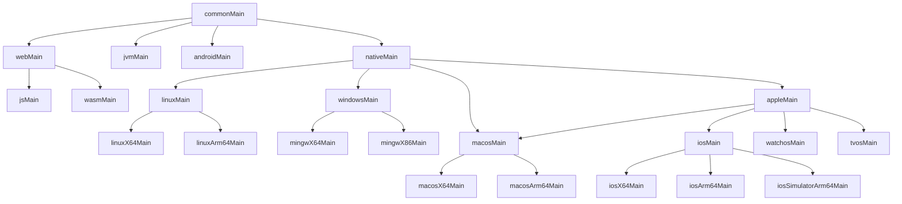

# core:platform

```mermaid
---
KMP 依赖关系逻辑图
---
graph TD
%% ===== Common =====
    commonMain["commonMain"]

%% ===== Web =====
    webMain["webMain"]
    jsMain["jsMain"]
    wasmMain["wasmMain"]

%% ===== JVM / Android =====
    jvmMain["jvmMain"]
    androidMain["androidMain"]

%% ===== Native Root =====
    nativeMain["nativeMain"]

%% ===== Linux =====
    linuxMain["linuxMain"]
    linuxX64Main["linuxX64Main"]
    linuxArm64Main["linuxArm64Main"]

%% ===== Windows =====
    windowsMain["windowsMain"]
    mingwX64Main["mingwX64Main"]
    mingwX86Main["mingwX86Main"]

%% ===== Apple / macOS =====
    appleMain["appleMain"]
    macosMain["macosMain"]
    macosX64Main["macosX64Main"]
    macosArm64Main["macosArm64Main"]

%% ===== iOS / watchOS / tvOS =====
    iosMain["iosMain"]
    iosX64Main["iosX64Main"]
    iosArm64Main["iosArm64Main"]
    iosSimArm64Main["iosSimulatorArm64Main"]

    watchosMain["watchosMain"]
    tvosMain["tvosMain"]

%% ===== Relations =====
    commonMain --> webMain
    commonMain --> jvmMain
    commonMain --> androidMain
    commonMain --> nativeMain

%% Web
    webMain --> jsMain
    webMain --> wasmMain

%% Native branches
    nativeMain --> linuxMain
    nativeMain --> windowsMain
    nativeMain --> macosMain
    nativeMain --> appleMain

%% Linux
    linuxMain --> linuxX64Main
    linuxMain --> linuxArm64Main

%% Windows
    windowsMain --> mingwX64Main
    windowsMain --> mingwX86Main

%% macOS (dual parent: native + apple)
    macosMain --> macosX64Main
    macosMain --> macosArm64Main
    appleMain --> macosMain

%% Apple
    appleMain --> iosMain
    appleMain --> watchosMain
    appleMain --> tvosMain

%% iOS
    iosMain --> iosX64Main
    iosMain --> iosArm64Main
    iosMain --> iosSimArm64Main


```
