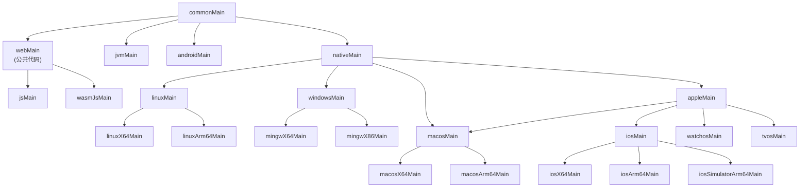

# core:platform

平台抽象模块，提供跨平台的平台检测、系统属性访问和依赖注入模块。

## 📋 功能特性

- ✅ **平台检测**：获取当前运行平台信息
- ✅ **系统属性访问**：跨平台的系统属性读取
- ✅ **依赖注入模块**：平台特定的 Koin 模块
- ✅ **WASM 支持**：完整支持 Kotlin/WASM 平台
- ✅ **代码复用**：Web 平台（JS/WASM）公共代码提取到 `webMain`
- ✅ **单元测试**：完整的测试覆盖

## 🎯 支持的平台

- **Android** - Android 平台
- **iOS** - iOS 平台（所有架构）
- **JVM** - 桌面应用（Windows、macOS、Linux）
- **JS** - Web 应用（Kotlin/JS）
- **WASM** - Web 应用（Kotlin/WASM）

## 📁 模块结构



### 源集说明

- **commonMain**：公共接口和期望函数
- **webMain**：Web 平台（JS/WASM）公共代码
  - `SystemProperty.web.kt` - Web 平台系统属性实现
  - `PlatformModule.web.kt` - Web 平台 DI 模块
- **jsMain**：JS 平台特定代码
  - `Platform.js.kt` - JS 平台实现
- **wasmJsMain**：WASM 平台特定代码
  - `Platform.wasmJs.kt` - WASM 平台实现
- **androidMain**：Android 平台特定代码
- **iosMain**：iOS 平台特定代码
- **jvmMain**：JVM 平台特定代码

## 🔧 主要 API

### 平台检测

```kotlin
// 获取当前平台
val platform = getPlatform()
println(platform.name) // 例如: "Android 34", "Web with Kotlin/JS"
```

### 系统属性

```kotlin
// 获取系统属性（平台特定）
val javaVersion = getSystemProperty("java.version")
// Android/JVM: 返回实际值
// iOS/Web: 返回 null（不支持）
```

### 依赖注入模块

```kotlin
// 在 Koin 模块中使用
val appModule = module {
    includes(platformModule()) // 平台特定模块
}
```

## 🧪 测试

模块包含完整的单元测试：

- **PlatformTest** - 平台检测测试
- **SystemPropertyTest** - 系统属性访问测试
- **PlatformModuleTest** - DI 模块测试

### 运行测试

```bash
# 运行所有平台的测试
./gradlew :core:platform:allTests

# 运行特定平台的测试
./gradlew :core:platform:jvmTest
./gradlew :core:platform:jsTest
./gradlew :core:platform:wasmJsTest
```

## 📝 设计说明

### Web 平台代码复用

- JS 和 WASM 的公共代码（`SystemProperty`、`PlatformModule`）提取到 `webMain`
- 平台特定的实现（`Platform`）分别放在 `jsMain` 和 `wasmJsMain`
- 符合 KMP 默认结构：`webMain` 是 `jsMain` 和 `wasmJsMain` 的父级源集

### 系统属性处理

- **Android/JVM**：使用 `System.getProperty()`，空 key 返回 `null`（避免异常）
- **iOS/Web**：返回 `null`（不支持系统属性）
- 所有平台统一行为：空 key 返回 `null`，不会抛出异常

## 🔗 相关模块

- `core:platform-compose` - Compose UI 平台抽象
- `core:logger` - 日志模块
