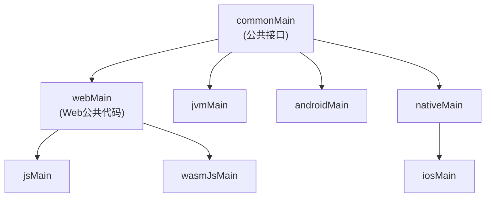

# MyHub 平台抽象模块方案设计

**方案名称**：Platform Infra v1  
**文档版本**：v1.0  
**文档类型**：技术方案设计文档  
**创建日期**：2026-01-13  
**锁定日期**：2026-01-13  
**最后更新**：2026-01-13  
**作者**：MyHub Development Team  
**评审状态**：🟢 通过  
**方案状态**：🔒 已锁定

---

## 📋 文档目录

1. [修改历史](#修改历史)
2. [方案状态摘要](#-方案状态摘要)
3. [问题背景](#1-问题背景)
4. [设计目标](#2-设计目标)
5. [技术调研](#3-技术调研)
6. [架构设计](#4-架构设计)
7. [实现细节](#5-实现细节)
8. [实施计划](#6-实施计划)
9. [风险评估](#7-风险评估)
10. [附录](#8-附录)

---

## 📊 方案状态摘要

**当前状态**：

- **评审状态**：🟢 通过（文档已通过评审，可以进入实施阶段）
- **方案状态**：🔒 已锁定 - 此版本已冻结，作为 Platform Infra v1 的基线设计
- **锁定日期**：2026-01-13
- **当前进度**：所有阶段已完成，方案设计已确定并锁定

**状态说明**：

- **评审状态**：用于标识文档的评审进度
  - 🟢 通过：文档已通过评审，可以进入实施阶段
  - 🟡 待评审：文档正在等待评审或评审进行中
  - 🔴 需修改：文档评审后需要修改
- **方案状态**：用于标识方案的实施进度
  - 🔒 已锁定：方案设计已确定，不允许随意修改
  - 📝 进行中：方案设计正在进行中，可以修改
  - ⏸️ 暂停：方案设计暂时停止，保留当前状态
- 详细状态定义请参考 [MyHub 架构设计文档规范](../../../docs/infra/myhub-infra-rules.md)

---

## 修改历史

| 版本 | 日期       | 修改内容                           | 修改原因           |
| ---- | ---------- | ---------------------------------- | ------------------ |
| v1.0 | 2026-01-13 | 初始方案设计                       | 新建               |
| v1.0 | 2026-01-13 | 完成架构设计文档                   | 完善文档           |
| v1.0 | 2026-01-13 | 更新状态：评审通过、方案已锁定     | 状态更新：评审通过 |

---

## 1. 问题背景

### 1.1 用户场景

在 MyHub 应用的开发和运行过程中，需要处理多个平台（Android、iOS、JVM、Web）的差异。典型的场景包括：

1. **平台检测**：应用运行时需要识别当前运行平台，以便执行平台特定的逻辑
2. **系统属性访问**：某些平台（如 Android、JVM）需要访问系统属性（如 Java 版本、系统版本等）
3. **依赖注入配置**：不同平台需要注册不同的依赖注入模块（如 Android 需要注册 `Context`，iOS 需要注册平台特定的服务）
4. **跨平台抽象**：在 KMP 项目中，需要为不同平台提供统一的抽象接口，隐藏平台实现细节
5. **构建变体支持**：需要支持不同的构建变体（dev/prod、free/premium）在不同平台上的配置

### 1.2 问题根因

在引入统一的平台抽象模块之前，MyHub 应用面临以下问题：

1. **平台检测分散**：各模块可能使用不同的方式检测平台，导致代码重复和不一致
2. **平台特定代码耦合**：业务代码直接使用平台特定的 API（如 Android 的 `Build.VERSION`、iOS 的 `UIDevice`），导致跨平台代码难以维护
3. **依赖注入配置分散**：平台特定的依赖注入配置分散在各处，难以统一管理
4. **系统属性访问不一致**：不同平台对系统属性的支持不同，缺乏统一的抽象
5. **扩展性差**：添加新的平台支持需要修改多处代码，扩展性差

### 1.3 影响范围

- **开发效率**：缺乏统一的平台抽象导致开发人员需要了解多个平台的 API，降低开发效率
- **代码维护**：平台特定代码分散，增加维护成本和出错风险
- **跨平台兼容性**：直接使用平台特定 API 导致代码难以在不同平台间复用
- **测试困难**：平台特定代码难以测试，特别是单元测试

---

## 2. 设计目标

### 2.1 功能目标

- ✅ **统一的平台检测接口**：提供统一的 `Platform` 接口和 `getPlatform()` 函数，隐藏平台实现细节
- ✅ **跨平台系统属性访问**：提供统一的 `getSystemProperty()` 函数，支持不同平台的系统属性访问
- ✅ **平台特定依赖注入模块**：提供统一的 `platformModule()` 函数，返回平台特定的 Koin 模块
- ✅ **多平台支持**：支持 Android、iOS、JVM、JS、WASM 等多个平台
- ✅ **构建变体支持**：支持 dev/prod、free/premium 等构建变体的平台配置
- ✅ **类型安全**：使用 Kotlin 的类型系统，提供类型安全的 API

### 2.2 非功能目标

- ✅ **性能优化**：平台检测和系统属性访问应该是轻量级的，不影响应用性能
- ✅ **易用性**：提供简洁、易用的 API，降低学习成本
- ✅ **可扩展性**：易于添加新的平台支持或新的平台相关功能
- ✅ **可测试性**：提供可测试的接口，支持单元测试和集成测试
- ✅ **代码复用**：最大化代码复用，减少重复代码

### 2.3 模块特性说明

**重要说明**：`core/platform` 模块是一个**混合（Mixed）模块**，与其他单一功能的 core 模块（如 `core/logger`、`core/app-build-config`）不同，它包含多个平台相关的功能：

1. **平台检测功能**：提供平台识别能力
2. **系统属性访问功能**：提供跨平台的系统属性读取能力
3. **依赖注入模块功能**：提供平台特定的依赖注入配置
4. **未来可能扩展的功能**：如平台特定的文件系统访问、网络配置等

这种混合设计是合理的，因为：

- 这些功能都与平台相关，属于同一领域
- 将它们放在同一个模块中可以减少模块数量，简化依赖关系
- 它们共享相同的平台抽象机制（expect/actual）
- 便于统一管理和维护平台相关的代码

---

## 3. 技术调研

### 3.1 技术选型

#### 3.1.1 Kotlin Multiplatform expect/actual 机制

**选择理由**：

- ✅ **KMP 原生支持**：Kotlin Multiplatform 提供的 expect/actual 机制是跨平台抽象的标准方式
- ✅ **编译时检查**：expect/actual 机制在编译时检查，确保所有平台都提供了实现
- ✅ **类型安全**：使用 Kotlin 的类型系统，提供类型安全的 API
- ✅ **零运行时开销**：expect/actual 在编译时解析，运行时无额外开销
- ✅ **IDE 支持**：IDE 可以自动生成 actual 实现，提高开发效率

#### 3.1.2 Koin 依赖注入框架

**选择理由**：

- ✅ **KMP 支持**：Koin 是支持 Kotlin Multiplatform 的依赖注入框架
- ✅ **轻量级**：Koin 是纯 Kotlin 实现，无需代码生成，编译速度快
- ✅ **易用性**：API 简洁，学习成本低
- ✅ **模块化**：支持模块化的依赖注入配置，适合平台特定的配置

### 3.2 平台支持策略

#### 3.2.1 支持的平台

| 平台    | 支持状态    | 说明                 |
| ------- | ----------- | -------------------- |
| Android | ✅ 完全支持 | 使用 Android SDK API |
| iOS     | ✅ 完全支持 | 使用 iOS SDK API     |
| JVM     | ✅ 完全支持 | 使用 Java 标准库 API |
| JS      | ✅ 完全支持 | Kotlin/JS 平台       |
| WASM    | ✅ 完全支持 | Kotlin/WASM 平台     |

#### 3.2.2 平台特定实现策略

- **Android**：使用 `android.os.Build` 获取平台信息，使用 `System.getProperty()` 获取系统属性
- **iOS**：使用 `platform.UIKit.UIDevice` 获取平台信息，系统属性返回 `null`（不支持）
- **JVM**：使用 `System.getProperty()` 获取平台信息和系统属性
- **JS/WASM**：使用 JavaScript API 获取平台信息，系统属性返回 `null`（不支持）

### 3.3 代码复用策略

#### 3.3.1 Web 平台代码复用

- **webMain Source Set**：JS 和 WASM 的公共代码提取到 `webMain` Source Set
- **符合 KMP 结构**：`webMain` 是 `jsMain` 和 `wasmJsMain` 的父级源集，符合 KMP 默认结构
- **减少重复代码**：`SystemProperty` 和 `PlatformModule` 的 Web 实现放在 `webMain`，避免重复

---

## 4. 架构设计

### 4.1 整体架构

```text
┌─────────────────────────────────────────────────────────────┐
│                     应用层（Application）                      │
│  ┌──────────────┐  ┌──────────────┐  ┌──────────────┐      │
│  │  Feature A   │  │  Feature B   │  │  Feature C   │      │
│  └──────┬───────┘  └──────┬───────┘  └──────┬───────┘      │
└─────────┼──────────────────┼──────────────────┼──────────────┘
          │                  │                  │
          └──────────────────┼──────────────────┘
                             │
          ┌──────────────────▼──────────────────┐
          │      core:platform 模块             │
          │  (混合模块 - 平台相关功能集合)        │
          │                                     │
          │  ┌──────────────────────────────┐   │
          │  │    Platform API             │   │
          │  │  (平台检测接口)              │   │
          │  └──────────────┬─────────────┘   │
          │                 │                  │
          │  ┌──────────────┼──────────────┐   │
          │  │              │              │   │
          │  ▼              ▼              ▼   │
          │  ┌──────────┐  ┌──────────┐  ┌──────────┐
          │  │Platform  │  │System    │  │Platform  │
          │  │Detection │  │Property  │  │Module    │
          │  │          │  │Access    │  │(DI)      │
          │  └────┬─────┘  └────┬─────┘  └────┬─────┘
          │       │             │             │
          │       │             │             │
          │  ┌────▼─────────────▼─────────────▼─────┐
          │  │     expect/actual 机制               │
          │  │  (平台特定实现抽象)                  │
          │  └──────────────────────────────────────┘
          └──────────────────┬───────────────────────┘
                             │
          ┌──────────────────▼──────────────────┐
          │      KMP Source Sets               │
          │                                     │
          │  ┌──────────────┐  ┌──────────────┐ │
          │  │  commonMain  │  │  webMain     │ │
          │  │  (公共接口)  │  │  (Web公共)   │ │
          │  └──────┬───────┘  └──────┬───────┘ │
          │         │                 │         │
          │  ┌───────┼─────────────────┼───────┐ │
          │  │       │                 │       │ │
          │  ▼       ▼       ▼         ▼       ▼ │
          │  ┌──────┐ ┌──────┐ ┌──────┐ ┌──────┐ │
          │  │android│ │ ios │ │ jvm │ │ js/  │ │
          │  │ Main  │ │Main │ │Main │ │wasmJs│ │
          │  └──────┘ └──────┘ └──────┘ └──────┘ │
          └─────────────────────────────────────┘
                             │
          ┌──────────────────▼──────────────────┐
          │      平台特定实现                    │
          │  - Android: Build.VERSION           │
          │  - iOS: UIDevice                    │
          │  - JVM: System.getProperty()        │
          │  - Web: navigator.userAgent         │
          └─────────────────────────────────────┘
```

### 4.2 核心组件设计

#### 4.2.1 Platform 接口

`Platform` 接口定义了平台信息的抽象：

```kotlin
package tech.zhifu.app.myhub

interface Platform {
    val name: String
}

expect fun getPlatform(): Platform
```

**设计要点**：

- 使用 `interface` 定义平台信息契约
- 提供 `name` 属性，返回平台名称和版本信息
- 使用 `expect` 函数声明，各平台提供 `actual` 实现

#### 4.2.2 SystemProperty 函数

`getSystemProperty()` 函数提供跨平台的系统属性访问：

```kotlin
package tech.zhifu.app.myhub.system

expect fun getSystemProperty(key: String): String?
```

**设计要点**：

- 返回 `String?`，不支持的平台返回 `null`
- 空 key 返回 `null`，避免异常
- 各平台根据自身能力提供实现

#### 4.2.3 PlatformModule 函数

`platformModule()` 函数提供平台特定的依赖注入模块：

```kotlin
package tech.zhifu.app.myhub.di

import org.koin.core.module.Module

expect fun platformModule(): Module
```

**设计要点**：

- 返回 Koin `Module`，各平台注册平台特定的依赖
- Android 平台注册 `Context`
- iOS 平台可以注册平台特定的服务
- JVM 平台可以注册平台特定的配置

### 4.3 模块结构

```text
core/platform/
├── build.gradle.kts              # 模块构建配置
├── README.md                     # 模块说明文档
├── docs/                         # 架构设计文档
│   └── myhub-platform-infra-v1.0.md
└── src/
    ├── commonMain/               # 公共接口和期望函数
    │   └── kotlin/tech/zhifu/app/myhub/
    │       ├── Platform.kt                    # Platform 接口
    │       ├── system/
    │       │   └── SystemProperty.kt          # 系统属性访问接口
    │       └── di/
    │           └── PlatformModule.kt          # DI 模块接口
    │
    ├── webMain/                  # Web 平台（JS/WASM）公共代码
    │   └── kotlin/tech/zhifu/app/myhub/
    │       ├── system/
    │       │   └── SystemProperty.web.kt     # Web 系统属性实现
    │       └── di/
    │           └── PlatformModule.web.kt      # Web DI 模块实现
    │
    ├── androidMain/              # Android 平台特定实现
    │   └── kotlin/tech/zhifu/app/myhub/
    │       ├── Platform.android.kt            # Android 平台实现
    │       ├── system/
    │       │   └── SystemProperty.android.kt  # Android 系统属性实现
    │       └── di/
    │           └── PlatformModule.android.kt  # Android DI 模块实现
    │
    ├── iosMain/                  # iOS 平台特定实现
    │   └── kotlin/tech/zhifu/app/myhub/
    │       ├── Platform.ios.kt                # iOS 平台实现
    │       ├── system/
    │       │   └── SystemProperty.ios.kt      # iOS 系统属性实现
    │       └── di/
    │           └── PlatformModule.ios.kt      # iOS DI 模块实现
    │
    ├── jvmMain/                  # JVM 平台特定实现
    │   └── kotlin/tech/zhifu/app/myhub/
    │       ├── Platform.jvm.kt                # JVM 平台实现
    │       ├── system/
    │       │   └── SystemProperty.jvm.kt      # JVM 系统属性实现
    │       └── di/
    │           └── PlatformModule.jvm.kt      # JVM DI 模块实现
    │
    ├── jsMain/                   # JS 平台特定实现
    │   └── kotlin/tech/zhifu/app/myhub/
    │       └── Platform.js.kt                 # JS 平台实现
    │
    ├── wasmJsMain/               # WASM 平台特定实现
    │   └── kotlin/tech/zhifu/app/myhub/
    │       └── Platform.wasmJs.kt             # WASM 平台实现
    │
    ├── devMain/                  # 开发环境配置（构建变体）
    │   └── kotlin/tech/zhifu/app/myhub/
    │       └── config/
    │
    ├── prodMain/                 # 生产环境配置（构建变体）
    │   └── kotlin/tech/zhifu/app/myhub/
    │       └── config/
    │
    ├── freeMain/                 # 免费版配置（构建变体）
    │   └── kotlin/tech/zhifu/app/myhub/
    │       └── config/
    │
    ├── premiumMain/              # 高级版配置（构建变体）
    │   └── kotlin/tech/zhifu/app/myhub/
    │       └── config/
    │
    └── commonTest/               # 公共测试代码
        └── kotlin/tech/zhifu/app/myhub/
            ├── PlatformTest.kt                # Platform 测试
            ├── system/
            │   └── SystemPropertyTest.kt      # SystemProperty 测试
            └── di/
                └── PlatformModuleTest.kt      # PlatformModule 测试
```

### 4.4 平台实现关系图



---

## 5. 实现细节

### 5.1 关键 API 设计

#### 5.1.1 Platform 接口和实现

**公共接口**：

```kotlin
package tech.zhifu.app.myhub

interface Platform {
    val name: String
}

expect fun getPlatform(): Platform
```

**Android 实现**：

```kotlin
package tech.zhifu.app.myhub

import android.os.Build

class AndroidPlatform : Platform {
    override val name: String = "Android ${Build.VERSION.SDK_INT}"
}

actual fun getPlatform(): Platform = AndroidPlatform()
```

**iOS 实现**：

```kotlin
package tech.zhifu.app.myhub

import platform.UIKit.UIDevice

class IOSPlatform : Platform {
    override val name: String = UIDevice.currentDevice.systemName() + " " +
                                UIDevice.currentDevice.systemVersion
}

actual fun getPlatform(): Platform = IOSPlatform()
```

**JVM 实现**：

```kotlin
package tech.zhifu.app.myhub

class JVMPlatform : Platform {
    override val name: String = "Java ${System.getProperty("java.version")}"
}

actual fun getPlatform(): Platform = JVMPlatform()
```

**JS 实现**：

```kotlin
package tech.zhifu.app.myhub

class JSPlatform : Platform {
    override val name: String = "Web with Kotlin/JS"
}

actual fun getPlatform(): Platform = JSPlatform()
```

**WASM 实现**：

```kotlin
package tech.zhifu.app.myhub

class WASMPlatform : Platform {
    override val name: String = "Web with Kotlin/WASM"
}

actual fun getPlatform(): Platform = WASMPlatform()
```

#### 5.1.2 SystemProperty 函数实现

**公共接口**：

```kotlin
package tech.zhifu.app.myhub.system

expect fun getSystemProperty(key: String): String?
```

**Android 实现**：

```kotlin
package tech.zhifu.app.myhub.system

actual fun getSystemProperty(key: String): String? {
    return if (key.isBlank()) null else System.getProperty(key)
}
```

**JVM 实现**：

```kotlin
package tech.zhifu.app.myhub.system

actual fun getSystemProperty(key: String): String? {
    return if (key.isBlank()) null else System.getProperty(key)
}
```

**iOS 实现**：

```kotlin
package tech.zhifu.app.myhub.system

actual fun getSystemProperty(key: String): String? = null
```

**Web 实现**（webMain）：

```kotlin
package tech.zhifu.app.myhub.system

actual fun getSystemProperty(key: String): String? = null
```

#### 5.1.3 PlatformModule 函数实现

**公共接口**：

```kotlin
package tech.zhifu.app.myhub.di

import org.koin.core.module.Module

expect fun platformModule(): Module
```

**Android 实现**：

```kotlin
package tech.zhifu.app.myhub.di

import android.content.Context
import org.koin.core.module.Module
import org.koin.dsl.module

actual fun platformModule(): Module = module {
    single<Context> { get<android.app.Application>().applicationContext }
}
```

**iOS 实现**：

```kotlin
package tech.zhifu.app.myhub.di

import org.koin.core.module.Module
import org.koin.dsl.module

actual fun platformModule(): Module = module {
    // iOS 平台特定的依赖注入配置
    // 可以根据需要添加 iOS 特定的服务
}
```

**JVM 实现**：

```kotlin
package tech.zhifu.app.myhub.di

import org.koin.core.module.Module
import org.koin.dsl.module

actual fun platformModule(): Module = module {
    // JVM 平台特定的依赖注入配置
    // 可以根据需要添加 JVM 特定的服务
}
```

**Web 实现**（webMain）：

```kotlin
package tech.zhifu.app.myhub.di

import org.koin.core.module.Module
import org.koin.dsl.module

actual fun platformModule(): Module = module {
    // Web 平台特定的依赖注入配置
    // 可以根据需要添加 Web 特定的服务
}
```

### 5.2 使用示例

#### 5.2.1 平台检测

```kotlin
import tech.zhifu.app.myhub.getPlatform

fun main() {
    val platform = getPlatform()
    println("当前平台: ${platform.name}")
    // Android: "Android 34"
    // iOS: "iOS 17.0"
    // JVM: "Java 17.0.1"
    // JS: "Web with Kotlin/JS"
    // WASM: "Web with Kotlin/WASM"
}
```

#### 5.2.2 系统属性访问

```kotlin
import tech.zhifu.app.myhub.system.getSystemProperty

fun main() {
    val javaVersion = getSystemProperty("java.version")
    // Android/JVM: 返回实际值，如 "17.0.1"
    // iOS/Web: 返回 null（不支持）

    if (javaVersion != null) {
        println("Java 版本: $javaVersion")
    } else {
        println("当前平台不支持系统属性访问")
    }
}
```

#### 5.2.3 依赖注入模块

```kotlin
import org.koin.core.context.startKoin
import tech.zhifu.app.myhub.di.platformModule

fun main() {
    startKoin {
        modules(
            platformModule(), // 平台特定的模块
            // 其他模块...
        )
    }

    // 在 Android 平台上，可以获取 Context
    // val context: Context = get()
}
```

### 5.3 测试策略

#### 5.3.1 单元测试

**PlatformTest**：

```kotlin
package tech.zhifu.app.myhub

import kotlin.test.Test
import kotlin.test.assertNotNull
import kotlin.test.assertTrue

class PlatformTest {
    @Test
    fun testGetPlatform() {
        val platform = getPlatform()
        assertNotNull(platform)
        assertTrue(platform.name.isNotBlank())
    }
}
```

**SystemPropertyTest**：

```kotlin
package tech.zhifu.app.myhub.system

import kotlin.test.Test
import kotlin.test.assertNull

class SystemPropertyTest {
    @Test
    fun testGetSystemPropertyWithBlankKey() {
        val result = getSystemProperty("")
        assertNull(result)
    }

    @Test
    fun testGetSystemPropertyWithInvalidKey() {
        val result = getSystemProperty("invalid.key")
        // 根据平台不同，可能返回 null 或实际值
    }
}
```

**PlatformModuleTest**：

```kotlin
package tech.zhifu.app.myhub.di

import org.koin.core.context.startKoin
import org.koin.core.context.stopKoin
import org.koin.test.check.checkModules
import kotlin.test.AfterTest
import kotlin.test.BeforeTest
import kotlin.test.Test

class PlatformModuleTest {
    @BeforeTest
    fun setup() {
        startKoin {
            modules(platformModule())
        }
    }

    @AfterTest
    fun tearDown() {
        stopKoin()
    }

    @Test
    fun testPlatformModule() {
        checkModules {
            platformModule()
        }
    }
}
```

---

## 6. 实施计划

### 6.1 实施阶段

#### 阶段 1：基础架构搭建（已完成）

- ✅ 创建 `core/platform` 模块
- ✅ 定义公共接口（Platform、SystemProperty、PlatformModule）
- ✅ 实现 Android 平台支持
- ✅ 实现 iOS 平台支持
- ✅ 实现 JVM 平台支持
- ✅ 实现 JS 平台支持
- ✅ 实现 WASM 平台支持
- ✅ 创建 Web 平台公共代码（webMain）
- ✅ 编写单元测试

#### 阶段 2：文档完善（已完成）

- ✅ 创建架构设计文档
- ✅ 完善使用文档
- ✅ 添加代码示例
- ✅ 添加最佳实践指南

#### 阶段 3：功能扩展（持续进行）

- 🔄 添加平台特定的文件系统访问（如需要）
- 🔄 添加平台特定的网络配置（如需要）
- 🔄 添加平台特定的权限管理（如需要）
- 🔄 支持更多构建变体的平台配置

**说明**：功能扩展将根据实际需求持续进行，不设固定时间表。

### 6.2 里程碑

| 里程碑             | 目标日期   | 状态         |
| ------------------ | ---------- | ------------ |
| 基础架构完成       | 2026-01-13 | ✅ 已完成     |
| 文档完善           | 2026-01-13 | ✅ 已完成     |
| 功能扩展（如需要） | 持续进行   | 🔄 持续进行   |

---

## 7. 风险评估

### 7.1 技术风险

#### 风险 1：平台 API 变更

**风险描述**：平台 SDK 更新可能导致 API 变更，影响平台实现。

**影响程度**：中

**应对措施**：

- 使用稳定的平台 API，避免使用实验性 API
- 定期更新平台 SDK，及时适配 API 变更
- 编写测试用例，确保平台实现正确

#### 风险 2：性能问题

**风险描述**：平台检测和系统属性访问可能影响应用性能。

**影响程度**：低

**应对措施**：

- 平台检测和系统属性访问是轻量级操作，性能影响可忽略
- 使用延迟初始化，避免不必要的计算
- 进行性能测试，确保不影响应用性能

### 7.2 维护风险

#### 风险 1：代码复杂度增加

**风险描述**：作为混合模块，包含多个功能，可能导致代码复杂度增加。

**影响程度**：中

**应对措施**：

- 保持清晰的模块结构，每个功能独立实现
- 使用包结构组织代码，避免功能耦合
- 编写清晰的文档，说明模块的混合特性
- 定期重构，保持代码简洁

#### 风险 2：扩展性限制

**风险描述**：未来可能需要添加更多平台相关功能，可能超出模块职责范围。

**影响程度**：低

**应对措施**：

- 在添加新功能前，评估是否属于平台相关功能
- 如果功能过于复杂或独立，考虑创建新的模块
- 保持模块职责清晰，避免功能膨胀

### 7.3 兼容性风险

#### 风险 1：新平台支持

**风险描述**：未来可能需要支持新的平台（如 watchOS、tvOS 等）。

**影响程度**：低

**应对措施**：

- 使用 KMP 的 expect/actual 机制，易于添加新平台支持
- 保持接口稳定，新平台只需实现 actual 函数
- 编写平台实现指南，降低新平台接入成本

---

## 8. 附录

### 8.1 相关文档

- [MyHub 基础设施文档](../../../docs/infra/myhub-infra.md)
- [MyHub 架构设计文档规范](../../../docs/infra/myhub-infra-rules.md)
- [Kotlin Multiplatform 官方文档](https://kotlinlang.org/docs/multiplatform.html)
- [Koin 官方文档](https://insert-koin.io/)

### 8.2 参考实现

- `core/platform` 模块实现代码
- 其他 core 模块的架构设计文档（如 `core/logger`、`core/app-build-config`）

### 8.3 术语表

| 术语           | 说明                                           |
| -------------- | ---------------------------------------------- |
| KMP            | Kotlin Multiplatform，Kotlin 多平台框架        |
| expect/actual  | KMP 提供的跨平台抽象机制                       |
| Source Set     | KMP 中的源集，用于组织不同平台的代码           |
| 混合模块       | 包含多个相关功能的模块，而非单一功能           |
| Platform       | 平台抽象接口，提供平台信息                     |
| SystemProperty | 系统属性访问函数，提供跨平台的系统属性读取能力 |
| PlatformModule | 平台特定的依赖注入模块                         |

### 8.4 常见问题

#### Q1: 为什么 `core/platform` 是混合模块？

**A**: `core/platform` 模块包含多个平台相关的功能（平台检测、系统属性访问、依赖注入模块），这些功能都与平台相关，属于同一领域。将它们放在同一个模块中可以减少模块数量，简化依赖关系，便于统一管理和维护。

#### Q2: 如何添加新的平台支持？

**A**: 添加新平台支持需要：

1. 在 `build.gradle.kts` 中添加新平台的插件配置
2. 创建对应的 Source Set（如 `watchosMain`）
3. 实现 `Platform`、`SystemProperty`、`PlatformModule` 的 actual 函数
4. 编写测试用例

#### Q3: 系统属性访问在不同平台上的行为是什么？

**A**:

- **Android/JVM**：使用 `System.getProperty()`，返回实际值
- **iOS/Web**：返回 `null`（不支持系统属性）
- **所有平台**：空 key 返回 `null`，不会抛出异常

#### Q4: 如何测试平台特定的代码？

**A**:

- 使用 `commonTest` Source Set 编写公共测试代码
- 使用平台特定的测试框架（如 JUnit for JVM）
- 使用 KMP 的测试机制，确保所有平台都有测试覆盖

---

## 文档结束
