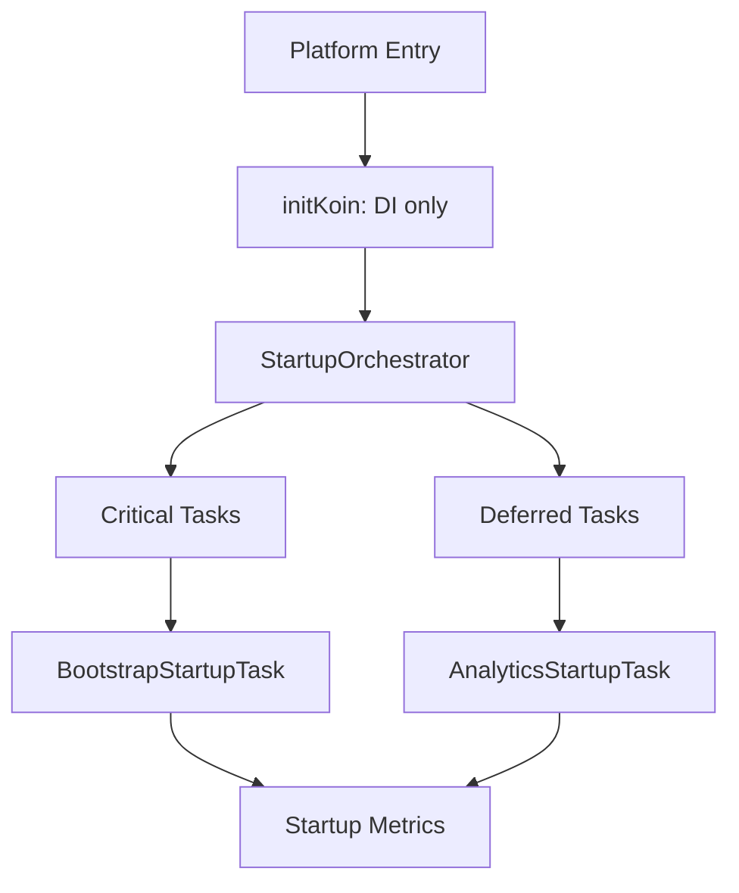

# MyHub KMP 启动初始化方案设计

- 文档版本：`v1.0.1`
- 文档类型：`技术方案设计文档（Infra）`
- 创建日期：`2026-03-09`
- 最后更新：`2026-03-09`
- 作者：`MyHub Infra / AI Copilot`
- 评审状态：`🟢 通过`
- 方案状态：`🔒 已锁定`

## 修改历史

| 版本     | 日期         | 修改内容                                 | 修改原因           |
|--------|------------|--------------------------------------|----------------|
| v1.0.1 | 2026-03-09 | 文档迁移至 `core/startup`；补充失败重试策略；更新模块落点 | 与代码结构对齐并增强可用性  |
| v1.0   | 2026-03-09 | 初版方案：启动初始化 SOP、选型对比、落地计划与风险          | 规范化治理 KMP 启动任务 |

## 📊 方案状态摘要

**当前状态**：

- **评审状态**：🟢 通过（文档已通过评审，可以进入实施阶段）
- **方案状态**：🔒 已锁定 - 此版本已冻结，作为 Startup Infra v1 的基线设计
- **锁定日期**：2026-03-09
- **当前进度**：所有核心阶段已完成，方案设计已确定并锁定

**状态说明**：

- **评审状态**：用于标识文档的评审进度
  - 🟢 通过：文档已通过评审，可以进入实施阶段
  - 🟡 待评审：文档正在等待评审或评审进行中
  - 🔴 需修改：文档评审后需要修改
- **方案状态**：用于标识方案的实施进度
  - 🔒 已锁定：方案设计已确定，不允许随意修改
  - 📝 进行中：方案设计正在进行中，可以修改
  - ⏸️ 暂停：方案设计暂时停止，保留当前状态
- 详细状态定义请参考 [MyHub 架构设计文档规范](../../../docs/infra/myhub-infra-rules.md)

## 目录

1. [问题背景 / 动机](#1-问题背景--动机)
2. [设计目标](#2-设计目标)
3. [技术调研 / 方案对比](#3-技术调研--方案对比)
4. [架构设计 / 方案设计](#4-架构设计--方案设计)
5. [实现细节](#5-实现细节)
6. [实施计划](#6-实施计划)
7. [风险评估](#7-风险评估)
8. [测试策略](#8-测试策略)
9. [边界与非目标](#9-边界与非目标)
10. [参考出处](#10-参考出处)

## 1. 问题背景 / 动机

### 1.1 用户场景

应用启动时需完成一批初始化任务（如 bootstrap、analytics、配置预热等），要求：

- 首屏尽快可用。
- 关键任务可控完成。
- 非关键任务不阻塞启动。

### 1.2 根因分析

当前存在 `delay + get()` 的时序规避实现，主要问题：

- 依赖“时间猜测”而非生命周期/依赖声明。
- DI 装配与业务启动耦合，难测试、难演进。
- 缺少统一编排，新增任务容易引入隐式依赖与竞态。

### 1.3 影响范围

- 影响平台：Android、iOS、Desktop(JVM)、Web/JS、Wasm。
- 影响模块：`composeApp` 启动入口、`di/Koin.kt`、`core/analytics`、`bootstrap`。

## 2. 设计目标

### 2.1 功能目标

- 提供统一 `StartupTask` 声明模型。
- 支持任务分级（Critical/Deferred）与依赖关系。
- 支持幂等执行、失败隔离、可重试。

### 2.2 非功能目标

- 启动关键路径可观测（耗时、失败率）。
- 跨平台一致行为，commonMain 尽量复用。
- 与现有 Koin 架构保持一致，低迁移成本。

## 3. 技术调研 / 方案对比

### 3.1 候选方案

- 方案 A：继续使用手写协程启动（`delay + launch`）。
- 方案 B：基于 Koin + Coroutines 实现 Startup Orchestrator（推荐）。
- 方案 C：切换到编译期 DI（`kotlin-inject`）并重构启动链路。

### 3.2 对比表

| 维度       | 方案 A：手写启动 | 方案 B：Koin + Orchestrator | 方案 C：编译期 DI 重构 |
|----------|-----------|--------------------------|----------------|
| 改造成本     | 低         | 中                        | 高              |
| 时序稳定性    | 低         | 高                        | 高              |
| 与现有架构一致性 | 中         | 高                        | 低-中            |
| 可观测性     | 低         | 高                        | 高              |
| 落地速度     | 快         | 快-中                      | 慢              |
| 结论       | 不推荐       | 推荐                       | 后续评估           |

### 3.3 推荐方案

推荐 **方案 B**：在现有 Koin 上引入统一 Startup Orchestrator，并使用 `kotlinx.coroutines` 做结构化并发与幂等控制。

## 4. 架构设计 / 方案设计

### 4.1 总体架构



### 4.2 核心组件

- `StartupTask`：任务契约（`id/critical/dependencies/version/run`）。
- `StartupOrchestrator`：任务排序、调度、失败策略、指标上报。
- `StartupReporter`（可选）：统一记录耗时和状态。

### 4.3 数据流与状态流

1. 平台入口触发 orchestrator。
2. orchestrator 先执行 critical，再并发执行 deferred。
3. 每个任务上报状态：`Success/Failed/Skipped/Retried`。

### 4.4 KMP 平台差异处理

- commonMain：任务模型、调度逻辑、重试策略、指标协议。
- platformMain：平台特定日志、启动打点、必要的入口挂载。
- 平台抽象：必要时通过 `expect/actual` 提供时钟、设备信息、平台日志桥接。

## 5. 实现细节

### 5.1 接口设计（示例）

```kotlin
interface StartupTask {
    val id: String
    val critical: Boolean
    val dependencies: Set<String>
    val version: Int
    suspend fun run()
}
```

### 5.2 并发与幂等策略

- 调度层使用 `supervisorScope`，非关键任务失败不影响其它任务。
- 任务内部使用 `Mutex.withLock + initialized flag` 防重入。
- 失败不置位，允许重试。

### 5.3 与 Koin 集成

- `initKoin()` 只做依赖装配，不写业务初始化。
- 通过 `single(createdAtStart = true)` 启动 orchestrator 或在入口显式触发。
- 非关键模块可结合 `lazyModules` 分摊启动负载。

### 5.4 MyHub 代码落点

- 新增：`core/startup/src/commonMain/...`（启动框架与编排器）
- 新增：`core/analytics/src/commonMain/.../startup/AnalyticsStartupTask.kt`
- 新增：`datastore/bootstrap/src/commonMain/.../startup/BootstrapStartupTask.kt`
- 调整：`composeApp/.../di/Koin.kt`（接入 `startupModule()`，移除 `delay + get()`）
- 调整：`core/analytics/.../AnalyticsManager.initialize()`（幂等化）

### 5.5 失败重试策略

#### 5.5.1 适用范围

- `Critical` 任务：允许有限重试，超过阈值后中断启动流程并上报错误。
- `Deferred` 任务：允许有限重试，超过阈值后降级为失败，不阻塞应用可用性。

#### 5.5.2 策略参数（建议默认值）

| 参数               | 建议值  | 说明                |
|------------------|------|-------------------|
| `maxAttempts`    | 3    | 总尝试次数（含首次执行）      |
| `initialDelayMs` | 200  | 首次重试前等待时间         |
| `maxDelayMs`     | 3000 | 重试等待上限            |
| `backoffFactor`  | 2.0  | 指数退避倍率            |
| `jitterRatio`    | 0.2  | 随机抖动比例，避免同批任务同时重试 |

#### 5.5.3 执行规则

1. 首次失败后进入重试流程；成功即终止后续重试。
2. 使用指数退避：`delay = min(maxDelayMs, initialDelayMs * backoffFactor^(attempt-1))`。
3. 每次延迟叠加抖动：`finalDelay = delay * (1 ± jitterRatio)`。
4. 仅对可恢复错误重试（网络超时、临时 IO 异常等）；参数错误、配置错误等快速失败。
5. 达到 `maxAttempts` 后：
    - `Critical`：抛出异常并中断 startup。
    - `Deferred`：记录最终失败并继续其他任务。

#### 5.5.4 观测要求

- 记录每次尝试：`taskId`、`attempt`、`errorType`、`nextDelayMs`、`result`。
- 聚合指标：`retryCount`、`retrySuccessRate`、`finalFailureRate`、`p95RetryLatency`。

#### 5.5.5 参考伪代码

```kotlin
suspend fun runWithRetry(task: StartupTask, policy: RetryPolicy) {
    var attempt = 1
    var lastError: Throwable? = null
    while (attempt <= policy.maxAttempts) {
        runCatching { task.run() }.onSuccess { return }
            .onFailure { error -> lastError = error }

        if (attempt == policy.maxAttempts || !isRetryable(lastError)) break
        delay(policy.nextDelayMs(attempt))
        attempt++
    }
    throw lastError ?: IllegalStateException("Startup task failed without error")
}
```

## 6. 实施计划

### 6.1 阶段划分

1. Phase 1：抽象 `StartupTask` 与 `StartupOrchestrator`
2. Phase 2：接入 `Bootstrap` 和 `Analytics`
3. Phase 3：补齐观测与重试策略
4. Phase 4：补齐测试并灰度验证

### 6.2 里程碑

- M1：无 `delay` 时序等待。
- M2：关键路径稳定，非关键失败不阻塞启动。
- M3：跨平台启动行为一致并有指标可观测。

### 6.3 当前进度说明

- 当前状态：`📝 方案进行中`，待评审后进入实现。

## 7. 风险评估

| 风险        | 等级 | 说明                  | 缓解措施          |
|-----------|----|---------------------|---------------|
| 任务依赖配置错误  | 中  | 拓扑排序失败或执行顺序错误       | 启动前依赖校验 + 单测  |
| 幂等实现不完整   | 高  | 重复初始化导致重复注册/副作用     | 统一幂等模板 + 并发测试 |
| 平台入口行为不一致 | 中  | 某平台未触发 orchestrator | 各平台入口检查清单     |
| 启动耗时波动    | 中  | 关键任务过多拖慢首屏          | 关键任务瘦身 + 指标监控 |

## 8. 测试策略

- 单元测试：
    - 重复执行只生效一次。
    - 并发执行无竞态副作用。
    - 依赖排序正确、循环依赖可检测。
- 集成测试：
    - 各平台启动链路可执行。
    - 非关键任务失败不影响主流程。
- 回归验证：
    - 启动指标（critical 时长、失败率）满足阈值。

## 9. 边界与非目标

- 本方案不重构业务功能逻辑，仅规范“启动初始化链路”。
- 本期不切换 DI 框架（`kotlin-inject` 仅保留为后续评估项）。
- 本期不引入重量级任务调度中间件。

## 10. 参考出处

- Koin KMP: <https://insert-koin.io/docs/reference/koin-mp/kmp>
- Koin Definitions（`createdAtStart`）: <https://insert-koin.io/docs/reference/koin-core/definitions>
- Koin Lazy Modules: <https://insert-koin.io/docs/reference/koin-core/lazy-modules/>
- Koin Starting Koin: <https://insert-koin.io/docs/reference/koin-core/starting-koin/>
- Kotlin Coroutines（组合挂起函数/结构化并发）: <https://kotlinlang.org/docs/composing-suspending-functions.html>
- `supervisorScope` API: <https://kotlinlang.org/api/kotlinx.coroutines/kotlinx-coroutines-core/kotlinx.coroutines/supervisor-scope.html>
- `Mutex` API: <https://kotlinlang.org/api/kotlinx.coroutines/kotlinx-coroutines-core/kotlinx.coroutines.sync/-mutex/>
- Kotlin Multiplatform expect/actual: <https://kotlinlang.org/docs/multiplatform/multiplatform-expect-actual.html>
- Multiplatform Settings: <https://github.com/russhwolf/multiplatform-settings>
- kotlin-inject: <https://github.com/evant/kotlin-inject>
- AndroidX App Startup: <https://developer.android.com/topic/libraries/app-startup>
- Android 启动性能指标: <https://developer.android.com/topic/performance/vitals/launch-time>
- Apple 启动优化: <https://developer.apple.com/documentation/xcode/reducing-your-app-s-launch-time>
