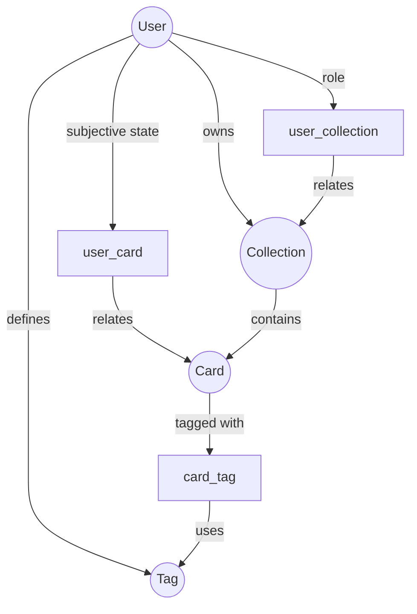

# MyHub 领域模型图

> **文档定位**：
> 本文档用于从“领域模型（Domain Model）”视角，描述 MyHub v0.1 中的核心实体、它们之间的关系，以及每种关系在产品与数据层面的真实含义。
>
> 目标不是画 ER 图，而是：
> - 帮助产品 / 设计 / 工程对齐心智模型
> - 防止把“主观关系”误当成“实体属性”

---

## 一、核心领域对象（Entities）

MyHub v0.1 的核心领域对象只有四个：

- **User**：系统中的身份主体
- **Card**：内容事实（最小内容单元）
- **Collection**：结构化内容容器
- **Tag**：用户私有的语义工具

其余所有表，都是它们之间的 **关系（Relation）** 或 **扩展语义（Metadata）**。

---

## 二、领域模型总览（Mermaid）

---

## 三、逐关系语义说明（非常重要）

### 3.1 User → Card（user_card）

> **这是“主观关系”，不是事实关系**

含义：

- 我是否喜欢这张卡片
- 我是否看过 / 何时复看

特点：

- 同一张 Card，不同 User 状态完全不同
- 永远不允许合并进 Card 表

---

### 3.2 User → Collection（user_collection）

> **这是“权限关系”，不是所有权事实**

含义：

- 我能否查看 / 编辑 / 管理该 Collection

说明：

- role 描述能力，而不是归属
- owner 是权限角色之一，但不等同于数据所有权

---

### 3.3 Collection → User（owner）

> **这是“数据归属关系”，不是权限关系**

实现：

- collection.user_id

含义：

- 谁创建了这个 Collection
- 谁对其生命周期负责

> ⚠️ `这是 v0.1 阶段必须存在的关系`

---

### 3.4 Collection → Card

> **这是“结构关系”**

含义：

- Card 被组织进某个主题 / 卡集
- Card 本身不依附于 Collection 存在

特点：

- Card 可以存在于多个 Collection（未来）
- Collection 是使用视角，不是内容事实

---

### 3.5 User → Tag

> **这是“语义定义关系”**

含义：

- Tag 属于用户私有语义空间
- 相同名称的 Tag，在不同用户下语义不同

原则：

- Tag 必须是 user scope

---

### 3.6 Card → Tag（card_tag）

> **这是“语义附着关系”**

含义：

- Card 被用户用自己的语义系统标注

特点：

- Tag 不影响 Card 的客观存在
- 只影响该用户的使用体验

---

## 四、哪些“看起来像实体”的，其实不是？

| 名称              | 实际类型 | 说明         |
|-----------------|------|------------|
| user_card       | 关系   | 用户对内容的主观状态 |
| user_collection | 关系   | 用户在集合中的权限  |
| card_tag        | 关系   | 内容与语义的连接   |
| statistics      | 派生   | 可删除 / 可重建  |

> **原则**：关系不能反向污染实体。

---

## 五、领域模型的阶段性演进视角

### v0.1（当前）

- 单用户为主
- Collection 有明确 owner
- Tag 完全私有

### v2+（未来）

- Collection 可去 owner 化
- Tag 可演进为公共 Topic
- Card 进入 Graph / Knowledge Node 模式

> 当前模型已经为上述演进留好空间。

---

## 六、一句话领域总结（请记住）

> **Card 是事实，
> Collection 是结构，
> Tag 是语义，
> User 是视角。**

这是 MyHub 所有数据与功能设计的“底层世界观”。
