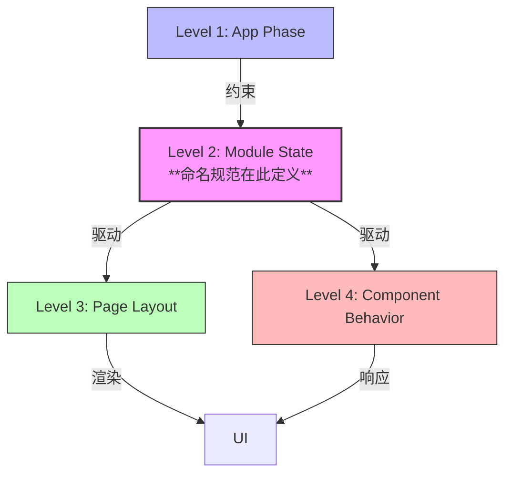

依据《UI Design & Analysis Rulebook v1.0》的架构定义，**状态命名规范（State Naming Convention）主要对应的是 Level 2：Module-level State（模块级状态）**。

但它是一个**跨层级连接点**，因为它包含了 Level 1 的定义，并驱动 Level 3 和 Level 4 的表现。

以下是详细的层级映射分析与治理说明：

---

# 状态命名规范与四层模型的映射关系

> **核心结论：**  
> 状态命名规范是 **Level 2（模块级状态）** 的**唯一身份标识标准**。  
> 它通过嵌入 Level 1（阶段）信息，确保模块状态与全局生命周期对齐；  
> 它通过输出语义，驱动 Level 3（布局）和 Level 4（组件）的行为。

---

## 1. 命名分段与层级映射（Segment Mapping）

命名格式 `<Module>_<Phase>_<Context>_<Mode>` 的四段内容，分别对应不同的抽象层级：

| 命名分段            | 对应层级                | 职责说明                             | 示例值                           |
|:----------------|:--------------------|:---------------------------------|:------------------------------|
| **`<Module>`**  | **Level 2** (模块级)   | **定义作用域边界**。明确该状态属于哪个业务模块。       | `Auth`, `Order`, `Dashboard`  |
| **`<Phase>`**   | **Level 1** (应用级)   | **定义生命周期**。引用全局阶段定义，确保模块不脱离应用节奏。 | `Init`, `Ready`, `Processing` |
| **`<Context>`** | **Level 2** (模块级)   | **定义业务焦点**。在模块内部细化当前操作的业务对象。     | `Input`, `List`, `Detail`     |
| **`<Mode>`**    | **Level 2/4** (交互态) | **定义交互权限**。描述该状态下用户能做什么（驱动组件行为）。 | `Idle`, `Locked`, `Focused`   |

> **💡 关键解读：**  
> 虽然 `<Phase>` 来自 Level 1，但一旦它与 `<Module>` 结合（如 `Order_Processing`），它就实例化为一个具体的 **Level 2 状态**。因此，整个命名规范是用于定义 **Level 2 状态集合** 的。

---

## 2. 层级间的驱动关系（Driving Relationship）

状态命名规范定义的 **Level 2 状态**，是连接上下层级的**枢纽**：

1. **Level 1 → Level 2（约束）：**  
   `<Phase>` 段必须来自 Level 1 字典。模块不能发明自己的生命周期阶段（如不能发明 `Loading` 阶段，必须用 `Init` 或 `Processing`）。
2. **Level 2 → Level 3（驱动布局）：**  
   当状态名为 `Order_Ready_List_Idle` 时，Level 3 层知道必须渲染“列表结构”；当状态变为 `Order_Result_Error_Disabled` 时，Level 3 层切换为“错误页结构”。
3. **Level 2 → Level 4（驱动行为）：**  
   当状态名中包含 `Locked` 模式时，Level 4 层的所有输入组件必须自动禁用；当包含 `Focused` 时，对应组件自动获取焦点。

---

## 3. 为什么不是其他层？（Exclusion Logic）

### ❌ 为什么不是 Level 1（App-level Phase）？

- **原因：** Level 1 是全局的、粗粒度的（如 `Processing`）。它不包含模块信息（如 `Order` 还是 `Auth` 在 Processing）。
- **证据：** 命名规范第一段是 `<Module>`，这明确将其限定在模块作用域内。

### ❌ 为什么不是 Level 3（Page Layout）？

- **原因：** Level 3 定义的是“区域结构”（Region），而不是“状态身份”。
- **证据：** Rulebook Section 2.3 明确禁止在 Level 3 描述状态语义。Layout 是状态的**结果**，而不是状态本身。
- **示例：** `Header Region` 是 Layout 概念，`Dashboard_Ready_Global_Idle` 是状态概念。

### ❌ 为什么不是 Level 4（Component Behavior）？

- **原因：** Level 4 定义的是“单个组件的反馈”，它**响应**状态，但不**定义**全局状态名。
- **证据：** Rulebook Section 2.4 禁止组件层“引入新的状态语义”。组件的内部状态（如 Button Hover）是局部的，不应污染全局状态机命名。
- **例外：** 只有当组件行为上升到模块级影响时（如表单整体提交），才会触发 Level 2 状态变更。

---

## 4. 治理意义（Governance Implication）

将状态命名规范锁定在 **Level 2** 具有重大的工程治理意义：

1. **防止状态爆炸：**  
   如果在 Level 4 定义状态，每个组件都有自己的状态名，系统将无法维护。锁定在 Level 2 确保状态数量可控。
2. **确保代码类型安全：**  
   Level 2 状态对应代码中的 `Enum`。前端框架（如 React/Vue）通过监听 Level 2 状态变化来渲染 Level 3 和 Level 4。
3. **解耦设计与实现：**  
   设计师定义 Level 2 状态名（如 `Order_Ready_List_Idle`），开发者实现该状态对应的 UI。双方通过**字符串枚举**对齐，而非通过设计稿像素对齐。

---

## 5. 示例解析（Example Analysis）

以 **`Order_Processing_Input_Pending`** 为例：

| 层级          | 关注点      | 具体表现                                                     |
|:------------|:---------|:---------------------------------------------------------|
| **Level 1** | 全局阶段     | 系统处于 `Processing` 阶段（全局 Loading 遮罩可能显示）。                 |
| **Level 2** | **状态命名** | **`Order_Processing_Input_Pending`**（这是本规范的核心定义层）。       |
| **Level 3** | 页面结构     | 订单页面结构保持稳固，输入区域显示骨架屏（Skeleton）。                          |
| **Level 4** | 组件行为     | 提交按钮变为 `Disabled` 且显示 Loading  Spinner；输入框变为 `ReadOnly`。 |

> **结论：**  
> 设计师在文档中编写 **`Order_Processing_Input_Pending`** 时，他是在定义 **Level 2 状态**。  
> 这个命名一旦确定，Level 3 的布局和 Level 4 的行为都必须随之确定。

---

## 6. 一句话总结

> **状态命名规范是 Level 2（模块级状态）的“身份证”**：  
> 它引用 Level 1 的生命周期，封装模块业务语义，并作为唯一真理源驱动 Level 3 布局与 Level 4 组件行为。
