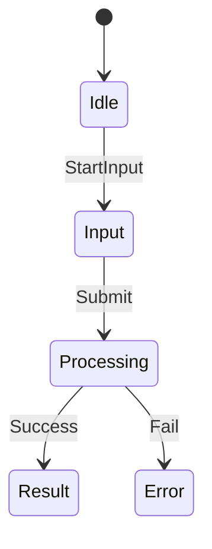

# UI Architecture Rulebook

- **Version**: v1.0
- **Purpose**: 定义一套可工程落地、AI 可解析、可自动验证的 UI 架构规则。

**核心理念**：
> UI 是有限状态机 (Finite State Machine)，而不是静态页面。

---
<!-- TOC -->
* [UI Architecture Rulebook](#ui-architecture-rulebook)
* [1. UI结构概述 (UI Architecture Overview)](#1-ui结构概述-ui-architecture-overview)
  * [1.1. 四层结构](#11-四层结构)
  * [1.2. 术语定义](#12-术语定义)
    * [1.2.1. 状态分类](#121-状态分类)
    * [1.2.2. 常用状态](#122-常用状态)
* [2. 核心设计原则（Core Design Principles）](#2-核心设计原则core-design-principles)
  * [P1. UI 必须是状态机](#p1-ui-必须是状态机)
  * [P2. Screen 状态 ≤ 7](#p2-screen-状态--7)
  * [P3. State 必须形成合法状态图](#p3-state-必须形成合法状态图)
  * [P4. Layout 与 State 解耦](#p4-layout-与-state-解耦)
  * [P5. Component State 独立](#p5-component-state-独立)
* [3. UI 状态图 (UI State Graph)](#3-ui-状态图-ui-state-graph)
* [4. 状态图规则 (State Graph Rules)](#4-状态图规则-state-graph-rules)
  * [R1. 单入口状态](#r1-单入口状态)
  * [R2. 每个状态必须可达](#r2-每个状态必须可达)
  * [R3. 每个状态必须可退出](#r3-每个状态必须可退出)
  * [R4. 禁止死循环](#r4-禁止死循环)
  * [R5. 明确异常路径](#r5-明确异常路径)
* [5. 结构约束 (Layout Contract)](#5-结构约束-layout-contract)
  * [Capture Screen Layout](#capture-screen-layout)
* [6. 组件状态(Component State)](#6-组件状态component-state)
  * [TextField](#textfield)
  * [Button](#button)
* [7. Kotlin 状态机实现 (Kotlin State Machine Implementation)](#7-kotlin-状态机实现-kotlin-state-machine-implementation)
  * [Screen State](#screen-state)
  * [Event Model](#event-model)
  * [Reducer](#reducer)
* [8. Compose UI 渲染 （Compose UI Rendering）](#8-compose-ui-渲染-compose-ui-rendering)
* [9. AI UI DSL](#9-ai-ui-dsl)
  * [Screen](#screen)
  * [Layout](#layout)
  * [Components](#components)
  * [Interactions](#interactions)
* [10. AI Generated UI](#10-ai-generated-ui)
* [11. UI 校验系统（UI Validation System）](#11-ui-校验系统ui-validation-system)
  * [UI Linter](#ui-linter)
  * [校验规则（Validation Rules）](#校验规则validation-rules)
* [12. 核心哲学（Core Philosophy）](#12-核心哲学core-philosophy)
<!-- TOC -->
---

# 1. UI结构概述 (UI Architecture Overview)

UI 系统分为 **四层结构**：

## 1.1. 四层结构

```
App State
   ↓
Screen State
   ↓
Component State
   ↓
Layout Structure
```

| Layer           | Responsibility |
|-----------------|----------------|
| App State       | 整体应用阶段         |
| Screen State    | 单个界面的业务状态      |
| Component State | 组件交互状态         |
| Layout          | UI结构布局         |

## 1.2. 术语定义

- **State**：可枚举、有限且互斥的 UI 状态。
- **Transition**：状态之间的有向变化路径。
- **Event**：触发状态变更的输入（用户行为或系统回调）。
- **Layout**：稳定的 UI 结构骨架，不随状态变化而变化。
- **Component State**：组件内部的交互性状态，不等同于业务状态。

### 1.2.1. 状态分类

UI 状态通常属于以下五类：

| Type      | Example    |
|-----------|------------|
| Initial   | Idle       |
| Input     | Editing    |
| Loading   | Processing |
| Result    | Success    |
| Exception | Error      |

### 1.2.2. 常用状态

| Screen Type    | Pattern（模式） | States （可用状态）                                    |
|----------------|-------------|--------------------------------------------------|
| Feed           | List        | Loading / Content / Empty / Error                |
| Detail Page    | Detail      | Loading / Content / Error                        |                                 |
| Login / Form   | Form        | Idle / Editing / Submitting / Success / Error    |
| Search Page    | Search      | Idle / Searching / Result / Empty / Error        |
| AI Tool        | AI          | Idle / Input / Processing / Result / Error       |
| Onboarding     | Wizard      | Step1 / Step2 / Step3 / Complete                 |
| Note Editor    | Editor      | Loading / Editing / Saving / Saved / Error       |
| Article Reader | Viewer      | Loading / Ready / Reading / Error                |
| Admin Panel    | Dashboard   | Loading / Content / Partial / Error              |
| Login System   | Auth        | Idle / Input / Verifying / Authenticated / Error |

> UI 状态设计的核心：
> **State 表示 UI 阶段，而不是 UI细节。**

---

# 2. 核心设计原则（Core Design Principles）

## P1. UI 必须是状态机

每个 Screen 必须定义 `<Screen>State`。例如：

```
CaptureState
EditorState
ViewerState
SearchState
```

状态示例：

```
Idle
Input
Processing
Result
Error
```

要求：

- 有限（Finite）
- 互斥（Mutually Exclusive）
- 可推理（Reasonable & Derivable）

## P2. Screen 状态 ≤ 7

建议 `3 ~ 6` 个状态，超过 `7` 时**必须**拆分 Screen 或合并状态。

> 认知科学结论：人类稳定理解能力为 **7 ± 2**

## P3. State 必须形成合法状态图

必须存在：

```
Initial State
Transitions
Exit Paths
```

示例

```
Idle
 ↓
Input
 ↓
Processing
 ↓
Result
```

异常路径：

```
Processing → Error
```

## P4. Layout 与 State 解耦

Layout 是稳定结构，不为每个状态创建 Layout。

错误设计：

```
ProcessingLayout
ResultLayout
```

正确设计：

```
CaptureLayout
```

状态只影响：

```
Components
Visibility
Interaction
```

## P5. Component State 独立

组件必须拥有自己的状态，不得混入 Screen State。

例如：

```
TextFieldState
ButtonState
SelectionState
```

不能与 Screen State 混合。

---

# 3. UI 状态图 (UI State Graph)

UI 必须定义 **状态图（State Graph）**。

+ 组成元素：

```
State
Event
Transition
```

+ 状态转移公式：

```
State + Event → Next State
```

+ 文字表达：

```
Idle + StartInput → Input
Input + Submit → Processing
Processing + Success → Result
Processing + Fail → Error
```

+ 图形表示



---

# 4. 状态图规则 (State Graph Rules)

## R1. 单入口状态

必须存在：

```
Initial State
```

例如：

```
Idle
```

## R2. 每个状态必须可达

错误：

```
Idle → Input → Processing

Result
```

Result 永远无法进入。

## R3. 每个状态必须可退出

不可存在无出口状态。

错误：

```
Processing
```

没有出口。

## R4. 禁止死循环

禁止自循环（`Processing → Processing`）。

## R5. 明确异常路径

必须定义错误状态及其恢复路径，例如：

```
Processing → Error
Error → Input
```

---

# 5. 结构约束 (Layout Contract)

Layout 定义 `UI 结构骨架`。 例如：

## Capture Screen Layout

```
HeaderRegion
MainRegion
PreviewRegion
ActionRegion
OverlayRegion
```

| Region  | Responsibility |
|---------|----------------|
| Header  | 全局操作           |
| Main    | 输入区域           |
| Preview | 输出预览           |
| Action  | CTA按钮          |
| Overlay | 临时 UI          |

要求：

- Region 命名固定且语义清晰。
- Layout 不依赖状态。

---

# 6. 组件状态(Component State)

组件状态只负责交互性能力。 例如：

## TextField

```
TextFieldState
```

字段：

```
value
focused
enabled
error
```

示例代码：

```kotlin
data class TextFieldState(
    val value: String,
    val focused: Boolean,
    val enabled: Boolean
)
```

## Button

```
ButtonState
```

示例：

```kotlin
data class ButtonState(
    val enabled: Boolean,
    val loading: Boolean
)
```

---

# 7. Kotlin 状态机实现 (Kotlin State Machine Implementation)

## Screen State

```kotlin
sealed interface CaptureState {

    data object Idle : CaptureState

    data class Input(
        val text: String
    ) : CaptureState

    data class Captured(
        val media: Media
    ) : CaptureState

    data object Processing : CaptureState

    data class Result(
        val output: Analysis
    ) : CaptureState

    data class Error(
        val message: String
    ) : CaptureState
}
```

## Event Model

```kotlin
sealed interface CaptureEvent {

    data class InputChanged(
        val text: String
    ) : CaptureEvent

    data object CaptureClicked : CaptureEvent

    data object ProcessingFinished : CaptureEvent

    data object Retry : CaptureEvent
}
```

## Reducer

```kotlin
fun reduce(
    state: CaptureState,
    event: CaptureEvent
): CaptureState
```

要求：

- Reducer 必须覆盖所有状态和事件。
- Reducer 不允许产生非法状态转移。

示例：

```kotlin
when (state) {

    is CaptureState.Idle -> {
        ...
    }

    is CaptureState.Input -> {
        ...
    }

    is CaptureState.Processing -> {
        ...
    }

}
```

---

# 8. Compose UI 渲染 （Compose UI Rendering）

UI 根据状态渲染：

```kotlin
@Composable
fun CaptureScreen(
    state: CaptureState
) {

    when (state) {

        CaptureState.Idle ->
            IdleView()

        is CaptureState.Input ->
            InputView(state.text)

        is CaptureState.Processing ->
            ProcessingView()

        is CaptureState.Result ->
            ResultView(state.output)

        is CaptureState.Error ->
            ErrorView(state.message)
    }
}
```

---

# 9. AI UI DSL

为了支持 AI 自动生成 UI，定义 `UI Spec DSL`。

```
Screen: Capture

States:
 - Idle
 - Input
 - Processing
 - Result
 - Error

Layout:
 Header
 Main
 Preview
 ActionBar

Components:
 TextField
 CaptureButton
 UploadButton
 ProgressIndicator
 ResultView
 ErrorView

Interactions:

Idle:
 CaptureButton → Input
 UploadButton → Input

Input:
 Submit → Processing

Processing:
 Complete → Result
 Fail → Error

Error:
 Retry → Input
```

分块说明：

## Screen

```
Screen: Capture

States:
 - Idle
 - Input
 - Processing
 - Result
 - Error
```

## Layout

```
Layout:
 Header
 Main
 Preview
 ActionBar
```

## Components

```
Components:

 TextField
 CaptureButton
 UploadButton
 ProgressIndicator
 ResultView
 ErrorView
```

## Interactions

```
Idle:
 CaptureButton → Input
 UploadButton → Input

Input:
 Submit → Processing

Processing:
 Complete → Result
 Fail → Error

Error:
 Retry → Input
```

---

# 10. AI Generated UI

DSL 可以驱动 AI 自动生成 Compose UI。 例如：

Spec：

```
State: Processing

Components:
 ProgressIndicator
 CancelButton
```

生成 UI：

```kotlin
@Composable
fun ProcessingView(
    onCancel: () -> Unit
) {

    Column {

        CircularProgressIndicator()

        Button(onClick = onCancel) {
            Text("Cancel")
        }
    }
}
```

---

# 11. UI 校验系统（UI Validation System）

为了保证 UI 质量，需要自动校验系统。

## UI Linter

```
UI Linter
```

## 校验规则（Validation Rules）

```
Rule 1: State Count ≤ 7
Rule 2: State Graph Valid
Rule 3: Component State 不得混入 Screen State
Rule 4: Layout 不得依赖 State
```

---

# 12. 核心哲学（Core Philosophy）

UI 设计的核心原则：

> **UI 不是页面，而是状态机。**

通过状态驱动 UI，可以获得：

* 更清晰的逻辑
* 更稳定的代码结构
* 更容易自动化生成
* 更容易测试和验证
