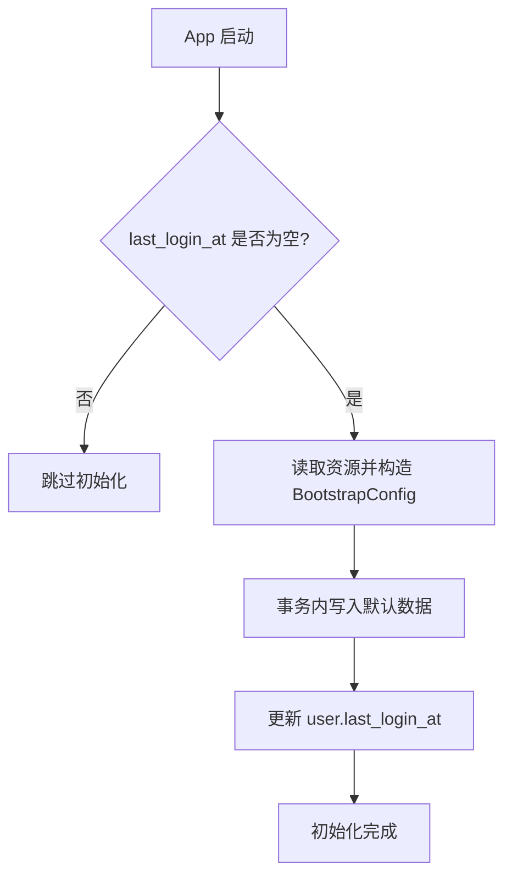

# MyHub 首次安装数据初始化方案

**方案名称**：首次安装数据初始化（Bootstrap）  
**文档版本**：v1.0  
**文档类型**：技术方案设计文档  
**创建日期**：2026-01-20  
**最后更新**：2026-01-23  
**作者**：MyHub Development Team  
**评审状态**：🟡 待评审  
**方案状态**：📝 进行中

---

## 📋 文档目录

1. [修改历史](#修改历史)（如有修改）
2. [问题背景](#1-问题背景)
3. [设计目标](#2-设计目标)
4. [技术调研](#3-技术调研)
5. [架构设计](#4-架构设计)
6. [实现细节](#5-实现细节)
7. [实施计划](#6-实施计划)
8. [风险评估](#7-风险评估)
9. [附录](#8-附录)

---

## 📊 方案状态摘要

**当前状态**：

- **评审状态**：🟡 待评审（文档已完成初稿，等待评审）
- **方案状态**：📝 进行中（方案设计正在进行中）
- **当前进度**：完成初始化流程与可控配置设计，待评审

---

## 修改历史（如有修改）

| 版本   | 日期         | 修改内容      | 修改原因 |
|------|------------|-----------|------|
| v1.0 | 2026-01-20 | 初版初始化方案设计 | 初版创建 |
| v1.0 | 2026-01-23 | 同步当前实现细节 | 落地实现更新 |

---

## 1. 问题背景

### 1.1 用户场景

MVP 阶段允许免登录、离线使用。首次安装后数据库为空，用户打开应用时界面缺乏内容和引导，不利于体验与转化。  
需要在首次安装时生成一组“可控”的默认数据（用户信息、偏好、标签、合集、引导卡片/模板等）。

### 1.2 问题根因

当前数据层缺少统一的“首次安装初始化流程”。  
默认数据如果散落在各处，会导致不可控、难以测试与难以统一维护。

### 1.3 影响范围

- user 与 user_preferences 初始化
- tag / collection / card / template 默认数据
- 首次安装判定与幂等控制
- MVP 阶段的默认数据与资源组织

---

## 2. 设计目标

### 2.1 功能目标

- ✅ 首次安装自动生成默认数据
- ✅ 初始化流程可控、可测试
- ✅ MVP 阶段仅依赖 userId 生成默认内容（资源驱动）
- ✅ 可幂等执行，避免重复写入

### 2.2 非功能目标

- 可测试：初始化过程可单测/集成测验证
- 可维护：新增默认内容不影响既有流程
- 跨平台一致：KMP 共享逻辑

---

## 3. 技术调研

### 3.1 候选方案

#### 方案 A：在各 Repository 内部隐式初始化

- 优势：接入简单
- 劣势：逻辑分散、难以追踪，无法配置化

#### 方案 B：独立 Bootstrap 流程（推荐）

- 优势：统一入口，支持资源驱动与幂等控制
- 劣势：需要新增模块或服务类

#### 方案 C：服务端下发默认数据

- 优势：可动态调整
- 劣势：不满足离线优先

### 3.2 方案对比

| 维度     | 方案 A 内嵌初始化 | 方案 B Bootstrap | 方案 C 服务端下发 |
|--------|------------|----------------|------------|
| 离线可用   | ✅          | ✅              | ❌          |
| 可控性    | ❌          | ✅              | ✅          |
| 可维护性   | ❌          | ✅              | 中          |
| 跨平台一致性 | 中          | ✅              | 中          |
| 实现复杂度  | 低          | 中              | 中          |

### 3.3 推荐方案

**推荐方案 B：独立 Bootstrap 流程**。  
理由：可控、可配置、可测试，且满足离线优先需求。

---

## 4. 架构设计

### 4.0 模块边界

Bootstrap 作为**独立模块**存在，提供初始化入口与默认资源，避免与业务模块耦合。  
模块内包含：

    - 初始化流程编排（Bootstrap / Builder）
- composeResources 中的默认数据资源
- 数据装配与写入适配

### 4.1 整体架构

```text
App 启动
  └─ 判断是否首次安装
       ├─ 否 -> 跳过
       └─ 是 -> 组装 BootstrapConfig -> 执行 Bootstrap -> 更新用户状态
```

### 4.2 核心组件

- **Bootstrap**
    - 统一入口，负责流程编排与幂等控制
- **BootstrapConfig**
    - 初始化数据载体（可配置）
- **Repositories**
    - 数据写入执行者（user/tag/collection/card/template）

### 4.3 数据流

1. 启动时判断是否需要初始化（以 user.last_login_at 为准）
2. 从 composeResources 读取 bootstrap JSON 并构造 BootstrapConfig
3. 通过 Repository 写入 user、preferences、tags、collections、cards、templates
4. 卡片元数据通过 `Card.metadata` 自动写入各 `card_metadata_*` 表
5. `card_tag` 由 `LocalCardDataSourceImpl.insertCard` 统一写入
6. 更新 user.last_login_at

**首次安装判定方式**：

- 使用 `user.last_login_at` 作为判定依据
    - **为空**：视为首次安装，执行初始化流程
    - **非空**：视为已初始化，跳过



---

## 5. 实现细节

### 5.1 关键 API

```kotlin
data class BootstrapConfig(
    val userId: String,
    val user: User,
    val userPreferences: UserPreferences,
    val tags: List<Tag>,
    val collections: List<Collection>,
    val cards: List<Card>,
    val templates: List<CardTemplate>
)

```

### 5.1.1 BootstrapConfig 生成策略

BootstrapConfig 由初始化生成器负责生成，要求 **可控、可复现、可测试**。建议按以下顺序生成：

1. **userId**
    - 由匿名身份模块生成并传入（强制参数）
2. **user**
    - 由资源文件提供，入库前覆盖 userId
3. **preferences**
    - 由资源文件提供（如 theme、language、auto_sync）
4. **tags**
    - 由资源文件提供（含 name、color、description）
5. **collections**
    - 由资源文件提供（含 name、topic）
6. **templates / cards**
    - 由资源文件提供（用于引导或示例内容）
    - `card_tag.json` 提供卡片标签关联
    - `card_metadata_*.json` 提供卡片元数据，构建时注入 `Card.metadata`

### 5.1.2 生成规则（MVP）

MVP 阶段仅以 `userId` 作为输入，生成固定的一组默认内容。  
规则要求 **确定性**（同一 userId 输出一致）与 **可测试**。

```kotlin
class DefaultBootstrapBuilder {
    fun buildConfig(userId: String): BootstrapConfig {
        val resourceConfig = loadBootstrapConfigFromResources()
        return resourceConfig.copy(
            userId = userId,
            user = resourceConfig.user.copy(id = userId)
        )
    }
}

private fun loadBootstrapConfigFromResources(): BootstrapConfig {
    // 参考 database-manage 的资源加载方式：Res.readBytes("files/...").decodeToString()
    val locale = resolveLocaleTag()
    val baseDir = "bootstrap_${locale}"
    val userJson = readResource("$baseDir/user.json")
    val prefsJson = readResource("$baseDir/user_preferences.json")
    val tagJson = readResource("$baseDir/tag.json")
    val collectionJson = readResource("$baseDir/collection.json")
    val cardJson = readResource("$baseDir/card.json")
    val templateJson = readResource("$baseDir/template.json")
    val cardTagJson = readResource("$baseDir/card_tag.json")
    val cardMetadataJson = readResource("$baseDir/card_metadata_*.json")

    return BootstrapConfig(
        userId = "",
        user = Json.decodeFromString(userJson),
        userPreferences = Json.decodeFromString(prefsJson),
        tags = Json.decodeFromString(tagJson),
        collections = Json.decodeFromString(collectionJson),
        cards = Json.decodeFromString(cardJson),
        templates = Json.decodeFromString(templateJson)
    )
}

private fun readResource(path: String): String {
    return runCatching {
        Res.readBytes("files/$path").decodeToString()
    }.getOrElse {
        val fallback = path.substringAfter("/").let { "bootstrap_default/$it" }
        Res.readBytes("files/$fallback").decodeToString()
    }
}

private fun resolveLocaleTag(): String {
    // 读取系统 locale，转换为资源命名（例如 zh-CN -> zh_cn）
    return "zh_cn"
}
```

### 5.1.3 composeResources 资源组织方式对比

**方式 1：字符串序列化（每类资源为字符串）**  
示例：`user_default.json` / `tags_default.json` 以字符串形式存储

- 优点：
    - 国际化更直接（多语言资源文件分发）
    - 各表资源可拆分、按需加载
- 缺点：
    - 字段跨表一致性难维护
    - 多文件维护成本较高

**方式 2：单一 JSON 资源（整体配置）**  
示例：`bootstrap_default.json` 包含 user/tags/collections/cards/templates

- 优点：
    - 统一管理，修改字段更集中
    - 便于版本化与整体回滚
- 缺点：
    - 国际化时可能需要拆分或增加多套 JSON
    - 单文件过大时维护成本上升

**方式 3：多语言 JSON 套件（按语言分包，按表拆分）**  
示例：

- `bootstrap_zh_cn/user.json`
- `bootstrap_zh_cn/user_preferences.json`
- `bootstrap_zh_cn/tag.json`
- `bootstrap_zh_cn/collection.json`
- `bootstrap_zh_cn/card.json`
- `bootstrap_zh_cn/template.json`

- 优点：
    - 多语言支持清晰直观，文件结构简单
    - 仍保持“单文件整体配置”的管理方式
- 缺点：
    - 多语言文件内容重复度高
    - 新增语言时需要复制并维护一套完整配置

**推荐（当前方案）**：方式 3  
理由：需要多语言支持，且按表拆分便于维护与按需加载。

**读取策略（方式 3）**：

- 启动时读取本地 `locale`（系统语言/地区）
- 将 `locale` 映射为资源目录名（如 `zh-CN` -> `bootstrap_zh_cn/`）
- 逐表读取对应 JSON（user/user_preferences/tag/collection/card/template）
- 若某表资源不存在，回退到 `bootstrap_default/<table>.json`

### 5.2 可控性与可配置

MVP 阶段仅使用默认配置，完全由资源文件定义内容。  
`display_name` 由资源文件定义，必要时可在加载后进行覆盖。

### 5.3 幂等与事务

使用 `user.last_login_at` 进行幂等控制：

- **为空**：执行初始化流程
- **非空**：直接跳过

### 5.4 初始化表清单（示例）

| 表                | 初始化内容        | 可配置字段                      |
|------------------|--------------|----------------------------|
| user             | anonymous 用户 | display_name, avatar       |
| user_preferences | 默认偏好         | theme, language, auto_sync |
| tag              | 默认标签         | name, color                |
| collection       | 默认合集         | name, topic                |
| card             | 引导卡片         | title, content             |
| card_template    | 模板           | type, content              |

---

## 6. 实施计划

### 6.1 当前进度

**方案状态**：📝 进行中  
**当前进度**：完成设计，待评审

### 6.2 阶段划分

- 阶段 1：定义 BootstrapConfig 与默认生成器（📝 进行中）
- 阶段 2：实现 AppBootstrapper 与幂等控制（⏸️ 待开始）
- 阶段 3：默认数据落地（⏸️ 待开始）

---

## 7. 风险评估

### 7.1 技术风险

- **默认数据过多** → 影响首次启动速度
    - 缓解：控制默认数据量，按需延迟加载
- **幂等失败导致重复数据**
    - 缓解：以 user.last_login_at 判定，事务化写入

### 7.2 边界条件

- 仅首次安装执行
- 不要求网络
- 不涉及服务端强制下发

---

## 8. 附录

### 8.1 相关文档

- [MyHub 架构设计文档规范](./infra/myhub-infra-rules.md)
- [匿名身份与免登录标识方案设计](./myhub-anonymous-identity-infra-v1.0.md)

### 8.2 参考资料

- [Android App Startup](https://developer.android.com/topic/libraries/app-startup)
- [Apple App Launch Best Practices](https://developer.apple.com/documentation/xcode/improving-your-app-s-startup-time)
