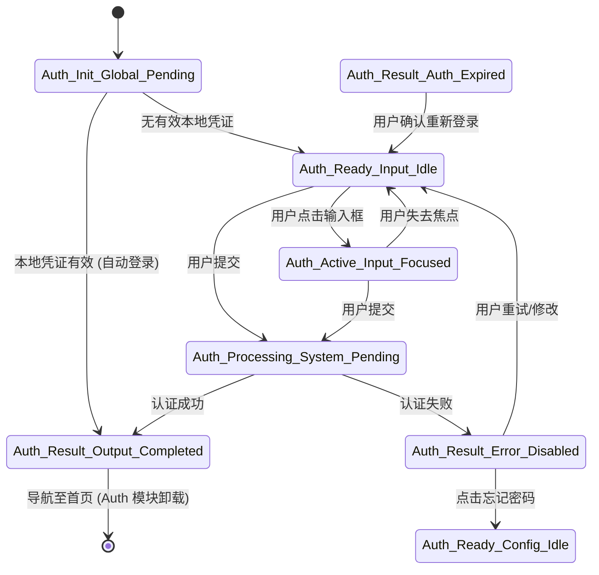

---
依据《UI Design & Analysis Rulebook v1.0》，以下是 **Auth 模块** 的完整状态机设计方案。

本方案严格遵循 **Section 3.1 命名规范** 与 **Section 2 抽象层级模型**，确保状态语义清晰、工程可映射、多端一致。

---

# Auth Module State Specification v1.0

> **关联规则：** UI Design & Analysis Rulebook v1.0  
> **模块名称：** `Auth`  
> **适用范围：** 登录、注册、_token_ 刷新、授权失效处理  
> **设计原则：** 语义优先、状态机驱动、封闭集合

---

## 1. 模块定义（Module Definition）

| 属性              | 定义                                                    |
|:----------------|:------------------------------------------------------|
| **Module Enum** | `Auth`                                                |
| **业务职责**        | 管理用户身份凭证的获取、验证与失效处理                                   |
| **边界说明**        | 不包含“用户个人资料编辑”（属于 `Profile` 模块），不包含“全局导航”（属于 `Nav` 模块） |
| **核心输入**        | 账号、密码、生物特征、Token                                      |
| **核心输出**        | 认证结果（成功/失败）、有效 Session                                |

---

## 2. 状态全集（State Enumeration）

基于 Rulebook 字典，Auth 模块的合法状态集合如下。**禁止定义此集合之外的状态**。

| 状态名 (State Name)                 | 阶段 (Phase)   | 上下文 (Context) | 模式 (Mode)   | 语义简述               |
|:---------------------------------|:-------------|:--------------|:------------|:-------------------|
| `Auth_Init_Global_Pending`       | `Init`       | `Global`      | `Pending`   | 启动时检查本地凭证，等待结果     |
| `Auth_Ready_Input_Idle`          | `Ready`      | `Input`       | `Idle`      | 登录表单已就绪，等待用户输入     |
| `Auth_Active_Input_Focused`      | `Active`     | `Input`       | `Focused`   | 用户正在编辑账号或密码        |
| `Auth_Processing_System_Pending` | `Processing` | `System`      | `Pending`   | 正在向服务器提交认证请求       |
| `Auth_Result_Output_Completed`   | `Result`     | `Output`      | `Completed` | 认证成功，准备跳转          |
| `Auth_Result_Error_Disabled`     | `Result`     | `Error`       | `Disabled`  | 认证失败（密码错/网络错），表单禁用 |
| `Auth_Result_Auth_Expired`       | `Result`     | `Auth`        | `Expired`   | 会话过期，需重新认证         |
| `Auth_Ready_Config_Idle`         | `Ready`      | `Config`      | `Idle`      | 忘记密码/切换登录方式页就绪     |

> **💡 治理说明：**
> 1. **无 `Loading` 状态：** 加载行为被拆解为 `Init` (启动加载) 和 `Processing` (提交加载)。
> 2. **无 `Success` 状态：** 成功被定义为 `Result` 阶段 + `Completed` 模式。
> 3. **无 `Form` 状态：** 表单是 `Input` 上下文的表现形式，而非状态名。

---

## 3. 状态流转图（State Flow）



---

## 4. 关键状态规范文档（State Specifications）

*遵循 Rulebook Section 4 强制模板。选取最核心的三个状态进行详细定义。*

### 4.1 State: `Auth_Init_Global_Pending`

| 章节                 | 内容                                                                                                                                           |
|:-------------------|:---------------------------------------------------------------------------------------------------------------------------------------------|
| **4.1 Definition** | This state represents the system actively verifying local credentials or session validity upon app launch, before allowing user interaction. |
| **4.2 Position**   | **Prev:** `App_Launch` <br> **Next:** `Auth_Ready_Input_Idle` OR `Auth_Result_Output_Completed` <br> **Skip:** Yes (若无本地凭证)                  |
| **4.3 Semantics**  | **User:** 感知到应用正在启动，不可操作。<br>**System:** 阻塞主流程，异步检查 Token/Session。<br>**Why:** 区分“启动加载”与“提交加载”，避免用户误操作。                                      |
| **5. Layout**      | **Main:** 全局品牌 Logo + Loading 指示器。<br>**Input:** 隐藏。<br>**Overlay:** 无。                                                                      |
| **6. Interaction** | **Global:** 禁止所有交互。<br>**Nav:** 禁止返回。                                                                                                        |
| **9. Negative**    | ❌ 禁止显示登录表单。<br>❌ 禁止显示错误提示（错误应在 `Result` 态显示）。                                                                                                |

### 4.2 State: `Auth_Ready_Input_Idle`

| 章节                 | 内容                                                                                                                                                  |
|:-------------------|:----------------------------------------------------------------------------------------------------------------------------------------------------|
| **4.1 Definition** | This state represents the Auth module having loaded the login form, waiting for user input, with no active background processes.                    |
| **4.2 Position**   | **Prev:** `Auth_Init_Global_Pending` OR `Auth_Result_Error_Disabled` <br> **Next:** `Auth_Active_Input_Focused` OR `Auth_Processing_System_Pending` |
| **4.3 Semantics**  | **User:** 明确知道需要登录，表单可填。<br>**System:** 资源已就绪，监听用户事件。<br>**Why:** 区分“就绪”与“编辑中”，优化键盘/焦点管理。                                                           |
| **5. Layout**      | **Main:** 登录表单（账号/密码/提交按钮）。<br>**Header:** 无。<br>**Footer:** 忘记密码/注册链接。                                                                             |
| **6. Interaction** | **Input:** 可编辑。<br>**Button:** 可点击（若表单验证通过）。                                                                                                        |
| **9. Negative**    | ❌ 禁止显示 Loading 动效。<br>❌ 禁止禁用提交按钮（除非表单无效）。                                                                                                           |

### 4.3 State: `Auth_Processing_System_Pending`

| 章节                 | 内容                                                                                                                                                           |
|:-------------------|:-------------------------------------------------------------------------------------------------------------------------------------------------------------|
| **4.1 Definition** | This state represents the system actively sending credentials to the server and waiting for a response, locking user input to prevent duplicate submissions. |
| **4.2 Position**   | **Prev:** `Auth_Ready_Input_Idle` OR `Auth_Active_Input_Focused` <br> **Next:** `Auth_Result_Output_Completed` OR `Auth_Result_Error_Disabled`               |
| **4.3 Semantics**  | **User:** 知道请求正在处理，需等待。<br>**System:** 锁定输入，防止重放攻击。<br>**Why:** 必须与 `Ready` 区分，防止用户重复点击提交。                                                                   |
| **5. Layout**      | **Main:** 登录表单（保持可见，但遮罩或禁用）。<br>**Button:** 显示 Loading Spinner。                                                                                              |
| **6. Interaction** | **Input:** 锁定 (`Locked`)。<br>**Button:** 禁用 (`Disabled`)。                                                                                                    |
| **9. Negative**    | ❌ 禁止允许用户修改输入框内容。<br>❌ 禁止允许用户点击返回键（防止中断流程）。                                                                                                                   |

---

## 5. KMP 工程映射（Engineering Mapping）

依据 Rulebook Section 3.2 与 KMP 实施计划，状态必须映射为 `sealed class`。

```kotlin
// src/commonMain/kotlin/com/example/feature/auth/AuthState.kt

sealed class AuthState {
    // 1. Init Phase
    object Auth_Init_Global_Pending : AuthState()

    // 2. Ready Phase
    object Auth_Ready_Input_Idle : AuthState()
    object Auth_Ready_Config_Idle : AuthState() // 忘记密码等

    // 3. Active Phase
    object Auth_Active_Input_Focused : AuthState()

    // 4. Processing Phase
    object Auth_Processing_System_Pending : AuthState()

    // 5. Result Phase
    object Auth_Result_Output_Completed : AuthState()
    object Auth_Result_Error_Disabled : AuthState()
    object Auth_Result_Auth_Expired : AuthState()
}
```

### 5.1 UI 层消费示例 (Compose)

```kotlin
@Composable
fun AuthScreen(viewModel: AuthViewModel) {
    val state by viewModel.state.collectAsState()

    // Rulebook Section 2.3: Layout Contract
    // 强制 Exhaustive When，防止遗漏状态
    when (state) {
        is AuthState.Auth_Init_Global_Pending -> {
            GlobalLoadingLayout()
        }
        is AuthState.Auth_Ready_Input_Idle -> {
            LoginFormLayout(
                mode = UiMode.IDLE,
                enabled = true
            )
        }
        is AuthState.Auth_Active_Input_Focused -> {
            LoginFormLayout(
                mode = UiMode.FOCUSED,
                enabled = true
            )
        }
        is AuthState.Auth_Processing_System_Pending -> {
            LoginFormLayout(
                mode = UiMode.PENDING, // 组件内部根据 Mode 显示 Loading
                enabled = false
            )
        }
        is AuthState.Auth_Result_Error_Disabled -> {
            ErrorLayout(
                message = "认证失败",
                mode = UiMode.DISABLED
            )
        }
        // ... 处理其他状态
    }
}
```

---

## 6. 设计治理问答（Governance Q&A）

### Q1: 为什么没有 `Auth_Loading` 状态？

**A:** 违反 Rulebook Section 3.1。`Loading` 是视觉表现，不是语义。

- 启动时的加载是 `Init` 阶段。
- 提交时的加载是 `Processing` 阶段。
- 区分两者有助于工程优化（如 `Init` 可跳过，`Processing` 不可跳过）。

### Q2: 为什么 `Focused` 要独立成一个状态？

**A:** 依据 Rulebook Section 2.4。

- 在 Auth 场景，焦点变化可能触发键盘弹出，导致页面结构（L3）变化（如防止遮挡）。
- 焦点状态可能影响提交按钮的校验逻辑（L4）。
- 若项目简单，可合并回 `Ready`，但标准规范建议分离以保语义精确。

### Q3: 认证成功后的首页是谁的状态？

**A:** 不是 `Auth` 模块的状态。

- `Auth_Result_Output_Completed` 是一个**过渡状态**。
- 一旦成功，`Nav` 模块接管，路由跳转至 `Browse` 或 `Dashboard` 模块。
- `Auth` 模块随后可能卸载或进入后台休眠。

### Q4: 网络错误和账号密码错误怎么区分？

**A:** 都在 `Auth_Result_Error_Disabled` 状态。

- 具体错误文案（"网络超时" vs "密码错误"）是 **Component Behavior (L4)** 或 **String Resource** 的差异。
- 模块状态只关心“认证失败，需用户干预”这一语义，不关心失败细节，保持状态机简洁。

---

## 7. 验收清单（Validation Checklist）

- [ ] **命名合规：** 所有状态名是否严格匹配 `Auth_<Phase>_<Context>_<Mode>`？
- [ ] **封闭性：** 代码中是否使用了 `sealed class` 禁止外部继承？
- [ ] ** Exhaustive：** UI 层 `when(state)` 是否覆盖了所有分支且无 `else`？
- [ ] **语义一致：** `Processing` 状态下，输入框是否确实被锁定（L4 行为一致）？
- [ ] **文档同步：** 新增状态是否已更新本规范文档（Rulebook Section 11.1）？

---

> **一句话总结：**  
> **Auth 模块状态机由 8 个标准状态构成，覆盖从启动检查到认证结果的全生命周期，通过 KMP 类型系统强制约束，确保多端行为一致。**
