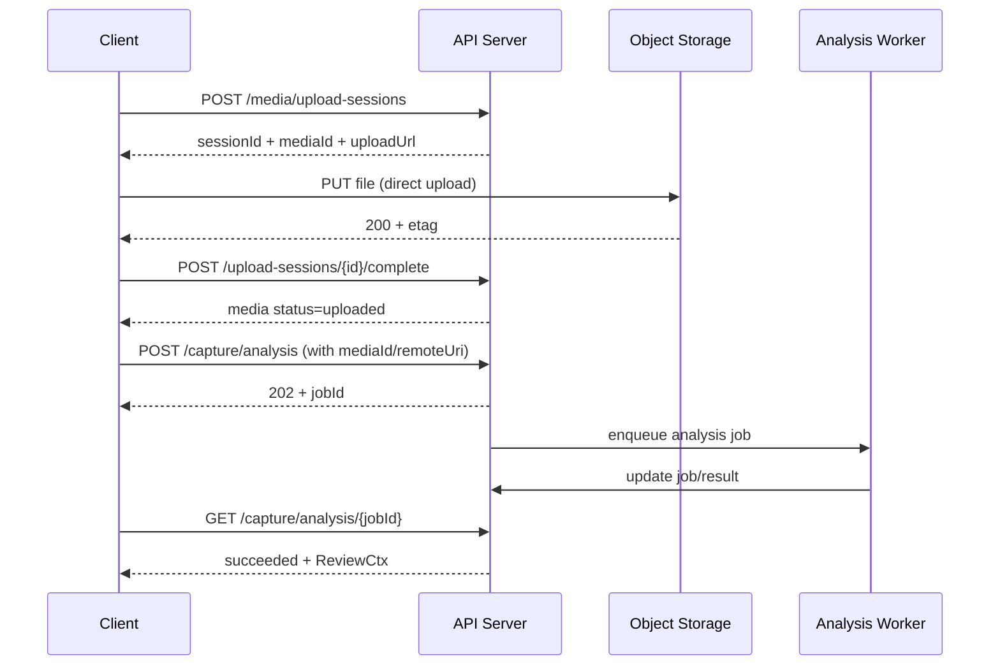

# Capture Real Analysis Integration Plan

> 目标：替换 `CaptureViewModel.startCapture()` 中的模拟 `delay(1000)`，接入真实分析链路，保证可扩展、可观测、可恢复。

---

## 1. 背景与目标

当前实现为前端本地模拟处理：

- 进入 processing（`isProcessing = true`）
- 固定延时 1s
- 使用 `buildReviewCtx(state)` 直接生成复核内容

该方式无法支撑真实 OCR/视频元数据/文本结构化分析。需要升级为“服务端真实处理 + 前端状态驱动”架构。

本方案的目标：

1. 替换模拟流程为真实分析流程
2. 保持当前 UI 状态机兼容（Processing -> Review/Failed）
3. 支持失败重试、幂等、防重复提交
4. 具备上线后可观测性（成功率、时延、错误分布）

---

## 2. 行业参考（概述 + 核心说明）

### 2.1 Async Request-Reply（Azure）

- 概述：请求先返回 `202 Accepted`，包含状态查询地址；客户端轮询获取最终结果。
- 核心说明：
    - 避免长请求超时
    - 通过 `Location`/`Retry-After` 限制轮询频率
    - 非阻塞、适合中长任务
- 参考：
    - https://learn.microsoft.com/en-us/azure/architecture/patterns/async-request-reply

### 2.2 Long-Running Operations（Google）

- 概述：所有长任务统一抽象为 `Operation`，包含 `done/error/response`。
- 核心说明：
    - 统一状态模型，客户端逻辑稳定
    - 同时支持轮询与事件通知
    - 便于跨服务复用处理框架
- 参考：
    - https://cloud.google.com/apis/design/design_patterns#long_running_operations

### 2.3 Idempotency（Stripe）

- 概述：客户端重复提交同一请求时，通过 `Idempotency-Key` 保证“只执行一次”。
- 核心说明：
    - 移动端弱网重试不会重复创建任务
    - 解决“超时后用户重复点击 Capture”导致的重复分析
    - 是生产级异步任务的基础能力
- 参考：
    - https://docs.stripe.com/api/idempotent_requests

### 2.4 队列解耦（AWS Well-Architected）

- 概述：API 与耗时分析任务通过消息队列解耦。
- 核心说明：
    - 抗流量尖峰
    - 失败可重试
    - 保护核心 API 的稳定性与响应时间
- 参考：
    - https://docs.aws.amazon.com/wellarchitected/latest/framework/rel_mitigate_interaction_failure_fail_fast.html

---

## 3. 推荐落地框架

### 3.1 推荐架构

采用：`异步任务 + 轮询（首版）`，后续可扩展 `SSE/WebSocket` 推送。

为什么首版不用推送：

- 轮询接入最小、跨端简单、故障面小
- 与当前状态模型最契合
- 先保证正确性和鲁棒性，再升级体验

### 3.2 分层设计

#### Client（feature/capture）

- `CaptureViewModel`: 负责状态机和任务生命周期
- `CaptureAnalysisRepository`: 负责网络调用与轮询
- `CaptureUiState`: 承载 processing/job/error/review 数据

#### Server API

- `POST /api/capture/analysis`：创建分析任务
- `GET /api/capture/analysis/{jobId}`：查询任务状态与结果

#### Worker（分析执行层）

- 拉取 queued job -> 执行文本/OCR/视频元数据分析 -> 写回结果

#### Storage

- `analysis_job`：任务状态、进度、错误
- `analysis_result`：标准化结果（映射到 `ReviewCtx`）

---

## 4. 端到端流程

### 4.1 成功路径（首版轮询）

1. 用户点击 `Capture`
2. ViewModel 校验 `canCapture`
3. 调用 `POST /api/capture/analysis`
4. 服务端返回：

- 快速完成：`200 + result`
- 常规：`202 + jobId + retryAfterMs`

5. 客户端轮询 `GET /api/capture/analysis/{jobId}`
6. 状态 `Succeeded` 时写入 `review`
7. `isProcessing = false`，进入 Review 编辑态

### 4.2 失败路径

1. `GET job` 返回 `Failed`
2. UI 显示错误并解锁输入
3. 用户可重试；重试带新幂等键

### 4.3 取消路径（建议）

1. 用户离开页面或再次提交
2. 客户端取消轮询协程
3. 服务端任务可继续（首版）或支持 cancel（后续）

---

## 5. API 合约（建议）

### 5.1 Create Job

`POST /api/capture/analysis`

Headers:

- `Idempotency-Key: <uuid>`

Request（示例）：

```json
{
  "inputText": "...",
  "intent": "review",
  "sourceForm": "extract",
  "media": [
    {
      "id": "m1",
      "type": "image",
      "uri": "..."
    },
    {
      "id": "m2",
      "type": "video",
      "uri": "..."
    }
  ]
}
```

Response:

- `200 OK`：直接返回 `ReviewCtx`
- `202 Accepted`：

```json
{
  "jobId": "job_123",
  "status": "queued",
  "retryAfterMs": 800
}
```

### 5.2 Query Job

`GET /api/capture/analysis/{jobId}`

```json
{
  "jobId": "job_123",
  "status": "running",
  "progress": 45,
  "errorCode": null,
  "errorMessage": null,
  "result": null
}
```

`status = succeeded` 时 `result` 填充为标准化 `ReviewCtx`。

---

## 6. 客户端状态模型细化

建议在 `CaptureUiState` 增加：

- `analysisJobId: String?`
- `analysisStatus: AnalysisStatus?`（`Queued/Running/Succeeded/Failed`）
- `analysisProgress: Int?`
- `lastRequestId: String?`（可选）

并引入领域状态：

```kotlin
enum class AnalysisStatus { Queued, Running, Succeeded, Failed }
```

---

## 7. ViewModel 改造框架

`startCapture()` 从“延时生成”改为“提交+轮询”：

1. 生成 `idempotencyKey`
2. `isProcessing = true`
3. 调用 repository.startAnalysis(...)
4. 若返回 `result` 直接落地为 `review`
5. 若返回 `jobId`，进入轮询循环
6. 收到 `Succeeded` -> 更新 `review`
7. 收到 `Failed` 或异常 -> 更新 `error`
8. `finally` 里确保 `isProcessing = false`

并发策略：

- 仅允许一个 active job
- 新任务开始前 cancel 旧 polling job

---

## 8. Server/Worker 落地框架

### 8.1 Job 表建议

- `id`
- `idempotency_key`（唯一）
- `status`
- `progress`
- `request_payload`
- `result_payload`
- `error_code`
- `error_message`
- `created_at/updated_at`

### 8.2 执行管线

1. 文本结构化（title/tags/sourceForm hint）
2. 图片 OCR（`imageOcrSummary/imageOcrInfo`）
3. 视频元数据（`videoMetadataSummary/videoMetadataInfo`）
4. 统一映射为 `ReviewCtx`

---

## 9. 本地媒体文件处理方案（方案 2：对象存储直传 + 业务服务管控）

### 9.1 架构边界（必须遵守）

1. Client 只拿上传凭证，不直接持有永久存储权限
2. 文件内容不经过业务 API 转发（避免大文件压垮业务服务）
3. 分析任务只接受已入库的 `mediaId/remoteUri`，禁止本地路径
4. 业务服务负责权限、元数据、生命周期和状态机

### 9.2 组件职责

- Client（Capture）
  - 本地预览、上传进度、失败重试
  - 提交分析任务前等待媒体进入 `Uploaded`
- API Server（业务服务）
  - 生成上传会话和签名 URL
  - 校验并落库媒体元数据
  - 对外提供媒体可见状态（Pending/Uploaded/Failed）
- Object Storage（S3/OSS/COS）
  - 持久化二进制文件
- Media Worker（可选）
  - 异步提取视频时长、封面、图片尺寸、hash
- Analysis Worker
  - 读取 `remoteUri` 执行 OCR/视频元数据分析

### 9.3 API 合约（可直接编码）

#### A. 创建上传会话

`POST /api/media/upload-sessions`

Request:

```json
{
  "fileName": "clip.mp4",
  "mimeType": "video/mp4",
  "fileSize": 24893123,
  "source": "capture"
}
```

Response:

```json
{
  "sessionId": "us_123",
  "mediaId": "m_123",
  "uploadMethod": "single_part",
  "uploadUrl": "https://storage/...signature...",
  "uploadHeaders": {
    "Content-Type": "video/mp4"
  },
  "expiresAt": "2026-02-24T10:00:00Z"
}
```

说明：

- 大视频可返回 `uploadMethod = multipart`，并附分片上传参数
- `mediaId` 在会话创建时即生成，后续分析只认 `mediaId`

#### B. 客户端直传对象存储

- `PUT uploadUrl`（single part）或 multipart 上传
- 上传成功后必须回调业务服务做“完成确认”

#### C. 完成上传确认

`POST /api/media/upload-sessions/{sessionId}/complete`

Request:

```json
{
  "etag": "\"abc...\"",
  "checksumSha256": "..."
}
```

Response:

```json
{
  "mediaId": "m_123",
  "status": "uploaded",
  "remoteUri": "s3://bucket/path/m_123.mp4",
  "publicPreviewUrl": "https://cdn/.../m_123.mp4"
}
```

#### D. 查询媒体状态（可选）

`GET /api/media/{mediaId}`

Response:

```json
{
  "mediaId": "m_123",
  "status": "uploaded",
  "type": "video",
  "mimeType": "video/mp4",
  "size": 24893123,
  "durationMs": 1540000,
  "thumbnailUrl": "https://cdn/.../m_123.jpg",
  "remoteUri": "s3://bucket/path/m_123.mp4"
}
```

### 9.4 Client 状态机（可映射到 `CaptureMediaItem`）

推荐新增字段：

- `uploadState: Pending | Uploading | Uploaded | Failed`
- `uploadProgress: Int`
- `sessionId: String?`
- `mediaId: String?`
- `remoteUri: String?`
- `uploadErrorCode: String?`
- `uploadErrorMessage: String?`

状态流转：

`Pending -> Uploading -> Uploaded`  
`Uploading -> Failed`  
`Failed -> Uploading`（手动重试）

### 9.5 Capture 提交前门禁

`startCapture()` 执行前规则：

1. 若存在 `Uploading`：提示“媒体上传中”，不可提交
2. 若存在 `Failed`：提示重试或忽略该媒体
3. 仅 `Uploaded` 媒体进入 analysis request

analysis request 内媒体结构：

```json
{
  "media": [
    {
      "mediaId": "m_123",
      "type": "video",
      "remoteUri": "s3://bucket/path/m_123.mp4",
      "mimeType": "video/mp4"
    }
  ]
}
```

### 9.6 关键时序（方案 2）



### 9.7 错误码与重试策略（最小集合）

- `MEDIA_UPLOAD_URL_EXPIRED`
  - 动作：重新创建 upload session
- `MEDIA_TYPE_NOT_ALLOWED`
  - 动作：前端提示并中止
- `MEDIA_TOO_LARGE`
  - 动作：前端提示压缩或换文件
- `MEDIA_COMPLETE_CONFLICT`
  - 动作：按幂等逻辑读取已有结果

重试策略：

- 上传重试：3 次，指数退避（500ms/1s/2s）
- complete 重试：幂等重试，最多 3 次
- analysis 提交重试：必须携带 `Idempotency-Key`

### 9.8 安全与治理

1. 上传 URL 短时有效（建议 5~15 分钟）
2. 服务端强校验 `mimeType/size/ext/checksum`
3. 存储路径按租户隔离（如 `tenant/{uid}/media/{mediaId}`）
4. 清理未完成会话（TTL 任务）
5. 日志脱敏，不记录完整签名 URL

### 9.9 可代码落地的最小实现（MVP）

Client 最小新增：

- `MediaUploadRepository`
- `uploadMedia(item)` 协程（create session -> upload -> complete）
- `awaitUploadedMediaOrFail()`（供 `startCapture()` 前置检查）

Server 最小新增：

- `MediaUploadApi`（3 个接口：create/complete/get）
- `MediaService`（签名 URL、元数据落库、状态切换）
- `media_upload_session` + `media_asset` 两张表

MVP 可先不做：

- multipart 上传（先限制视频大小）
- 自动转码
- CDN 多规格封面

---

## 10. 容错与可观测性

### 10.1 容错策略

- 幂等：`Idempotency-Key` 去重
- 重试：仅对可重试错误指数退避
- 超时：单任务总超时（例如 120s）
- 降级：分析失败时返回可编辑最小草稿（可选）

### 10.2 指标与日志

核心指标：

- `capture.analysis.submit.qps`
- `capture.analysis.success.rate`
- `capture.analysis.duration.p95`
- `capture.analysis.queue.depth`
- `capture.analysis.retry.count`

日志字段：

- `jobId`, `requestId`, `idempotencyKey`, `userId`, `errorCode`

---

## 11. 迁移计划（执行顺序）

Phase 1（MVP）：

1. 定义媒体直传 API 合约与 DTO（create session/upload/complete）
2. 新增 `MediaUploadRepository` + 客户端媒体上传状态机
3. 新增 `CaptureAnalysisRepository`
4. 改造 `startCapture()`：先门禁上传状态，再提交分析任务并轮询
5. 串通 server 最小真实实现（非 `delay`）

Phase 2（生产可用）：

1. 接入真实 OCR/视频分析服务
2. 幂等、重试、超时、监控落地
3. 压测与失败注入测试

Phase 3（体验升级）：

1. 可选 SSE/WebSocket 推送
2. 部分结果先行显示（progressive result）

---

## 12. 验收标准（DoD）

1. 前端不再使用固定 `delay` 模拟分析
2. 同一请求重复提交不产生重复任务
3. 成功/失败/超时路径均有可视反馈
4. 轮询频率受控，无过度请求
5. 关键监控指标可用，错误可定位到 `jobId`
6. 本地图片/视频不会以本地路径提交给分析服务，仅通过已上传远端引用提交
7. 媒体上传采用 create-session -> direct-upload -> complete 三段式，且 complete 幂等
8. `startCapture()` 对 `Uploading/Failed` 媒体执行门禁，不会错误提交未上传媒体
