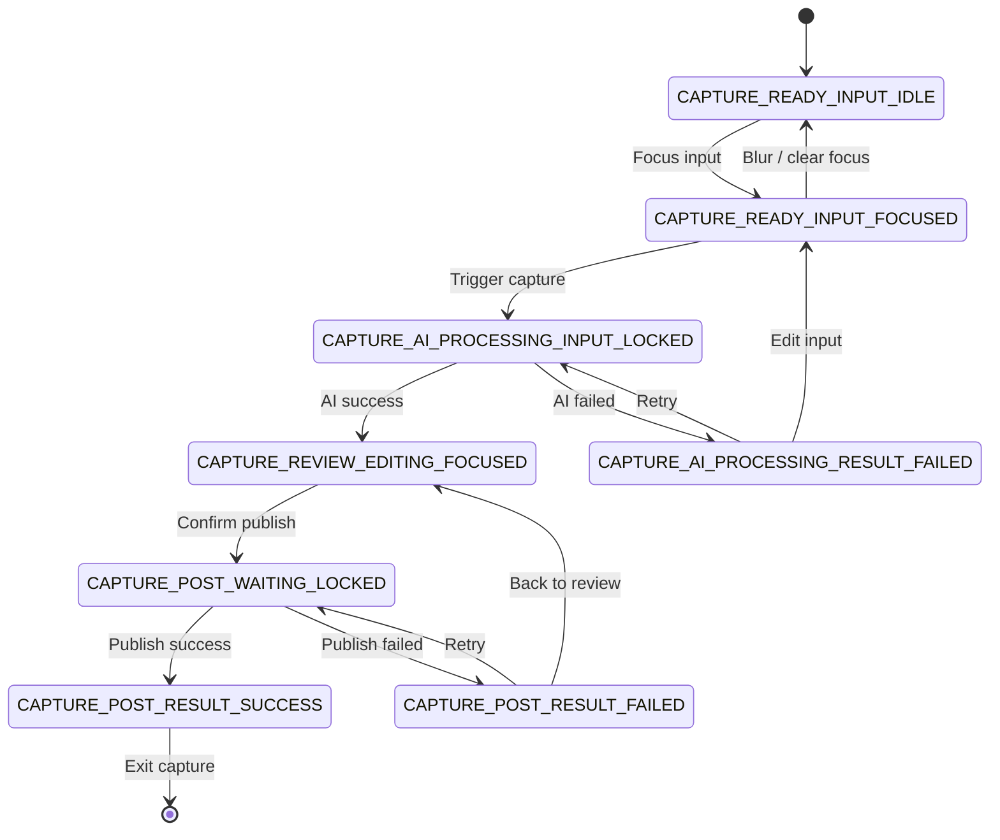

# Capture Flow UI Spec（Single Document）

> 本文档基于 [UI-Design-Analysis-Rulebook-v1.0](../../../../docs/design/spec/%20UI-Design-Analysis-Rulebook-v1.0.md)，用于定义 Capture 模块的状态划分、状态边界与流转关系。
> 本文档已合并原 8 个状态子文档，作为唯一导出文档。

---

## 1. 文档索引

- [2. 状态流转图（规范版）](#2-状态流转图规范版)
- [3. 状态规范（完整合并）](#3-状态规范完整合并)
- [4. 全局约束（Capture 模块）](#4-全局约束capture-模块)
- [5. 文档与代码一致性](#5-文档与代码一致性)
- 3.1 `CAPTURE_READY_INPUT_IDLE`
- 3.2 `CAPTURE_READY_INPUT_FOCUSED`
- 3.3 `CAPTURE_AI_PROCESSING_INPUT_LOCKED`
- 3.4 `CAPTURE_AI_PROCESSING_RESULT_FAILED`
- 3.5 `CAPTURE_REVIEW_EDITING_FOCUSED`
- 3.6 `CAPTURE_POST_WAITING_LOCKED`
- 3.7 `CAPTURE_POST_RESULT_SUCCESS`
- 3.8 `CAPTURE_POST_RESULT_FAILED`

## 2. 状态流转图（规范版）

## 3. 状态规范（完整合并）

### 3.1 CAPTURE_READY_INPUT_IDLE

> Capture 进入后的默认稳定态：允许用户开始输入，但尚未进入执行流程。

实现细节参考：[code-spec.md](./code-spec.md#ready-input-idle)

#### 1. State Definition（状态定义）

- State Name: `CAPTURE_READY_INPUT_IDLE`
- Definition: 系统已进入 Capture 模块并处于可输入待命状态，尚未触发 AI 分析或发布流程。
- Preconditions:
    - 用户进入 Capture 页面。
    - 当前无 AI 处理任务。
- Exit Conditions:
    - 输入框获得焦点，进入 `CAPTURE_READY_INPUT_FOCUSED`。
    - 用户离开模块，退出流程。

#### 2. State Position in Flow（状态在流程中的位置）

- Previous: `Entry`
- Current: `CAPTURE_READY_INPUT_IDLE`
- Next: `CAPTURE_READY_INPUT_FOCUSED`
- Skip Allowed: No
- Rollback Allowed: No
- Parallel: No

#### 3. Core Semantics（核心语义）

- User Perspective: 我可以开始输入，但系统还没有开始处理。
- System Perspective: 页面能力开放，等待用户提供输入并触发后续动作。
- Why Not Merge: 与 Focused 合并会丢失“未聚焦待命”语义，影响交互判断。

#### 4. Layout Contract（结构约束）

- Header Region: 关闭与主行动入口（Capture）。
- Main Region: 输入区与媒体区。
- Side Region: 结果占位预览区（仅预期，不展示结果）。
- Background Region: 稳定背景语义。

#### 5. Interaction Rules（交互规则）

- 输入区可编辑。
- 可添加/删除媒体。
- 主行动按钮根据输入有效性启用或禁用。
- 侧栏预览区不可编辑。

#### 6. Visual Rules（视觉规则）

- 强调“可开始输入”的稳定态，不表达执行中。
- 输入区保持高可读，避免处理态样式（遮罩、进度、冻结）。
- 占位预览应低干扰，不抢主输入焦点。

#### 7. Motion Contract（动效约束）

- 允许：焦点相关的轻量过渡。
- 禁止：持续旋转、加载节奏动效、结构位移动画。
- 实现参数参考：[code-spec.md](./code-spec.md#motion-ready-input)

#### 8. Negative Requirements（明确禁止）

- 不出现 Processing/Loading 文案或指示器。
- 不锁定输入区。
- 不展示 AI 结果内容。

#### 9. Validation Checklist（验收清单）

- 输入区可编辑。
- 主行动在无有效输入时不可触发。
- 侧栏保持占位语义。
- 无执行态语义泄漏。

#### 10. One-line Definition（一句话定义）

`CAPTURE_READY_INPUT_IDLE` 是 Capture 的默认待命输入状态。

### 3.2 CAPTURE_READY_INPUT_FOCUSED

> Capture 的输入聚焦态：用户正在编辑输入，尚未触发 AI 执行。

实现细节参考：[code-spec.md](./code-spec.md#ready-input-idle)

#### 1. State Definition（状态定义）

- State Name: `CAPTURE_READY_INPUT_FOCUSED`
- Definition: 输入焦点已进入主编辑区，用户可持续编辑并准备触发 Capture。
- Preconditions:
    - 处于 Ready 阶段。
    - 输入框已获得焦点。
- Exit Conditions:
    - 失焦回到 `CAPTURE_READY_INPUT_IDLE`。
    - 用户触发 Capture，进入 `CAPTURE_AI_PROCESSING_INPUT_LOCKED`。

#### 2. State Position in Flow（状态在流程中的位置）

- Previous: `CAPTURE_READY_INPUT_IDLE`
- Current: `CAPTURE_READY_INPUT_FOCUSED`
- Next: `CAPTURE_READY_INPUT_IDLE`, `CAPTURE_AI_PROCESSING_INPUT_LOCKED`
- Skip Allowed: No
- Rollback Allowed: No
- Parallel: No

#### 3. Core Semantics（核心语义）

- User Perspective: 我正在编辑内容，随时可以提交处理。
- System Perspective: 保持高响应输入能力，等待显式触发执行。
- Why Not Merge: 与 Idle 合并会丢失“编辑进行中”语义，影响交互反馈准确性。

#### 4. Layout Contract（结构约束）

- Header Region: 关闭、主行动入口。
- Main Region: 聚焦编辑区（文本/媒体）。
- Side Region: 结果预期占位区。
- Background Region: 稳定语义背景。

#### 5. Interaction Rules（交互规则）

- 文本输入、粘贴、媒体增删均可用。
- 主行动在输入有效时可触发。
- 侧栏不可作为主编辑区。

#### 6. Visual Rules（视觉规则）

- 必须有清晰的聚焦反馈。
- 视觉表达“可编辑”，而不是“处理中”。
- 主行动可用态与不可用态差异清晰。

#### 7. Motion Contract（动效约束）

- 允许：聚焦下划线或边框渐变。
- 禁止：加载类持续动效、结构抖动。
- 实现参数参考：[code-spec.md](./code-spec.md#motion-ready-input)

#### 8. Negative Requirements（明确禁止）

- 不得出现处理进度语义。
- 不得冻结输入。
- 不得提前展示处理结果。

#### 9. Validation Checklist（验收清单）

- 焦点反馈清晰。
- 编辑能力完整可用。
- 主行动条件启用正确。
- 无 Processing/Result 泄漏。

#### 10. One-line Definition（一句话定义）

`CAPTURE_READY_INPUT_FOCUSED` 是 Capture 的输入进行中状态。

### 3.3 CAPTURE_AI_PROCESSING_INPUT_LOCKED

> AI 执行态：输入已提交并冻结，系统正在分析生成。

实现细节参考：[code-spec.md](./code-spec.md#ai-processing-input-locked)

#### 1. State Definition（状态定义）

- State Name: `CAPTURE_AI_PROCESSING_INPUT_LOCKED`
- Definition: 用户输入已被系统接收，AI 分析执行中，输入上下文可见但不可修改。
- Preconditions:
    - 来自 `CAPTURE_READY_INPUT_FOCUSED` 的有效提交。
    - AI 任务已创建并进入队列/运行。
- Exit Conditions:
    - AI 成功，进入 `CAPTURE_REVIEW_EDITING_FOCUSED`。
    - AI 失败，进入 `CAPTURE_AI_PROCESSING_RESULT_FAILED`。

#### 2. State Position in Flow（状态在流程中的位置）

- Previous: `CAPTURE_READY_INPUT_FOCUSED`
- Current: `CAPTURE_AI_PROCESSING_INPUT_LOCKED`
- Next: `CAPTURE_REVIEW_EDITING_FOCUSED`, `CAPTURE_AI_PROCESSING_RESULT_FAILED`
- Skip Allowed: No
- Rollback Allowed: No
- Parallel: No

#### 3. Core Semantics（核心语义）

- User Perspective: 内容已提交，正在处理中，当前不可继续编辑。
- System Perspective: 执行异步分析任务，维持上下文可见以降低不确定性。
- Why Not Merge: 与 Ready/Review 合并会破坏“已提交且执行中”的关键语义。

#### 4. Layout Contract（结构约束）

- Header Region: 全局动作与处理中标识。
- Main Region: 冻结输入上下文。
- Overlay Region: 处理中叙事层。
- Side Region: 结果预期占位（非真实结果）。

#### 5. Interaction Rules（交互规则）

- 输入、媒体编辑、主提交动作均禁用。
- 允许退出动作（如关闭），但不能改变处理任务语义。
- Overlay 仅用于状态告知，不承载业务输入。

#### 6. Visual Rules（视觉规则）

- 明确表达“处理中 + 锁定”。
- 输入区降权但保持可识别。
- 处理中视觉焦点应位于叙事层，而非编辑控件。

#### 7. Motion Contract（动效约束）

- 允许：低强度循环动效（进度环、轻脉冲）。
- 禁止：布局重排、强位移、高频闪烁。
- 实现参数参考：[code-spec.md](./code-spec.md#motion-ai-processing-input-locked)

#### 8. Negative Requirements（明确禁止）

- 不允许编辑输入。
- 不显示最终结果内容。
- 不展示与“可编辑”冲突的控件状态。

#### 9. Validation Checklist（验收清单）

- 输入内容可见但不可编辑。
- 处理中语义清晰可感知。
- 无真实结果泄漏。
- 结构稳定无重排。

#### 10. One-line Definition（一句话定义）

`CAPTURE_AI_PROCESSING_INPUT_LOCKED` 是 Capture 的 AI 执行锁定状态。

### 3.4 CAPTURE_AI_PROCESSING_RESULT_FAILED

> AI 处理失败态：系统明确失败并提供恢复路径。

实现细节参考：[code-spec.md](./code-spec.md#ai-processing-result-failed)

#### 1. State Definition（状态定义）

- State Name: `CAPTURE_AI_PROCESSING_RESULT_FAILED`
- Definition: AI 分析流程已结束但失败，系统保留用户输入并提供重试或回编辑路径。
- Preconditions:
    - `CAPTURE_AI_PROCESSING_INPUT_LOCKED` 结束为失败。
- Exit Conditions:
    - Retry 进入 `CAPTURE_AI_PROCESSING_INPUT_LOCKED`。
    - 修改输入进入 `CAPTURE_READY_INPUT_FOCUSED`。

#### 2. State Position in Flow（状态在流程中的位置）

- Previous: `CAPTURE_AI_PROCESSING_INPUT_LOCKED`
- Current: `CAPTURE_AI_PROCESSING_RESULT_FAILED`
- Next: `CAPTURE_AI_PROCESSING_INPUT_LOCKED`, `CAPTURE_READY_INPUT_FOCUSED`
- Skip Allowed: No
- Rollback Allowed: Yes
- Parallel: No

#### 3. Core Semantics（核心语义）

- User Perspective: 处理失败，但我的输入仍在，可以重试或修改。
- System Perspective: 终止执行态，暴露可恢复分支。
- Why Not Merge: 与 Ready 合并会丢失失败原因与恢复路径语义。

#### 4. Layout Contract（结构约束）

- Header Region: 全局动作。
- Main Region: 可恢复编辑上下文。
- Overlay Region: 失败提示与重试入口。
- Side Region: 结果占位（不展示成功结果）。

#### 5. Interaction Rules（交互规则）

- 输入可编辑。
- Retry 可触发，走重新分析。
- 错误提示可关闭，但关闭提示不等于状态恢复。

#### 6. Visual Rules（视觉规则）

- 失败提示应清晰但不过度惊扰。
- 主任务焦点保持在“恢复操作”，而非“错误装饰”。
- 不用恐慌式视觉表达。

#### 7. Motion Contract（动效约束）

- 允许：失败提示轻入场。
- 禁止：闪烁警告、强抖动动效。
- 实现参数参考：[code-spec.md](./code-spec.md#motion-ai-processing-result-failed)

#### 8. Negative Requirements（明确禁止）

- 不清空用户输入。
- 不锁定输入。
- 不隐藏 Retry 路径。

#### 9. Validation Checklist（验收清单）

- 错误信息可见。
- Retry 入口可用。
- 输入可继续编辑。
- 状态恢复路径明确。

#### 10. One-line Definition（一句话定义）

`CAPTURE_AI_PROCESSING_RESULT_FAILED` 是 Capture 的 AI 失败可恢复状态。

### 3.5 CAPTURE_REVIEW_EDITING_FOCUSED

> Review 编辑态：AI 结果已回填，用户进行复核、修订与确认。

实现细节参考：[code-spec.md](./code-spec.md#review-editing-focused)

#### 1. State Definition（状态定义）

- State Name: `CAPTURE_REVIEW_EDITING_FOCUSED`
- Definition: AI 分析结果已生成并进入可编辑复核阶段，用户可调整内容后确认发布。
- Preconditions:
    - 来自 `CAPTURE_AI_PROCESSING_INPUT_LOCKED` 的成功分支。
    - Review 数据已可用。
- Exit Conditions:
    - 用户确认发布，进入 `CAPTURE_POST_WAITING_LOCKED`。
    - 用户离开流程，退出模块。

#### 2. State Position in Flow（状态在流程中的位置）

- Previous: `CAPTURE_AI_PROCESSING_INPUT_LOCKED`
- Current: `CAPTURE_REVIEW_EDITING_FOCUSED`
- Next: `CAPTURE_POST_WAITING_LOCKED`
- Skip Allowed: No
- Rollback Allowed: No
- Parallel: No

#### 3. Core Semantics（核心语义）

- User Perspective: 我正在审阅和修改 AI 结果，并决定是否发布。
- System Perspective: 提供结构化编辑能力与预览能力，等待显式确认。
- Why Not Merge: 与 Ready/Processing/Post 合并会破坏“可编辑审阅”语义。

#### 4. Layout Contract（结构约束）

- Header Region: 关闭、意图切换、确认动作。
- Main Region: 复核编辑区（文本/代码/媒体/标题/样式/标签）。
- Side Region: 结果预览区。
- Background Region: 稳定背景语义。

#### 5. Interaction Rules（交互规则）

- 主内容支持编辑与选择主内容类型。
- 样式选择与预览联动。
- 标签管理支持增删与输入。
- 确认动作为唯一流程前进入口。

#### 6. Visual Rules（视觉规则）

- 编辑区应具备明确可编辑反馈。
- 预览区是次焦点，不应抢占主编辑任务。
- 不使用处理态视觉（遮罩、加载旋转）覆盖可编辑区域。

#### 7. Motion Contract（动效约束）

- 允许：hover、focus、选中态过渡。
- 禁止：处理态持续动效覆盖编辑操作。
- 实现参数参考：[code-spec.md](./code-spec.md#motion-review-editing-focused)

#### 8. Negative Requirements（明确禁止）

- 不允许在该态锁定全部输入。
- 不允许隐藏确认路径。
- 不允许将失败提示常驻覆盖主编辑区域。

#### 9. Validation Checklist（验收清单）

- Review 数据可见且可编辑。
- 预览区可见并保持次级层级。
- 确认动作清晰可触发。
- 状态语义与交互一致。

#### 10. One-line Definition（一句话定义）

`CAPTURE_REVIEW_EDITING_FOCUSED` 是 Capture 的结果复核编辑状态。

### 3.6 CAPTURE_POST_WAITING_LOCKED

> 发布等待态：用户已确认，系统正在保存/发布，输入与确认动作锁定。

实现细节参考：[code-spec.md](./code-spec.md#post-waiting-locked)

#### 1. State Definition（状态定义）

- State Name: `CAPTURE_POST_WAITING_LOCKED`
- Definition: 发布动作已发起但尚未完成，系统进入等待执行结果的锁定态。
- Preconditions:
    - 来自 `CAPTURE_REVIEW_EDITING_FOCUSED` 的确认提交。
- Exit Conditions:
    - 成功进入 `CAPTURE_POST_RESULT_SUCCESS`。
    - 失败进入 `CAPTURE_POST_RESULT_FAILED`。

#### 2. State Position in Flow（状态在流程中的位置）

- Previous: `CAPTURE_REVIEW_EDITING_FOCUSED`
- Current: `CAPTURE_POST_WAITING_LOCKED`
- Next: `CAPTURE_POST_RESULT_SUCCESS`, `CAPTURE_POST_RESULT_FAILED`
- Skip Allowed: No
- Rollback Allowed: No
- Parallel: No

#### 3. Core Semantics（核心语义）

- User Perspective: 我已提交，系统正在保存，当前不能重复提交或继续编辑。
- System Perspective: 执行发布流程并保护幂等性，避免重复写入。
- Why Not Merge: 与 Review 合并会造成“可编辑/已提交”语义冲突。

#### 4. Layout Contract（结构约束）

- Header Region: 全局动作与等待状态指示。
- Main Region: 冻结的 Review 内容。
- Overlay Region: 发布中叙事层。
- Side Region: 锁定预览。

#### 5. Interaction Rules（交互规则）

- 编辑能力禁用。
- 提交动作禁用，防止重复提交。
- 可保留退出动作，但不改变“等待中”语义。

#### 6. Visual Rules（视觉规则）

- 必须表达“已提交等待结果”。
- 内容保持可见但降权，避免用户误判为可编辑。
- 处理提示与主编辑区层级分离。

#### 7. Motion Contract（动效约束）

- 允许：轻量等待动效。
- 禁止：布局抖动、重排、强节奏动画。
- 实现参数参考：[code-spec.md](./code-spec.md#motion-post-waiting-locked)

#### 8. Negative Requirements（明确禁止）

- 不允许编辑。
- 不允许重复点击提交。
- 不提前展示成功/失败最终语义。

#### 9. Validation Checklist（验收清单）

- 编辑与提交均锁定。
- 等待语义清晰可感知。
- 成功/失败分支可推导。
- 页面结构稳定。

#### 10. One-line Definition（一句话定义）

`CAPTURE_POST_WAITING_LOCKED` 是 Capture 的发布执行等待状态。

### 3.7 CAPTURE_POST_RESULT_SUCCESS

> 发布成功态：系统明确告知成功并收敛返回主流程。

实现细节参考：[code-spec.md](./code-spec.md#post-result-success)

#### 1. State Definition（状态定义）

- State Name: `CAPTURE_POST_RESULT_SUCCESS`
- Definition: 发布流程已完成且成功，系统进入成功确认并准备退出 Capture。
- Preconditions:
    - 来自 `CAPTURE_POST_WAITING_LOCKED` 的成功结果。
- Exit Conditions:
    - 自动或手动退出 Capture，回到上层流程。

#### 2. State Position in Flow（状态在流程中的位置）

- Previous: `CAPTURE_POST_WAITING_LOCKED`
- Current: `CAPTURE_POST_RESULT_SUCCESS`
- Next: `Exit`
- Skip Allowed: No
- Rollback Allowed: No
- Parallel: No

#### 3. Core Semantics（核心语义）

- User Perspective: 我的内容已成功保存/发布，流程即将结束。
- System Perspective: 关闭写入流程，提供成功确认并收敛导航。
- Why Not Merge: 与 Waiting 合并会丢失“成功已确认”语义。

#### 4. Layout Contract（结构约束）

- Header Region: 全局动作（可选）。
- Main Region: 降权后的已提交内容。
- Overlay Region: 成功确认层。
- Side Region: 锁定预览。

#### 5. Interaction Rules（交互规则）

- 编辑与再次提交禁用。
- 允许关闭或等待自动返回。
- 不提供与成功语义冲突的重试入口。

#### 6. Visual Rules（视觉规则）

- 明确成功语义，避免继续处理语义。
- 成功提示应清晰但克制。
- 主内容保持可识别，不再作为交互焦点。

#### 7. Motion Contract（动效约束）

- 允许：轻量成功反馈与退场过渡。
- 禁止：处理态循环动效、强闪烁强调。
- 实现参数参考：[code-spec.md](./code-spec.md#motion-post-result-success)

#### 8. Negative Requirements（明确禁止）

- 不显示 Processing/Loading 文案。
- 不允许继续编辑。
- 不出现失败语义。

#### 9. Validation Checklist（验收清单）

- 成功反馈明确。
- 编辑能力关闭。
- 退出路径明确。
- 无失败或处理中语义污染。

#### 10. One-line Definition（一句话定义）

`CAPTURE_POST_RESULT_SUCCESS` 是 Capture 的发布成功收敛状态。

### 3.8 CAPTURE_POST_RESULT_FAILED

> 发布失败态：发布未完成，系统提供重试与回退复核路径。

实现细节参考：[code-spec.md](./code-spec.md#post-result-failed)

#### 1. State Definition（状态定义）

- State Name: `CAPTURE_POST_RESULT_FAILED`
- Definition: 发布流程结束为失败，系统保留当前内容并提供恢复动作。
- Preconditions:
    - 来自 `CAPTURE_POST_WAITING_LOCKED` 的失败结果。
- Exit Conditions:
    - Retry 进入 `CAPTURE_POST_WAITING_LOCKED`。
    - 回退复核进入 `CAPTURE_REVIEW_EDITING_FOCUSED`。

#### 2. State Position in Flow（状态在流程中的位置）

- Previous: `CAPTURE_POST_WAITING_LOCKED`
- Current: `CAPTURE_POST_RESULT_FAILED`
- Next: `CAPTURE_POST_WAITING_LOCKED`, `CAPTURE_REVIEW_EDITING_FOCUSED`
- Skip Allowed: No
- Rollback Allowed: Yes
- Parallel: No

#### 3. Core Semantics（核心语义）

- User Perspective: 发布失败，但我可以重试或回到复核继续调整。
- System Perspective: 停止发布流程，暴露可恢复路径并保留上下文。
- Why Not Merge: 与 Waiting/Review 合并会模糊“失败结果”与“恢复分支”。

#### 4. Layout Contract（结构约束）

- Header Region: 全局动作。
- Main Region: 失败后的上下文内容区。
- Overlay Region: 失败提示与重试入口。
- Side Region: 锁定预览或恢复预览。

#### 5. Interaction Rules（交互规则）

- Retry 可触发重新发布。
- Back to Review 可回到编辑复核。
- 失败提示可消失，但失败状态语义不可丢失。

#### 6. Visual Rules（视觉规则）

- 强调“失败但可恢复”。
- 提示层应可见但不压倒主任务。
- 避免恐慌式高压视觉。

#### 7. Motion Contract（动效约束）

- 允许：失败提示轻量入场。
- 禁止：闪烁警报、剧烈位移反馈。
- 实现参数参考：[code-spec.md](./code-spec.md#motion-post-result-failed)

#### 8. Negative Requirements（明确禁止）

- 不清空用户内容。
- 不隐藏重试/回退路径。
- 不继续展示成功语义。

#### 9. Validation Checklist（验收清单）

- 失败提示明确。
- Retry 路径可用。
- 回退复核路径可用。
- 上下文内容被保留。

#### 10. One-line Definition（一句话定义）

`CAPTURE_POST_RESULT_FAILED` 是 Capture 的发布失败恢复状态。

---

## 4. 全局约束（Capture 模块）

- 任一时刻仅允许单一状态生效。
- Processing 状态禁止编辑输入与重复提交。
- Result Failed 状态必须提供可恢复路径。
- Result Success 状态必须显式表达“已完成”并收敛流程。

---

## 5. 文档与代码一致性

- 当前实现已采用 `sealed interface CaptureUiState` 进行显式状态建模。
- UI 渲染以状态分支驱动能力，不再依赖弱语义布尔组合。
- 后续状态语义变更只维护本文件，作为唯一导出文档。
