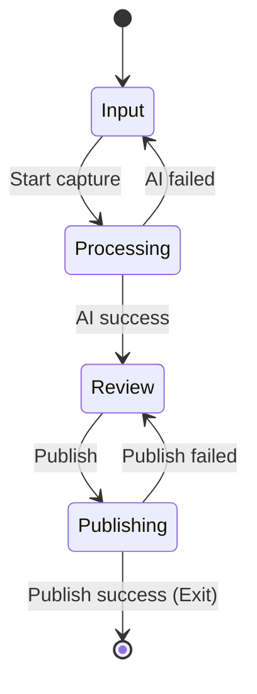

# Capture UI Design Spec

- **Version:** 1.0
- **Purpose:** 定义 Capture 的 UI 规范（状态机 + 布局 + 组件），并满足 UI Architecture Rulebook 要求。
- **Rulebook:** UI Architecture Rulebook

---

# 1. UI Spec DSL

```
Screen: Capture

States:
 - Input
 - Processing
 - Review
 - Publishing

Layout:
 HeaderRegion
 MainRegion
 OverlayRegion
 DrawerRegion

Components:
 TopBar
 InputPanel
 MediaGrid
 PreviewPanel
 ReviewEditor
 AiProcessingOverlay
 AiFailedOverlay
 PublishProcessingOverlay
 PublishFailedOverlay
 InlineErrorBanner

Interactions:
 Input:
  StartCapture -> Processing
  AddMedia -> Input
  RemoveMedia -> Input
  UpdateInput -> Input
  UpdateIntent -> Input

 Processing:
  AiSuccess -> Review
  AiFail -> Input

 Review:
  UpdateReview -> Review
  Publish -> Publishing
  UpdateIntent -> Review

 Publishing:
  PublishSuccess -> Exit
  PublishFail -> Review
```

---

# 2. 状态图



# 3. 校验

| 编号 | 规则                                | 通过（是/否） |
|----|-----------------------------------|---------|
| 1  | State Count ≤ 7                   |         |
| 2  | State Graph Valid                 |         |
|    | R1. 单入口状态                         |         |
|    | R2. 每个状态必须可达                      |         |
|    | R3. 每个状态必须可退出                     |         |
|    | R4. 禁止死循环                         |         |
|    | R5. 明确异常路径                        |         |
| 3  | Component State 不得混入 Screen State |         |
| 4  | Layout 不得依赖 State                 |         |

---
