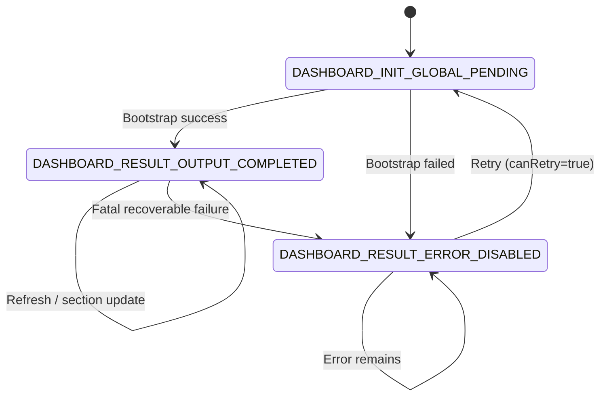

# Dashboard Flow UI Spec

> 本文档基于 [UI-Design-Analysis-Rulebook-v1.0](../../../../docs/design/spec/UI-Design-Analysis-Rulebook-v1.0.md) 与 [UI State Enumeration Dictionary v1.0](../../../../docs/design/spec/more/UI%20State%20Enumeration%20Dictionary%20v1.0.md)，定义 Dashboard 模块状态。
> 本文档仅以 `DashboardUiState.kt` 为单一事实来源（SSOT）。

---

## 0. App-level Phase Mapping（应用级阶段映射）

| Dashboard State                     | App-level Phase    | Description   |
|-------------------------------------|--------------------|---------------|
| `DASHBOARD_INIT_GLOBAL_PENDING`     | System Processing  | 全局初始化中，页面不可交互 |
| `DASHBOARD_RESULT_ERROR_DISABLED`   | Result Consumption | 错误结果态         |
| `DASHBOARD_RESULT_OUTPUT_COMPLETED` | Result Consumption | 输出完成态         |

---

## 1. 文档索引

- [2. 状态流转图（规范版）](#2-状态流转图规范版)
- [3. 状态规范（完整合并）](#3-状态规范完整合并)
- [4. 全局约束（Dashboard 模块）](#4-全局约束dashboard-模块)
- [5. 文档与代码一致性](#5-文档与代码一致性)
- 3.1 `DASHBOARD_INIT_GLOBAL_PENDING`
- 3.2 `DASHBOARD_RESULT_ERROR_DISABLED`
- 3.3 `DASHBOARD_RESULT_OUTPUT_COMPLETED`

## 2. 状态流转图（规范版）

## 3. 状态规范（完整合并）

### 3.1 DASHBOARD_INIT_GLOBAL_PENDING

> Dashboard 入口全局初始化态。

#### 1. State Definition（状态定义）

- State Name: `DASHBOARD_INIT_GLOBAL_PENDING`
- Definition: 页面处于全局初始化中，尚不能进入结果渲染。
- Preconditions:
    - 进入 Dashboard 页面。
- Exit Conditions:
    - 初始化成功，进入 `DASHBOARD_RESULT_OUTPUT_COMPLETED`。
    - 初始化失败，进入 `DASHBOARD_RESULT_ERROR_DISABLED`。

#### 2. State Position in Flow（状态在流程中的位置）

- Previous: `Entry`
- Current: `DASHBOARD_INIT_GLOBAL_PENDING`
- Next: `DASHBOARD_RESULT_OUTPUT_COMPLETED`, `DASHBOARD_RESULT_ERROR_DISABLED`
- Skip Allowed: No
- Rollback Allowed: No
- Parallel: No

#### 3. Core Semantics（核心语义）

- **User Perspective**: 页面初始化中，不可进行主业务操作。
- **System Perspective**: 等待初始化结果，收敛至结果分支。
- **Why This State Cannot Be Merged**: 与结果态合并会丢失初始化阻塞语义。

#### 4. Layout Contract（结构约束）

- Header Region: 页面识别信息。
- Main Region: 全局加载占位。
- Overlay Region: 可选阻塞层。

#### 5. Interaction Rules（交互规则）

- 禁止业务交互、详情跳转、分区操作。
- 允许系统级返回。

#### 6. Visual Rules（视觉规则）

- 必须表达“系统处理中”。

#### 7. Motion Contract（动效约束）

- 允许低强度加载动效。

#### 8. Negative Requirements（明确禁止）

- 不渲染结果内容。

#### 9. Validation Checklist（验收清单）

- 初始化期间不可触发业务动作。

#### 10. One-line Definition（一句话定义）

`DASHBOARD_INIT_GLOBAL_PENDING` 是 Dashboard 全局初始化阻塞状态。

### 3.2 DASHBOARD_RESULT_ERROR_DISABLED

> Dashboard 结果态之一（对应 `ResultErrorDisabled` 数据类）。

#### 1. State Definition（状态定义）

- State Name: `DASHBOARD_RESULT_ERROR_DISABLED`
- Definition: 失败结果分支，承载错误信息与可重试性。
- Preconditions:
    - 初始化或关键流程失败。
- Exit Conditions:
    - 重试后可回到 `DASHBOARD_INIT_GLOBAL_PENDING`。

#### 2. State Position in Flow（状态在流程中的位置）

- Previous: `DASHBOARD_INIT_GLOBAL_PENDING`, `DASHBOARD_RESULT_OUTPUT_COMPLETED`
- Current: `DASHBOARD_RESULT_ERROR_DISABLED`
- Next: `DASHBOARD_INIT_GLOBAL_PENDING`, `DASHBOARD_RESULT_ERROR_DISABLED`
- Skip Allowed: No
- Rollback Allowed: No
- Parallel: No

#### 3. Core Semantics（核心语义）

- **User Perspective**: 当前流程失败，可查看错误并重试。
- **System Perspective**: 停在失败结果分支，等待用户触发恢复。
- **Why This State Cannot Be Merged**: 与初始化/完成分支的能力边界不同。

#### 4. Layout Contract（结构约束）

- Main Region: 错误说明与重试入口（`message`, `canRetry`）。

#### 5. Interaction Rules（交互规则）

- `canRetry=true` 时允许重试。
- 禁止主内容交互。

#### 6. Visual Rules（视觉规则）

- 需明确失败反馈。

#### 7. Motion Contract（动效约束）

- 允许错误反馈过渡动效。

#### 8. Negative Requirements（明确禁止）

- 不隐式重试。

#### 9. Validation Checklist（验收清单）

- `message` 可见且可读。
- `canRetry=false` 时不应出现可触发重试的主动作。

#### 10. One-line Definition（一句话定义）

`DASHBOARD_RESULT_ERROR_DISABLED` 是 Dashboard 的失败结果分支状态。

### 3.3 DASHBOARD_RESULT_OUTPUT_COMPLETED

> Dashboard 结果态之一（对应 `ResultOutputCompleted` 数据类）。

#### 1. State Definition（状态定义）

- State Name: `DASHBOARD_RESULT_OUTPUT_COMPLETED`
- Definition: 页面进入结果展示分支，承载主内容区块与刷新标记。
- Preconditions:
    - 初始化成功并有可渲染数据。
- Exit Conditions:
    - 关键失败时可进入 `DASHBOARD_RESULT_ERROR_DISABLED`。
    - 局部刷新保持在本状态（`isRefreshing`）。

#### 2. State Position in Flow（状态在流程中的位置）

- Previous: `DASHBOARD_INIT_GLOBAL_PENDING`
- Current: `DASHBOARD_RESULT_OUTPUT_COMPLETED`
- Next: `DASHBOARD_RESULT_OUTPUT_COMPLETED`, `DASHBOARD_RESULT_ERROR_DISABLED`
- Skip Allowed: No
- Rollback Allowed: No
- Parallel: Yes（由 `reviewState` / section state 承载）

#### 3. Core Semantics（核心语义）

- **User Perspective**: 可浏览主要内容并触发主交互。
- **System Perspective**: 主状态稳定，细粒度变化由数据字段表达。
- **Why This State Cannot Be Merged**: 与初始化/失败分支交互能力不同。

#### 4. Layout Contract（结构约束）

- Main Region: `reviewState`, `collectionSectionState`, `cardSectionState`。
- Overlay Region: 轻量刷新反馈（`isRefreshing`）。

#### 5. Interaction Rules（交互规则）

- 允许主内容浏览和刷新行为。

#### 6. Visual Rules（视觉规则）

- 展示完成态内容结构。

#### 7. Motion Contract（动效约束）

- 允许分区更新和刷新动画。

#### 8. Negative Requirements（明确禁止）

- 不回退到全局阻塞视觉。

#### 9. Validation Checklist（验收清单）

- `collectionSectionState` 与 `cardSectionState` 必须可驱动渲染。
- `isRefreshing=true` 不应阻断全部交互。

#### 10. One-line Definition（一句话定义）

`DASHBOARD_RESULT_OUTPUT_COMPLETED` 是 Dashboard 结果展示分支的主内容状态。

## 4. 全局约束（Dashboard 模块）

- 状态命名遵循 `<MODULE>_<PHASE>_<CONTEXT>_<MODE>`。
- 模块顶层状态仅允许使用 `DashboardUiState.kt` 中当前定义的 3 个状态常量。
- 分区与刷新细节不新增平级顶层状态，使用 `ResultOutputCompleted` 字段表达。

## 5. 文档与代码一致性

### 5.1 顶层状态对齐（SSOT）

`feature/dashboard/src/commonMain/kotlin/tech/zhifu/app/myhub/feature/dashboard/DashboardUiState.kt` 当前定义：

- `InitGlobalPending : DashboardUiState(state = DASHBOARD_INIT_GLOBAL_PENDING)`
- `ResultOutputCompleted(...) : DashboardUiState(state = DASHBOARD_RESULT_OUTPUT_COMPLETED)`
- `ResultErrorDisabled(...) : DashboardUiState(state = DASHBOARD_RESULT_ERROR_DISABLED)`

### 5.2 State 常量四段值对齐

- `DASHBOARD_INIT_GLOBAL_PENDING` = `DASHBOARD + INIT + GLOBAL + PENDING`
- `DASHBOARD_RESULT_ERROR_DISABLED` = `DASHBOARD + RESULT + ERROR + DISABLED`
- `DASHBOARD_RESULT_OUTPUT_COMPLETED` = `DASHBOARD + RESULT + OUTPUT + COMPLETED`

### 5.3 与枚举字典的语义校验结论

- 命名值均来自封闭字典（`Module/Phase/Context/Mode` 均合法）。
- 状态名称与 `Context/Mode` 组合语义一致。

### 5.4 变更记录

- 移除不存在于当前代码的 `DASHBOARD_RESULT_AUTH_EXPIRED` 状态。
- 将状态集合收敛为当前代码真实定义的 3 态。
- 更新状态流转图与一致性章节，保持文档与 `DashboardUiState.kt` 同步。
