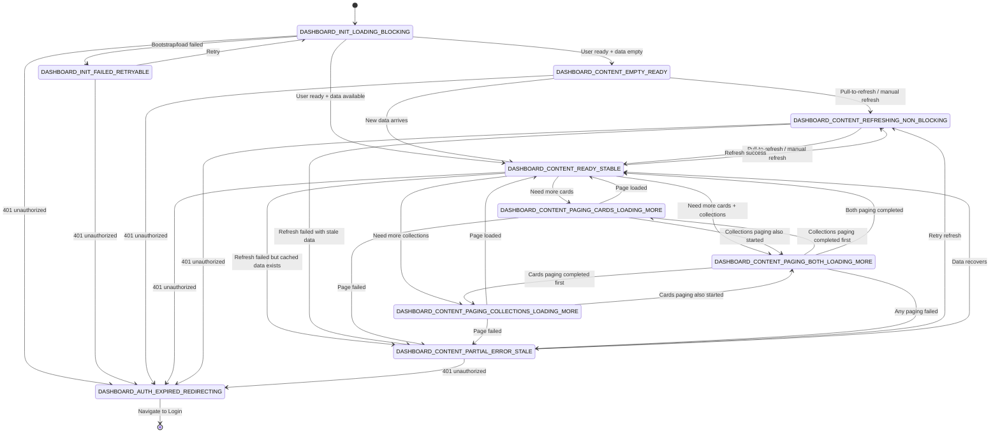

# Dashboard Flow UI Spec

> 本文档基于 [UI-Design-Analysis-Rulebook-v1.0](../../../../docs/design/spec/UI-Design-Analysis-Rulebook-v1.0.md)，用于定义 Dashboard 模块的状态划分、状态边界与流转关系。
> 本文档以 `feature/capture/docs/design/index.md` 为标杆，面向产品级交付与后续迭代上线。

---

## 0. App-level Phase Mapping（应用级阶段映射）

| Dashboard State                             | App-level Phase    | Description  |
|---------------------------------------------|--------------------|--------------|
| `DASHBOARD_INIT_LOADING_BLOCKING`           | System Processing  | 首次加载/初始化阶段   |
| `DASHBOARD_INIT_FAILED_RETRYABLE`           | System Processing  | 初始化失败，等待用户重试 |
| `DASHBOARD_CONTENT_EMPTY_READY`             | Pre-Interaction    | 上下文就绪，等待用户操作 |
| `DASHBOARD_CONTENT_READY_STABLE`            | Active Interaction | 主业务交互阶段      |
| `DASHBOARD_CONTENT_REFRESHING_NON_BLOCKING` | Active Interaction | 后台刷新，用户可继续操作 |
| `DASHBOARD_CONTENT_PARTIAL_ERROR_STALE`     | Active Interaction | 部分失败，仍可交互    |
| `DASHBOARD_CONTENT_PAGING_*_LOADING_MORE`   | Active Interaction | 分页加载中，用户可浏览  |
| `DASHBOARD_AUTH_EXPIRED_REDIRECTING`        | System Processing  | 会话过期，跳转登录    |

---

## 1. 文档索引

- [2. 状态流转图（规范版）](#2-状态流转图规范版)
- [3. 状态规范（完整合并）](#3-状态规范完整合并)
- [4. 全局约束（Dashboard 模块）](#4-全局约束dashboard-模块)
- [5. 文档与代码一致性](#5-文档与代码一致性)
- 3.1 `DASHBOARD_INIT_LOADING_BLOCKING`
- 3.2 `DASHBOARD_INIT_FAILED_RETRYABLE`
- 3.3 `DASHBOARD_CONTENT_EMPTY_READY`
- 3.4 `DASHBOARD_CONTENT_READY_STABLE`
- 3.5 `DASHBOARD_CONTENT_REFRESHING_NON_BLOCKING`
- 3.6 `DASHBOARD_CONTENT_PARTIAL_ERROR_STALE`
- 3.7 `DASHBOARD_CONTENT_PAGING_CARDS_LOADING_MORE`
- 3.8 `DASHBOARD_CONTENT_PAGING_COLLECTIONS_LOADING_MORE`
- 3.9 `DASHBOARD_CONTENT_PAGING_BOTH_LOADING_MORE`
- 3.10 `DASHBOARD_AUTH_EXPIRED_REDIRECTING`

## 2. 状态流转图（规范版）

## 3. 状态规范（完整合并）

### 3.1 DASHBOARD_INIT_LOADING_BLOCKING

> Dashboard 入口阻塞加载态：用户/基础数据上下文尚未就绪，页面主内容不可交互。

#### 1. State Definition（状态定义）

- State Name: `DASHBOARD_INIT_LOADING_BLOCKING`
- Definition: 页面处于首次加载或关键上下文初始化阶段，尚不具备可渲染的业务内容。
- Preconditions:
    - 进入 Dashboard 页面。
    - 尚未确认用户上下文（User）与首批卡片数据是否就绪。
- Exit Conditions:
    - 数据为空但上下文就绪，进入 `DASHBOARD_CONTENT_EMPTY_READY`。
    - 数据可用，进入 `DASHBOARD_CONTENT_READY_STABLE`。
    - 初始化失败，进入 `DASHBOARD_INIT_FAILED_RETRYABLE`。
    - 鉴权失败（401），进入 `DASHBOARD_AUTH_EXPIRED_REDIRECTING`。

#### 2. State Position in Flow（状态在流程中的位置）

- Previous: `Entry`
- Current: `DASHBOARD_INIT_LOADING_BLOCKING`
- Next: `DASHBOARD_CONTENT_EMPTY_READY`, `DASHBOARD_CONTENT_READY_STABLE`, `DASHBOARD_INIT_FAILED_RETRYABLE`, `DASHBOARD_AUTH_EXPIRED_REDIRECTING`
- Skip Allowed: No
- Rollback Allowed: No
- Parallel: No

#### 3. Core Semantics（核心语义）

- **User Perspective**: Dashboard 正在准备中，暂不可操作。
- **System Perspective**: 建立 user/data 依赖链，等待首个可用视图快照。
- **Why This State Cannot Be Merged**: 与 Empty/Content 合并会丢失"阻塞态"语义，导致空数据与加载中不可区分。

#### 4. Layout Contract（结构约束）

- Header Region: 可显示标题骨架，不显示可触发业务动作。
- Main Region: 加载占位（Skeleton/Loading 文案）。
- Overlay Region: 可选全屏阻塞层。

#### 5. Interaction Rules（交互规则）

- 禁止刷新、分页、卡片跳转、收藏切换。
- 允许系统级返回/退出。

#### 6. Visual Rules（视觉规则）

- 必须表达“等待系统完成初始化”，而非“空内容”。
- 不允许出现“无数据”空态插画或 CTA。

#### 7. Motion Contract（动效约束）

- 允许：低强度加载节奏。
- 禁止：列表结构动画、卡片 hover 动画。

#### 8. Negative Requirements（明确禁止）

- 不渲染业务卡片。
- 不渲染分页触发器。
- 不显示“lastSyncTime 成功语义”。

#### 9. Validation Checklist（验收清单）

- 初始化未完成时，用户无法误触业务操作。
- 加载态与空态视觉严格区分。
- 401 可从此态直接收敛到登录跳转链路。

#### 10. One-line Definition（一句话定义）

`DASHBOARD_INIT_LOADING_BLOCKING` 是 Dashboard 的入口阻塞初始化状态。

### 3.2 DASHBOARD_INIT_FAILED_RETRYABLE

> 启动失败可恢复态：首屏关键加载失败，允许用户重试。

#### 1. State Definition（状态定义）

- State Name: `DASHBOARD_INIT_FAILED_RETRYABLE`
- Definition: 首屏关键依赖加载失败，且当前不存在可展示的业务快照。
- Preconditions:
    - 处于入口阻塞态。
    - 关键加载链路失败且不可降级展示。
- Exit Conditions:
    - 用户重试，回到 `DASHBOARD_INIT_LOADING_BLOCKING`。
    - 401 鉴权失败，进入 `DASHBOARD_AUTH_EXPIRED_REDIRECTING`。

#### 2. State Position in Flow（状态在流程中的位置）

- Previous: `DASHBOARD_INIT_LOADING_BLOCKING`
- Current: `DASHBOARD_INIT_FAILED_RETRYABLE`
- Next: `DASHBOARD_INIT_LOADING_BLOCKING`, `DASHBOARD_AUTH_EXPIRED_REDIRECTING`
- Skip Allowed: No
- Rollback Allowed: No
- Parallel: No

#### 3. Core Semantics（核心语义）

- **User Perspective**: 当前不可用，但可以重试恢复。
- **System Perspective**: 终止当前阻塞链路，等待显式重试事件。
- **Why This State Cannot Be Merged**: 与 PartialError 合并会把"无数据失败"和"有缓存失败"混淆。

#### 4. Layout Contract（结构约束）

- Header Region: 简化为页面标识。
- Main Region: 错误说明 + 重试主按钮。

#### 5. Interaction Rules（交互规则）

- 主按钮仅触发重试。
- 禁止业务导航和分页。

#### 6. Visual Rules（视觉规则）

- 明确“失败且可恢复”。
- 不得使用成功/空态视觉。

#### 7. Motion Contract（动效约束）

- 允许：错误出现淡入。
- 禁止：持续加载循环（避免误导仍在处理中）。

#### 8. Negative Requirements（明确禁止）

- 不展示陈旧业务数据。
- 不触发自动无限重试。

#### 9. Validation Checklist（验收清单）

- 单击重试后状态回到阻塞加载。
- 错误消息可定位（网络/服务/数据）。

#### 10. One-line Definition（一句话定义）

`DASHBOARD_INIT_FAILED_RETRYABLE` 是首屏关键加载失败后的可重试状态。

### 3.3 DASHBOARD_CONTENT_EMPTY_READY

> 内容空态可交互：上下文就绪但暂无内容，支持创建与刷新。

#### 1. State Definition（状态定义）

- State Name: `DASHBOARD_CONTENT_EMPTY_READY`
- Definition: 页面已可交互，但 cards/collections 均为空或不足以构成内容流。
- Preconditions:
    - 用户上下文可用。
    - 首屏加载完成但无可展示内容。
- Exit Conditions:
    - 新数据到达，进入 `DASHBOARD_CONTENT_READY_STABLE`。
    - 用户触发刷新，进入 `DASHBOARD_CONTENT_REFRESHING_NON_BLOCKING`。
    - 401 鉴权失败，进入 `DASHBOARD_AUTH_EXPIRED_REDIRECTING`。

#### 2. State Position in Flow（状态在流程中的位置）

- Previous: `DASHBOARD_INIT_LOADING_BLOCKING`
- Current: `DASHBOARD_CONTENT_EMPTY_READY`
- Next: `DASHBOARD_CONTENT_READY_STABLE`, `DASHBOARD_CONTENT_REFRESHING_NON_BLOCKING`, `DASHBOARD_AUTH_EXPIRED_REDIRECTING`
- Skip Allowed: Yes
- Rollback Allowed: No
- Parallel: No

#### 3. Core Semantics（核心语义）

- **User Perspective**: 页面可用了，但我还没有资产。
- **System Perspective**: 保持完整操作入口，等待内容增长。
- **Why This State Cannot Be Merged**: 与 ReadyStable 合并会导致空态 CTA 与内容模块规则冲突。

#### 4. Layout Contract（结构约束）

- Header Region: 全部主动作可用（搜索、刷新、更多）。
- Main Region: 空态说明 + `New Capture` CTA。
- Side/Overlay Region: 无需悬浮复习模块。

#### 5. Interaction Rules（交互规则）

- 允许新建、刷新。
- 禁止分页触发（无列表可翻页）。

#### 6. Visual Rules（视觉规则）

- 必须表达“可行动的空态”，而非错误态。
- CTA 层级高于装饰信息。

#### 7. Motion Contract（动效约束）

- 允许：空态元素首次进入淡入。
- 禁止：加载旋转类动效常驻。

#### 8. Negative Requirements（明确禁止）

- 不显示“加载中”文案。
- 不显示陈旧错误横幅（除非刚由错误恢复）。

#### 9. Validation Checklist（验收清单）

- 空态时用户至少有 1 个明确下一步动作。
- 空态下刷新可触发并进入 Refreshing 状态。

#### 10. One-line Definition（一句话定义）

`DASHBOARD_CONTENT_EMPTY_READY` 是上下文就绪后的可行动空内容状态。

### 3.4 DASHBOARD_CONTENT_READY_STABLE

> 主稳态：业务内容可见、可浏览、可触发后续操作。

#### 1. State Definition（状态定义）

- State Name: `DASHBOARD_CONTENT_READY_STABLE`
- Definition: Dashboard 的主要工作态，展示 collections + latest captures + focus review 等模块。
- Preconditions:
    - 至少有一类内容模块可稳定渲染。
- Exit Conditions:
    - 刷新触发进入 `DASHBOARD_CONTENT_REFRESHING_NON_BLOCKING`。
    - 加载更多 cards 进入 `DASHBOARD_CONTENT_PAGING_CARDS_LOADING_MORE`。
    - 加载更多 collections 进入 `DASHBOARD_CONTENT_PAGING_COLLECTIONS_LOADING_MORE`。
    - cards 与 collections 同时进入加载，进入 `DASHBOARD_CONTENT_PAGING_BOTH_LOADING_MORE`。
    - 刷新失败且有缓存，进入 `DASHBOARD_CONTENT_PARTIAL_ERROR_STALE`。
    - 401 鉴权失败，进入 `DASHBOARD_AUTH_EXPIRED_REDIRECTING`。

#### 2. State Position in Flow（状态在流程中的位置）

- Previous: `DASHBOARD_INIT_LOADING_BLOCKING`, `DASHBOARD_CONTENT_EMPTY_READY`, `DASHBOARD_CONTENT_REFRESHING_NON_BLOCKING`
- Current: `DASHBOARD_CONTENT_READY_STABLE`
- Next: `DASHBOARD_CONTENT_REFRESHING_NON_BLOCKING`, `DASHBOARD_CONTENT_PAGING_CARDS_LOADING_MORE`, `DASHBOARD_CONTENT_PAGING_COLLECTIONS_LOADING_MORE`, `DASHBOARD_CONTENT_PAGING_BOTH_LOADING_MORE`, `DASHBOARD_CONTENT_PARTIAL_ERROR_STALE`, `DASHBOARD_AUTH_EXPIRED_REDIRECTING`
- Skip Allowed: Yes
- Rollback Allowed: Yes（从分页/刷新子态回退）
- Parallel: Yes（内容可见下允许非阻塞子任务）

#### 3. Core Semantics（核心语义）

- **User Perspective**: 我可以稳定浏览并操作内容。
- **System Perspective**: 提供完整读操作与轻写操作入口。
- **Why This State Cannot Be Merged**: 与 Refreshing/Paging 合并会导致"是否可触发重复动作"判定混乱。

#### 4. Layout Contract（结构约束）

- Header Region: 标题、副标题、刷新/搜索/更多动作。
- Main Region: Collections 模块、Latest Captures 模块、New Capture 卡片。
- Floating Region: Focus & Review 悬浮模块（条件显示）。

#### 5. Interaction Rules（交互规则）

- 允许进入详情、编辑、创建、刷新。
- 允许按条件触发分页（hasMore=true）。

#### 6. Visual Rules（视觉规则）

- 强调信息层级：标题 > 模块标题 > 卡片内容。
- 不出现阻塞遮罩。

#### 7. Motion Contract（动效约束）

- 允许：hover 抬升、轻量列表插入。
- 禁止：整屏闪烁、强位移动画。

#### 8. Negative Requirements（明确禁止）

- 不显示全屏 loading。
- 不重复触发同一分页请求。

#### 9. Validation Checklist（验收清单）

- 内容可稳定渲染于 1/2/3/4 列布局。
- 主动作可用且无状态冲突。

#### 10. One-line Definition（一句话定义）

`DASHBOARD_CONTENT_READY_STABLE` 是 Dashboard 的主业务稳定态。

### 3.5 DASHBOARD_CONTENT_REFRESHING_NON_BLOCKING

> 非阻塞刷新态：保留内容可见，后台更新数据。

#### 1. State Definition（状态定义）

- State Name: `DASHBOARD_CONTENT_REFRESHING_NON_BLOCKING`
- Definition: 页面在保留现有内容的前提下进行刷新，用户可继续浏览。
- Preconditions:
    - 来源于 `DASHBOARD_CONTENT_READY_STABLE` 或 `DASHBOARD_CONTENT_EMPTY_READY`。
- Exit Conditions:
    - 刷新成功，进入 `DASHBOARD_CONTENT_READY_STABLE`。
    - 刷新失败但有旧数据，进入 `DASHBOARD_CONTENT_PARTIAL_ERROR_STALE`。
    - 401 鉴权失败，进入 `DASHBOARD_AUTH_EXPIRED_REDIRECTING`。

#### 2. State Position in Flow（状态在流程中的位置）

- Previous: `DASHBOARD_CONTENT_READY_STABLE`, `DASHBOARD_CONTENT_EMPTY_READY`, `DASHBOARD_CONTENT_PARTIAL_ERROR_STALE`
- Current: `DASHBOARD_CONTENT_REFRESHING_NON_BLOCKING`
- Next: `DASHBOARD_CONTENT_READY_STABLE`, `DASHBOARD_CONTENT_PARTIAL_ERROR_STALE`, `DASHBOARD_AUTH_EXPIRED_REDIRECTING`
- Skip Allowed: Yes
- Rollback Allowed: Yes
- Parallel: Yes（可与滚动浏览并行）

#### 3. Core Semantics（核心语义）

- **User Perspective**: 数据在更新，但我不用等。
- **System Perspective**: 后台拉取并回写，前台保持可用快照。
- **Why This State Cannot Be Merged**: 与 Stable 合并会丢失刷新中禁用规则（例如刷新按钮禁用旋转）。

#### 4. Layout Contract（结构约束）

- Header Region: 刷新按钮旋转且不可重复点击。
- Main Region: 保持现有内容快照不清空。

#### 5. Interaction Rules（交互规则）

- 允许浏览、进入详情。
- 刷新入口应防重入。
- 分页请求可按策略串行化（推荐禁用新分页直到刷新完成）。

#### 6. Visual Rules（视觉规则）

- 刷新反馈局部可感知（按钮、PTR 指示器）。
- 禁止退化成全屏阻塞态。

#### 7. Motion Contract（动效约束）

- 允许：刷新 icon 循环旋转。
- 禁止：整页 Skeleton 覆盖。

#### 8. Negative Requirements（明确禁止）

- 不清空当前列表。
- 不弹出阻塞式错误对话框。

#### 9. Validation Checklist（验收清单）

- 刷新期间卡片依旧可见。
- 刷新结束后 `isRefreshing` 必须回落。

#### 10. One-line Definition（一句话定义）

`DASHBOARD_CONTENT_REFRESHING_NON_BLOCKING` 是 Dashboard 的非阻塞后台刷新状态。

### 3.6 DASHBOARD_CONTENT_PARTIAL_ERROR_STALE

> 部分失败陈旧态：请求失败但仍可展示上一次有效快照。

#### 1. State Definition（状态定义）

- State Name: `DASHBOARD_CONTENT_PARTIAL_ERROR_STALE`
- Definition: 数据刷新或分页失败，但页面保留旧数据并给出可恢复提示。
- Preconditions:
    - 当前已存在可展示内容。
    - 本次刷新/分页请求失败。
- Exit Conditions:
    - 用户重试，进入 `DASHBOARD_CONTENT_REFRESHING_NON_BLOCKING`。
    - 后续流更新成功，进入 `DASHBOARD_CONTENT_READY_STABLE`。
    - 401 鉴权失败，进入 `DASHBOARD_AUTH_EXPIRED_REDIRECTING`。

#### 2. State Position in Flow（状态在流程中的位置）

- Previous: `DASHBOARD_CONTENT_READY_STABLE`, `DASHBOARD_CONTENT_REFRESHING_NON_BLOCKING`, `DASHBOARD_CONTENT_PAGING_CARDS_LOADING_MORE`, `DASHBOARD_CONTENT_PAGING_COLLECTIONS_LOADING_MORE`, `DASHBOARD_CONTENT_PAGING_BOTH_LOADING_MORE`
- Current: `DASHBOARD_CONTENT_PARTIAL_ERROR_STALE`
- Next: `DASHBOARD_CONTENT_REFRESHING_NON_BLOCKING`, `DASHBOARD_CONTENT_READY_STABLE`, `DASHBOARD_AUTH_EXPIRED_REDIRECTING`
- Skip Allowed: Yes
- Rollback Allowed: Yes
- Parallel: Yes

#### 3. Core Semantics（核心语义）

- **User Perspective**: 内容还能看，但刚刚更新失败了。
- **System Perspective**: 保护可用性，避免失败导致全屏回退。
- **Why This State Cannot Be Merged**: 与 BootstrapFailed 合并将损失"已有可用数据"的关键差异。

#### 4. Layout Contract（结构约束）

- Header/Main Region: 延续 Ready 布局。
- Notice Region: 轻量错误条/Toast（可重试）。

#### 5. Interaction Rules（交互规则）

- 允许继续浏览既有内容。
- 允许重试刷新。

#### 6. Visual Rules（视觉规则）

- 错误提示应“可见但不抢占”。
- 保持卡片主体视觉稳定。

#### 7. Motion Contract（动效约束）

- 允许：错误提示短暂出现。
- 禁止：列表抖动或回顶。

#### 8. Negative Requirements（明确禁止）

- 不自动切回阻塞 loading。
- 不清空现有数据。

#### 9. Validation Checklist（验收清单）

- 错误后用户仍可进入详情。
- 重试后可恢复至 ReadyStable。

#### 10. One-line Definition（一句话定义）

`DASHBOARD_CONTENT_PARTIAL_ERROR_STALE` 是“失败但可用”的内容降级状态。

### 3.7 DASHBOARD_CONTENT_PAGING_CARDS_LOADING_MORE

> Cards 分页加载子态：底部触发追加加载，不影响主内容浏览。

#### 1. State Definition（状态定义）

- State Name: `DASHBOARD_CONTENT_PAGING_CARDS_LOADING_MORE`
- Definition: 正在为最近卡片流追加下一页数据。
- Preconditions:
    - `hasMoreCards = true`
    - `isLoadingMoreCards = false` 且触发 loadMore。
- Exit Conditions:
    - collections 分页也进入加载，转为 `DASHBOARD_CONTENT_PAGING_BOTH_LOADING_MORE`。
    - 仅 cards 完成时回到 `DASHBOARD_CONTENT_READY_STABLE`。
    - 失败，进入 `DASHBOARD_CONTENT_PARTIAL_ERROR_STALE`。

#### 2. State Position in Flow（状态在流程中的位置）

- Previous: `DASHBOARD_CONTENT_READY_STABLE`, `DASHBOARD_CONTENT_PAGING_BOTH_LOADING_MORE`（cards 已在加载，collections 先完成后回落）
- Current: `DASHBOARD_CONTENT_PAGING_CARDS_LOADING_MORE`
- Next: `DASHBOARD_CONTENT_READY_STABLE`, `DASHBOARD_CONTENT_PAGING_BOTH_LOADING_MORE`, `DASHBOARD_CONTENT_PARTIAL_ERROR_STALE`
- Skip Allowed: Yes
- Rollback Allowed: Yes
- Parallel: Yes（与浏览并行）

#### 3. Core Semantics（核心语义）

- **User Perspective**: 列表在继续加载更多条目。
- **System Perspective**: 以增量方式扩展 `recentCards`，避免整页刷新。
- **Why This State Cannot Be Merged**: 与 Ready 或 BothPaging 合并会造成"当前仅哪一路在加载"不明确。

#### 4. Layout Contract（结构约束）

- Main Region: 卡片列表底部展示局部 loading item。

#### 5. Interaction Rules（交互规则）

- 禁止重复触发 cards loadMore。
- 允许查看已加载卡片。

#### 6. Visual Rules（视觉规则）

- 仅底部出现进度反馈，不影响顶部模块。

#### 7. Motion Contract（动效约束）

- 允许：底部小型进度动画。
- 禁止：整页刷新动画。

#### 8. Negative Requirements（明确禁止）

- 不重置当前滚动位置。
- 不覆盖已有卡片内容。

#### 9. Validation Checklist（验收清单）

- 触发后 `isLoadingMoreCards=true`，结束后归零。
- 成功时列表长度增加。

#### 10. One-line Definition（一句话定义）

`DASHBOARD_CONTENT_PAGING_CARDS_LOADING_MORE` 是卡片增量分页加载状态。

### 3.8 DASHBOARD_CONTENT_PAGING_COLLECTIONS_LOADING_MORE

> Collections 分页加载子态：横向集合流追加加载。

#### 1. State Definition（状态定义）

- State Name: `DASHBOARD_CONTENT_PAGING_COLLECTIONS_LOADING_MORE`
- Definition: 正在为 collections 横向列表追加下一页数据。
- Preconditions:
    - `hasMoreCollections = true`
    - `isLoadingMoreCollections = false` 且触发 loadMore。
- Exit Conditions:
    - cards 分页也进入加载，转为 `DASHBOARD_CONTENT_PAGING_BOTH_LOADING_MORE`。
    - 仅 collections 完成时回到 `DASHBOARD_CONTENT_READY_STABLE`。
    - 失败，进入 `DASHBOARD_CONTENT_PARTIAL_ERROR_STALE`。

#### 2. State Position in Flow（状态在流程中的位置）

- Previous: `DASHBOARD_CONTENT_READY_STABLE`, `DASHBOARD_CONTENT_PAGING_BOTH_LOADING_MORE`（collections 已在加载，cards 先完成后回落）
- Current: `DASHBOARD_CONTENT_PAGING_COLLECTIONS_LOADING_MORE`
- Next: `DASHBOARD_CONTENT_READY_STABLE`, `DASHBOARD_CONTENT_PAGING_BOTH_LOADING_MORE`, `DASHBOARD_CONTENT_PARTIAL_ERROR_STALE`
- Skip Allowed: Yes
- Rollback Allowed: Yes
- Parallel: Yes

#### 3. Core Semantics（核心语义）

- **User Perspective**: 资产集合正在追加加载。
- **System Perspective**: 增量扩展 `collections`，维持主布局稳定。
- **Why This State Cannot Be Merged**: 与 CardsPaging 或 BothPaging 合并会丢失"仅 collections 在加载"的语义。

#### 4. Layout Contract（结构约束）

- Collection Region: 列表尾部局部 loading 占位。

#### 5. Interaction Rules（交互规则）

- 禁止重复触发 collections loadMore。
- 不阻断其他模块浏览。

#### 6. Visual Rules（视觉规则）

- loading 反馈局部且与 collection 视觉一致。

#### 7. Motion Contract（动效约束）

- 允许：尾部小型进度动画。
- 禁止：模块整体重排闪烁。

#### 8. Negative Requirements（明确禁止）

- 不清空已有 collections。
- 不改变 FocusReview 显示判定。

#### 9. Validation Checklist（验收清单）

- 触发后 `isLoadingMoreCollections=true`，结束后归零。
- 成功时 `collections` 长度增加。

#### 10. One-line Definition（一句话定义）

`DASHBOARD_CONTENT_PAGING_COLLECTIONS_LOADING_MORE` 是集合增量分页加载状态。

### 3.9 DASHBOARD_CONTENT_PAGING_BOTH_LOADING_MORE

> 双流并行分页子态：cards 与 collections 同时追加加载，两个区域各自显示 loading 反馈。

#### 1. State Definition（状态定义）

- State Name: `DASHBOARD_CONTENT_PAGING_BOTH_LOADING_MORE`
- Definition: `isLoadingMoreCards=true` 且 `isLoadingMoreCollections=true`，两条分页链路并行执行。
- Preconditions:
    - 已进入任一单流分页态，另一条分页在进行中被触发；或两条分页在同一轮事件中被触发。
- Exit Conditions:
    - cards 先完成，回落到 `DASHBOARD_CONTENT_PAGING_COLLECTIONS_LOADING_MORE`。
    - collections 先完成，回落到 `DASHBOARD_CONTENT_PAGING_CARDS_LOADING_MORE`。
    - 两条都完成，回到 `DASHBOARD_CONTENT_READY_STABLE`。
    - 任一路失败，进入 `DASHBOARD_CONTENT_PARTIAL_ERROR_STALE`。

#### 2. State Position in Flow（状态在流程中的位置）

- Previous: `DASHBOARD_CONTENT_READY_STABLE`, `DASHBOARD_CONTENT_PAGING_CARDS_LOADING_MORE`, `DASHBOARD_CONTENT_PAGING_COLLECTIONS_LOADING_MORE`
- Current: `DASHBOARD_CONTENT_PAGING_BOTH_LOADING_MORE`
- Next: `DASHBOARD_CONTENT_PAGING_CARDS_LOADING_MORE`, `DASHBOARD_CONTENT_PAGING_COLLECTIONS_LOADING_MORE`, `DASHBOARD_CONTENT_READY_STABLE`, `DASHBOARD_CONTENT_PARTIAL_ERROR_STALE`
- Skip Allowed: Yes
- Rollback Allowed: Yes
- Parallel: Yes

#### 3. Core Semantics（核心语义）

- **User Perspective**: 两个模块都在"加载更多"，且互不阻塞。
- **System Perspective**: 双分页请求并行进行，分别维护各自完成/失败回调。
- **Why This State Cannot Be Merged**: 该状态对应独立 UI 反馈（双 loading footer），无法由单流分页态准确表达。

#### 4. Layout Contract（结构约束）

- Main Region: Cards 区域底部与 Collections 区域尾部同时显示 loading 占位。

#### 5. Interaction Rules（交互规则）

- 两个分页入口都必须防重入。
- 允许浏览已加载内容，不阻断详情跳转。

#### 6. Visual Rules（视觉规则）

- 两个分页反馈同时可见，且互不覆盖。
- 不允许出现全屏 loading 或整页闪烁。

#### 7. Motion Contract（动效约束）

- 允许：两个局部 loading 动效并行运行。
- 禁止：主内容区域发生跳变重排。

#### 8. Negative Requirements（明确禁止）

- 不串行化为单流加载（除非明确策略要求）。
- 不因一侧完成而提前隐藏另一侧 loading。

#### 9. Validation Checklist（验收清单）

- `isLoadingMoreCards && isLoadingMoreCollections` 时必须进入该态。
- 任一路先完成时，准确回落到另一单流分页态。
- 两路都完成后，状态回到 `DASHBOARD_CONTENT_READY_STABLE`。

#### 10. One-line Definition（一句话定义）

`DASHBOARD_CONTENT_PAGING_BOTH_LOADING_MORE` 是 Dashboard 的双流并行分页状态。

### 3.10 DASHBOARD_AUTH_EXPIRED_REDIRECTING

> 会话过期跳转态：检测到 401，执行一次性登录跳转。

#### 1. State Definition（状态定义）

- State Name: `DASHBOARD_AUTH_EXPIRED_REDIRECTING`
- Definition: 当前会话无效，Dashboard 不再提供业务交互，触发登录重定向。
- Preconditions:
    - 任何数据链路检测到 401/Unauthorized。
- Exit Conditions:
    - 完成跳转并退出 Dashboard。

#### 2. State Position in Flow（状态在流程中的位置）

- Previous: Any
- Current: `DASHBOARD_AUTH_EXPIRED_REDIRECTING`
- Next: `Exit`
- Skip Allowed: No
- Rollback Allowed: No
- Parallel: No

#### 3. Core Semantics（核心语义）

- **User Perspective**: 登录过期，需要重新登录。
- **System Perspective**: 统一收敛到鉴权恢复链路，避免继续读写。
- **Why This State Cannot Be Merged**: 与错误态合并会导致 401 与一般网络错误处理不一致。

#### 4. Layout Contract（结构约束）

- Snackbar/Toast Region: 一次性提示“登录已过期”。
- Navigation Region: 立即触发路由跳转。

#### 5. Interaction Rules（交互规则）

- 禁止继续业务操作。
- 仅允许跳转链路执行。

#### 6. Visual Rules（视觉规则）

- 提示应短暂清晰，不与其他错误混用文案。

#### 7. Motion Contract（动效约束）

- 允许：提示淡入。
- 禁止：复杂过渡动画阻塞跳转。

#### 8. Negative Requirements（明确禁止）

- 不重复弹出多次登录过期提示。
- 不尝试在本页做自动静默恢复。

#### 9. Validation Checklist（验收清单）

- 401 只触发一次导航事件。
- 跳转前后状态机无循环抖动。

#### 10. One-line Definition（一句话定义）

`DASHBOARD_AUTH_EXPIRED_REDIRECTING` 是 Dashboard 的会话过期收敛状态。

## 4. 全局约束（Dashboard 模块）

- 状态机必须显式区分：`阻塞加载`、`可交互空态`、`内容稳态`、`非阻塞刷新`、`局部分页`、`会话过期`。
- `error` 不能直接替代状态；错误是状态的属性，不能成为隐式状态机。
- 分页状态必须拆分为 cards 与 collections 两条独立子流，并显式支持 `DASHBOARD_CONTENT_PAGING_BOTH_LOADING_MORE` 组合态。
- 所有加载行为必须防重入（refresh/loadMore）。
- 任何 401 错误优先收敛到 `DASHBOARD_AUTH_EXPIRED_REDIRECTING`。

## 5. 文档与代码一致性

### 5.1 当前实现映射（as-is）

- `DashboardUiState.InitialLoading` 覆盖：
    - `DASHBOARD_INIT_LOADING_BLOCKING`
    - （缺失）`DASHBOARD_INIT_FAILED_RETRYABLE`
- `DashboardUiState.Content` + 字段组合覆盖：
    - `DASHBOARD_CONTENT_EMPTY_READY`（`recentCards.isEmpty && collections.isEmpty && error==null`）
    - `DASHBOARD_CONTENT_READY_STABLE`（`!isRefreshing && !isLoadingMore* && error==null`）
    - `DASHBOARD_CONTENT_REFRESHING_NON_BLOCKING`（`isRefreshing==true`）
    - `DASHBOARD_CONTENT_PARTIAL_ERROR_STALE`（`error!=null` 且仍有内容）
    - `DASHBOARD_CONTENT_PAGING_BOTH_LOADING_MORE`（`isLoadingMoreCards==true && isLoadingMoreCollections==true`，优先级高于单流分页态）
    - `DASHBOARD_CONTENT_PAGING_CARDS_LOADING_MORE`（`isLoadingMoreCards==true && isLoadingMoreCollections==false`）
    - `DASHBOARD_CONTENT_PAGING_COLLECTIONS_LOADING_MORE`（`isLoadingMoreCollections==true && isLoadingMoreCards==false`）
- `navigateToLogin` SharedFlow 覆盖：
    - `DASHBOARD_AUTH_EXPIRED_REDIRECTING`

### 5.2 产品级重构建议（to-be）

- 将 `DashboardUiState` 从“单一 Content + flags”升级为显式层级状态：
    - `Bootstrapping`、`BootstrapFailed`、`Ready.Empty`、`Ready.Stable`、`Ready.Refreshing`、`Ready.PartialError`、`Ready.Paging(cards|collections|both)`、`AuthExpiredRedirecting`。
- 把刷新与分页并发控制集中到 reducer/event 层，避免在多个函数中直接 `copy` 导致状态竞争。
- 在 `DashboardScreen` 增加明确空态布局分支，避免“空数据但展示普通内容骨架”的语义漂移。

### 5.3 验收口径

- 任意时刻都能回答三个问题：
    - 现在是什么状态？
    - 用户能做什么？
    - 下一步会去哪里？
- 状态切换可通过日志或测试复现，不依赖人工观察猜测。
