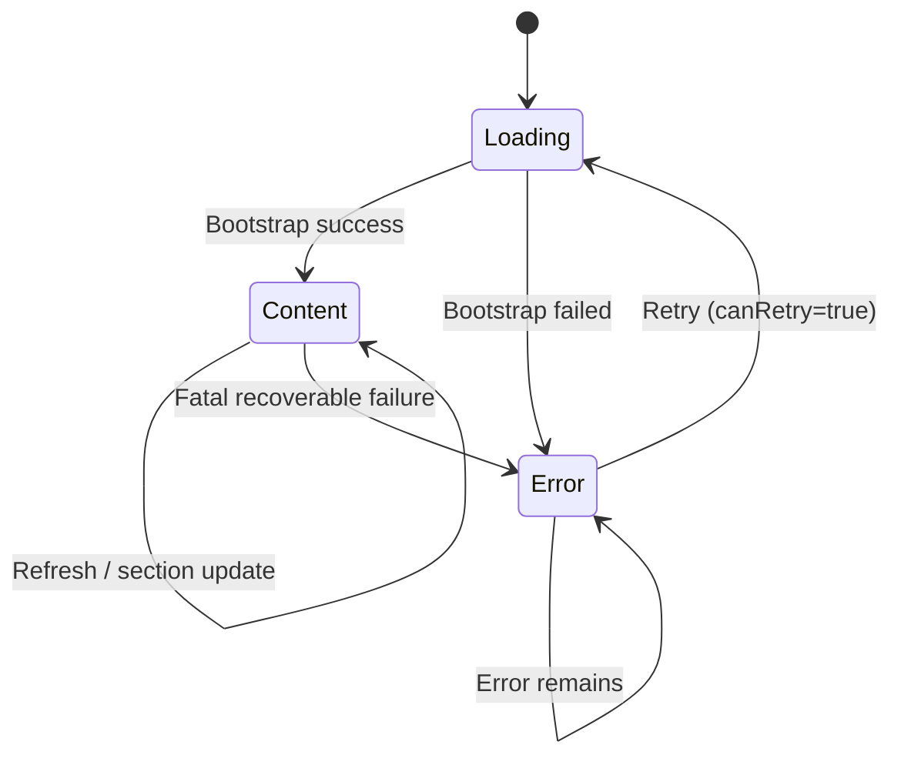

# Dashboard UI Design Spec

- **Version:** 1.0
- **Purpose:** 定义 Dashboard 的 UI 规范（状态机 + 布局 + 组件），并满足 UI Architecture Rulebook 要求。
- **Rulebook:** UI Architecture Rulebook

---

# 1. UI Spec DSL

```
Screen: Dashboard

States:
 - Loading
 - Content
 - Error

Layout:
 HeaderRegion
 MainRegion
 ActionRegion
 OverlayRegion

Components:
 TopBar
 CollectionSection
 CardSection
 ReviewSection
 ErrorPanel

Interactions:
 Loading:
  BootstrapSuccess -> Content
  BootstrapFail -> Error

 Content:
  Refresh -> Content
  FatalFailure -> Error

 Error:
  Retry(canRetry=true) -> Loading
  Retry(canRetry=false) -> Error
```

---

# 2. 状态图



# 3. 校验

| 编号 | 规则                                | 通过（是/否） |
|----|-----------------------------------|---------|
| 1  | State Count ≤ 7                   |         |
| 2  | State Graph Valid                 |         |
|    | R1. 单入口状态                         |         |
|    | R2. 每个状态必须可达                      |         |
|    | R3. 每个状态必须可退出                     |         |
|    | R4. 禁止死循环                         |         |
|    | R5. 明确异常路径                        |         |
| 3  | Component State 不得混入 Screen State |         |
| 4  | Layout 不得依赖 State                 |         |

---

