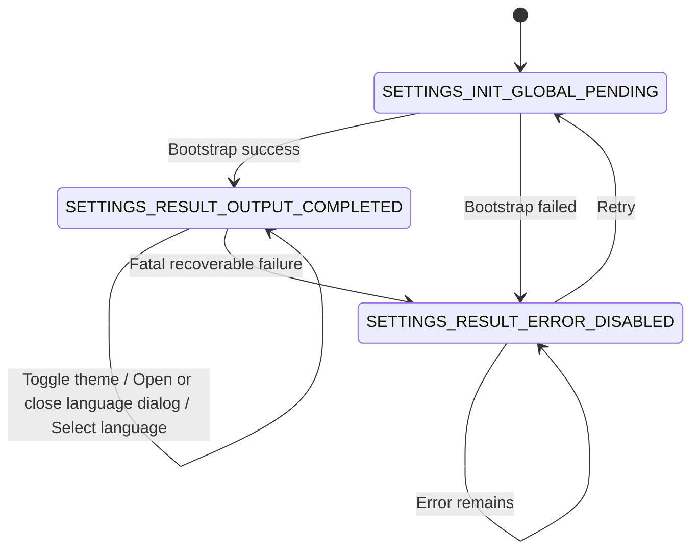

# Settings Flow UI Spec

> 本文档基于[ UI-Design-Analysis-Rulebook-v1.0.md](../../../docs/design/spec/%20UI-Design-Analysis-Rulebook-v1.0.md) 与 [UI State Enumeration Dictionary v1.0](../../../docs/design/spec/more/UI%20State%20Enumeration%20Dictionary%20v1.0.md)，定义 Settings 模块状态。
> 本文档作为 `SettingsViewModel` 重构前置规范，目标对齐 Dashboard 的状态建模方式。

---

## 0. App-level Phase Mapping（应用级阶段映射）

| Settings State                    | App-level Phase    | Description |
|-----------------------------------|--------------------|-------------|
| `SETTINGS_INIT_GLOBAL_PENDING`    | System Processing  | 页面初始化，读取配置中 |
| `SETTINGS_RESULT_ERROR_DISABLED`  | Result Consumption | 全局错误结果态（初始化失败） |
| `SETTINGS_RESULT_OUTPUT_COMPLETED`| Result Consumption | 主内容可交互完成态 |

---

## 1. 文档索引

- [2. 状态流转图（规范版）](#2-状态流转图规范版)
- [3. 状态规范（完整合并）](#3-状态规范完整合并)
- [4. SettingsViewModel 状态与规则（重定义）](#4-settingsviewmodel-状态与规则重定义)
- [5. 全局约束（Settings 模块）](#5-全局约束settings-模块)
- [6. 文档与代码一致性](#6-文档与代码一致性)
- 3.1 `SETTINGS_INIT_GLOBAL_PENDING`
- 3.2 `SETTINGS_RESULT_ERROR_DISABLED`
- 3.3 `SETTINGS_RESULT_OUTPUT_COMPLETED`

## 2. 状态流转图（规范版）



## 3. 状态规范（完整合并）

### 3.1 SETTINGS_INIT_GLOBAL_PENDING

> Settings 入口全局初始化态。

#### 1. State Definition（状态定义）

- State Name: `SETTINGS_INIT_GLOBAL_PENDING`
- Definition: 页面初始化中，正在加载主题与语言设置。
- Preconditions:
    - 进入 Settings 页面。
    - 用户触发 Retry。
- Exit Conditions:
    - 初始化成功，进入 `SETTINGS_RESULT_OUTPUT_COMPLETED`。
    - 初始化失败，进入 `SETTINGS_RESULT_ERROR_DISABLED`。

#### 2. State Position in Flow（状态在流程中的位置）

- Previous: `Entry`, `SETTINGS_RESULT_ERROR_DISABLED`
- Current: `SETTINGS_INIT_GLOBAL_PENDING`
- Next: `SETTINGS_RESULT_OUTPUT_COMPLETED`, `SETTINGS_RESULT_ERROR_DISABLED`
- Skip Allowed: No
- Rollback Allowed: No
- Parallel: No

#### 3. Core Semantics（核心语义）

- **User Perspective**: 页面加载中，不可进行设置变更。
- **System Perspective**: 等待主题与语言初值收敛。
- **Why This State Cannot Be Merged**: 必须保留初始化阻塞语义，避免“默认值闪烁可交互”。

#### 4. Layout Contract（结构约束）

- Header Region: 页面标题。
- Main Region: 全局加载占位。
- Overlay Region: 可选阻塞层。

#### 5. Interaction Rules（交互规则）

- 禁止主题开关、语言选择等业务交互。
- 允许系统返回。

#### 6. Visual Rules（视觉规则）

- 必须明确“正在加载设置”。

#### 7. Motion Contract（动效约束）

- 允许低强度 loading 动效。

#### 8. Negative Requirements（明确禁止）

- 不渲染可提交的设置控件。

#### 9. Validation Checklist（验收清单）

- 初始化期间点击主题开关无效。
- 初始化期间不弹出语言选择对话框。

#### 10. One-line Definition（一句话定义）

`SETTINGS_INIT_GLOBAL_PENDING` 是 Settings 全局初始化阻塞状态。

### 3.2 SETTINGS_RESULT_ERROR_DISABLED

> Settings 结果态之一（初始化失败兜底）。

#### 1. State Definition（状态定义）

- State Name: `SETTINGS_RESULT_ERROR_DISABLED`
- Definition: 初始化失败后展示错误信息与重试能力。
- Preconditions:
    - 初始加载失败或重试仍失败。
- Exit Conditions:
    - 用户触发重试，进入 `SETTINGS_INIT_GLOBAL_PENDING`。

#### 2. State Position in Flow（状态在流程中的位置）

- Previous: `SETTINGS_INIT_GLOBAL_PENDING`, `SETTINGS_RESULT_OUTPUT_COMPLETED`
- Current: `SETTINGS_RESULT_ERROR_DISABLED`
- Next: `SETTINGS_INIT_GLOBAL_PENDING`, `SETTINGS_RESULT_ERROR_DISABLED`
- Skip Allowed: No
- Rollback Allowed: No
- Parallel: No

#### 3. Core Semantics（核心语义）

- **User Perspective**: 无法继续设置操作，可选择重试。
- **System Perspective**: 主能力降级为错误展示与恢复入口。
- **Why This State Cannot Be Merged**: 与完成态交互能力完全不同，必须隔离。

#### 4. Layout Contract（结构约束）

- Main Region: 错误说明（`message`）与重试动作（`canRetry`）。

#### 5. Interaction Rules（交互规则）

- `canRetry=true` 时允许触发 Retry。
- 禁止主题、语言配置交互。

#### 6. Visual Rules（视觉规则）

- 需明确失败反馈和恢复路径。

#### 7. Motion Contract（动效约束）

- 允许错误反馈过渡。

#### 8. Negative Requirements（明确禁止）

- 不自动无限重试。

#### 9. Validation Checklist（验收清单）

- `message` 必须可见。
- `canRetry=false` 时不提供主动作按钮。

#### 10. One-line Definition（一句话定义）

`SETTINGS_RESULT_ERROR_DISABLED` 是 Settings 初始化失败后的结果分支状态。

### 3.3 SETTINGS_RESULT_OUTPUT_COMPLETED

> Settings 主内容结果态（对应可交互设置页）。

#### 1. State Definition（状态定义）

- State Name: `SETTINGS_RESULT_OUTPUT_COMPLETED`
- Definition: 配置已加载完成，页面可执行主题与语言设置。
- Preconditions:
    - 初始化成功，拿到 `isDarkMode` 与 `currentLanguage`。
- Exit Conditions:
    - 致命可恢复错误：进入 `SETTINGS_RESULT_ERROR_DISABLED`。
    - 常规交互（切换主题、弹窗开关、语言选择）保持在本状态。

#### 2. State Position in Flow（状态在流程中的位置）

- Previous: `SETTINGS_INIT_GLOBAL_PENDING`
- Current: `SETTINGS_RESULT_OUTPUT_COMPLETED`
- Next: `SETTINGS_RESULT_OUTPUT_COMPLETED`, `SETTINGS_RESULT_ERROR_DISABLED`
- Skip Allowed: No
- Rollback Allowed: No
- Parallel: Yes（由子字段承载）

#### 3. Core Semantics（核心语义）

- **User Perspective**: 可以查看并修改设置项。
- **System Perspective**: 顶层状态稳定，细粒度变化（提交中、弹窗开关、局部错误）由字段表达。
- **Why This State Cannot Be Merged**: 与初始化/错误态在能力边界上不可合并。

#### 4. Layout Contract（结构约束）

- Header Region: 设置标题。
- Main Region: 主题设置项、语言设置项。
- Overlay Region: 语言选择对话框（可选）。

#### 5. Interaction Rules（交互规则）

- 允许切换主题（可依据 `isSubmittingTheme` 临时锁定）。
- 允许打开语言对话框。
- 允许在对话框内选择语言（可依据 `isSubmittingLanguage` 临时锁定）。

#### 6. Visual Rules（视觉规则）

- 主内容信息稳定，局部提交状态以控件级反馈表达。

#### 7. Motion Contract（动效约束）

- 对话框开合与控件状态切换应平滑，不触发全页重排。

#### 8. Negative Requirements（明确禁止）

- 不因局部提交中而回退到全局 loading。

#### 9. Validation Checklist（验收清单）

- `showLanguageDialog=true` 时弹窗可见。
- `isSubmittingTheme=true` 时主题开关不可重复提交。
- `isSubmittingLanguage=true` 时语言选项不可重复提交。

#### 10. One-line Definition（一句话定义）

`SETTINGS_RESULT_OUTPUT_COMPLETED` 是 Settings 主内容可交互且稳定的结果状态。

## 4. SettingsViewModel 状态与规则（重定义）

### 4.1 目标状态模型（仿 Dashboard）

建议将当前字段聚合态重构为 sealed state：

```kotlin
sealed class SettingsUiState(val state: State) {
    object InitGlobalPending : SettingsUiState(SETTINGS_INIT_GLOBAL_PENDING)

    data class ResultOutputCompleted(
        val isDarkMode: Boolean,
        val currentLanguage: Language,
        val showLanguageDialog: Boolean = false,
        val isSubmittingTheme: Boolean = false,
        val isSubmittingLanguage: Boolean = false,
        val inlineMessage: String? = null,
    ) : SettingsUiState(SETTINGS_RESULT_OUTPUT_COMPLETED)

    data class ResultErrorDisabled(
        val message: String,
        val canRetry: Boolean = true,
    ) : SettingsUiState(SETTINGS_RESULT_ERROR_DISABLED)
}
```

### 4.2 事件与迁移规则（Reducer 语义）

- `OnEnterSettings`
  - `Entry -> SETTINGS_INIT_GLOBAL_PENDING`
- `OnBootstrapSuccess(isDarkMode, language)`
  - `SETTINGS_INIT_GLOBAL_PENDING -> SETTINGS_RESULT_OUTPUT_COMPLETED`
- `OnBootstrapFailure(message)`
  - `SETTINGS_INIT_GLOBAL_PENDING -> SETTINGS_RESULT_ERROR_DISABLED`
- `OnRetry`
  - `SETTINGS_RESULT_ERROR_DISABLED(canRetry=true) -> SETTINGS_INIT_GLOBAL_PENDING`
- `OnThemeToggleRequested(nextValue)`
  - 仅在 `SETTINGS_RESULT_OUTPUT_COMPLETED` 生效。
  - 将 `isSubmittingTheme=true`，成功后更新 `isDarkMode` 并复位提交标记。
  - 失败时保持在 `SETTINGS_RESULT_OUTPUT_COMPLETED`，写入 `inlineMessage`。
- `OnOpenLanguageDialog`
  - `SETTINGS_RESULT_OUTPUT_COMPLETED.showLanguageDialog=false -> true`
- `OnDismissLanguageDialog`
  - `SETTINGS_RESULT_OUTPUT_COMPLETED.showLanguageDialog=true -> false`
- `OnLanguageSelected(language)`
  - 仅在 `showLanguageDialog=true` 下生效。
  - 将 `isSubmittingLanguage=true`，成功后更新 `currentLanguage`、关闭对话框。
  - 失败时保留对话框并写入 `inlineMessage`。
- `OnInlineMessageConsumed`
  - `inlineMessage -> null`

### 4.3 不变量（Hard Rules）

- 顶层状态只能在 3 态中取值。
- `ResultErrorDisabled` 下禁止设置项交互。
- `InitGlobalPending` 下禁止对话框展示。
- `isSubmittingTheme` 与 `isSubmittingLanguage` 不得同时为 `true`。
- 主题/语言更新失败默认不切换顶层状态，作为完成态下的局部错误处理。

## 5. 全局约束（Settings 模块）

- 状态命名遵循 `<MODULE>_<PHASE>_<CONTEXT>_<MODE>`。
- 模块顶层状态收敛为 3 态，局部 UI 变化通过 `ResultOutputCompleted` 字段承载。
- `SettingsViewModel` 作为唯一状态写入点，UI 仅订阅 `uiState`。

## 6. 文档与代码一致性

### 6.1 当前代码现状（截至 2026-03-09）

`feature/settings/src/commonMain/kotlin/tech/zhifu/app/myhub/feature/settings/SettingsUiState.kt` 已完成 sealed 三态建模：

- `InitGlobalPending`
- `ResultErrorDisabled(message, canRetry)`
- `ResultOutputCompleted(isDarkMode, currentLanguage, showLanguageDialog, isSubmittingTheme, isSubmittingLanguage, inlineMessage)`

`SettingsViewModel.kt` 已改为单一 `MutableStateFlow` 状态迁移，包含 `bootstrap/retry/theme/language/dialog` 事件处理。

### 6.2 前置条件落实情况

已补齐状态枚举支持：

- `core/platform-compose/.../State.kt` 已新增 `State.Module.SETTINGS`。

### 6.3 代码对齐结论

- `SettingsUiState.kt`：已对齐为 sealed class + 3 个顶层状态常量。
- `SettingsViewModel.kt`：已对齐为事件驱动迁移。
- `SettingsScreen.kt`：已对齐为 `when(uiState)` 分支渲染（加载/错误/完成）。

### 6.4 变更记录

- 新增 Settings 模块流程状态规范文档。
- 明确 Settings 状态机从“字段聚合态”迁移为“Dashboard 同款三态模型”。
- 定义 `SettingsViewModel` 事件、迁移与不变量规则。
